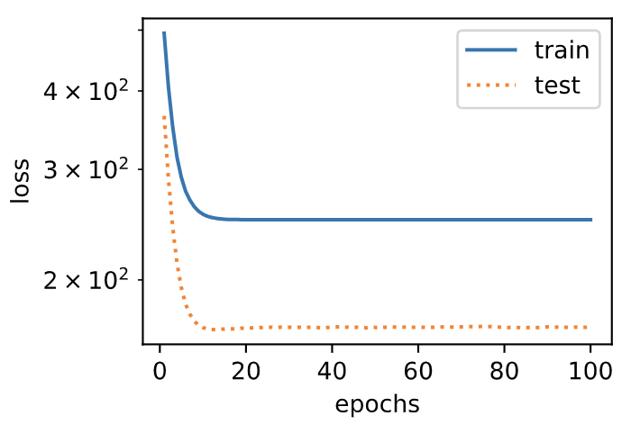

# 3.11 模型選擇、欠擬合和過擬合

在前幾節基於Fashion-MNIST數據集的實驗中，我們評價了機器學習模型在訓練數據集和測試數據集上的表現。如果你改變過實驗中的模型結構或者超參數，你也許發現了：當模型在訓練數據集上更準確時，它在測試數據集上卻不一定更準確。這是為什麼呢？


## 3.11.1 訓練誤差和泛化誤差

在解釋上述現象之前，我們需要區分訓練誤差（training error）和泛化誤差（generalization error）。通俗來講，前者指模型在訓練數據集上表現出的誤差，後者指模型在任意一個測試數據樣本上表現出的誤差的期望，並常常通過測試數據集上的誤差來近似。計算訓練誤差和泛化誤差可以使用之前介紹過的損失函數，例如線性迴歸用到的平方損失函數和softmax迴歸用到的交叉熵損失函數。

讓我們以高考為例來直觀地解釋訓練誤差和泛化誤差這兩個概念。訓練誤差可以認為是做往年高考試題（訓練題）時的錯誤率，泛化誤差則可以通過真正參加高考（測試題）時的答題錯誤率來近似。假設訓練題和測試題都隨機採樣於一個未知的依照相同考綱的巨大試題庫。如果讓一名未學習中學知識的小學生去答題，那麼測試題和訓練題的答題錯誤率可能很相近。但如果換成一名反覆練習訓練題的高三備考生答題，即使在訓練題上做到了錯誤率為0，也不代表真實的高考成績會如此。

在機器學習裡，我們通常假設訓練數據集（訓練題）和測試數據集（測試題）裡的每一個樣本都是從同一個概率分佈中相互獨立地生成的。基於該獨立同分布假設，給定任意一個機器學習模型（含參數），它的訓練誤差的期望和泛化誤差都是一樣的。例如，如果我們將模型參數設成隨機值（小學生），那麼訓練誤差和泛化誤差會非常相近。但我們從前面幾節中已經瞭解到，模型的參數是通過在訓練數據集上訓練模型而學習出的，參數的選擇依據了最小化訓練誤差（高三備考生）。所以，訓練誤差的期望小於或等於泛化誤差。也就是說，一般情況下，由訓練數據集學到的模型參數會使模型在訓練數據集上的表現優於或等於在測試數據集上的表現。由於無法從訓練誤差估計泛化誤差，一味地降低訓練誤差並不意味著泛化誤差一定會降低。

機器學習模型應關注降低泛化誤差。


## 3.11.2 模型選擇

在機器學習中，通常需要評估若干候選模型的表現並從中選擇模型。這一過程稱為模型選擇（model selection）。可供選擇的候選模型可以是有著不同超參數的同類模型。以多層感知機為例，我們可以選擇隱藏層的個數，以及每個隱藏層中隱藏單元個數和激活函數。為了得到有效的模型，我們通常要在模型選擇上下一番功夫。下面，我們來描述模型選擇中經常使用的驗證數據集（validation data set）。


### 3.11.2.1 驗證數據集

從嚴格意義上講，測試集只能在所有超參數和模型參數選定後使用一次。不可以使用測試數據選擇模型，如調參。由於無法從訓練誤差估計泛化誤差，因此也不應只依賴訓練數據選擇模型。鑑於此，我們可以預留一部分在訓練數據集和測試數據集以外的數據來進行模型選擇。這部分數據被稱為驗證數據集，簡稱驗證集（validation set）。例如，我們可以從給定的訓練集中隨機選取一小部分作為驗證集，而將剩餘部分作為真正的訓練集。

然而在實際應用中，由於數據不容易獲取，測試數據極少只使用一次就丟棄。因此，實踐中驗證數據集和測試數據集的界限可能比較模糊。從嚴格意義上講，除非明確說明，否則本書中實驗所使用的測試集應為驗證集，實驗報告的測試結果（如測試準確率）應為驗證結果（如驗證準確率）。


### 3.11.2.3 $K$折交叉驗證

由於驗證數據集不參與模型訓練，當訓練數據不夠用時，預留大量的驗證數據顯得太奢侈。一種改善的方法是$K$折交叉驗證（$K$-fold cross-validation）。在$K$折交叉驗證中，我們把原始訓練數據集分割成$K$個不重合的子數據集，然後我們做$K$次模型訓練和驗證。每一次，我們使用一個子數據集驗證模型，並使用其他$K-1$個子數據集來訓練模型。在這$K$次訓練和驗證中，每次用來驗證模型的子數據集都不同。最後，我們對這$K$次訓練誤差和驗證誤差分別求平均。


## 3.11.3 欠擬合和過擬合

接下來，我們將探究模型訓練中經常出現的兩類典型問題：一類是模型無法得到較低的訓練誤差，我們將這一現象稱作欠擬合（underfitting）；另一類是模型的訓練誤差遠小於它在測試數據集上的誤差，我們稱該現象為過擬合（overfitting）。在實踐中，我們要儘可能同時應對欠擬合和過擬合。雖然有很多因素可能導致這兩種擬合問題，在這裡我們重點討論兩個因素：模型複雜度和訓練數據集大小。

> 關於模型複雜度和訓練集大小對學習的影響的詳細理論分析可參見我寫的[這篇博客](https://tangshusen.me/2018/12/09/vc-dimension/)。


### 3.11.3.1 模型複雜度

為了解釋模型複雜度，我們以多項式函數擬合為例。給定一個由標量數據特徵$x$和對應的標量標籤$y$組成的訓練數據集，多項式函數擬合的目標是找一個$K$階多項式函數

$$
\hat{y} = b + \sum_{k=1}^K x^k w_k
$$

來近似 $y$。在上式中，$w_k$是模型的權重參數，$b$是偏差參數。與線性迴歸相同，多項式函數擬合也使用平方損失函數。特別地，一階多項式函數擬合又叫線性函數擬合。

因為高階多項式函數模型參數更多，模型函數的選擇空間更大，所以高階多項式函數比低階多項式函數的複雜度更高。因此，高階多項式函數比低階多項式函數更容易在相同的訓練數據集上得到更低的訓練誤差。給定訓練數據集，模型複雜度和誤差之間的關係通常如圖3.4所示。給定訓練數據集，如果模型的複雜度過低，很容易出現欠擬合；如果模型複雜度過高，很容易出現過擬合。應對欠擬合和過擬合的一個辦法是針對數據集選擇合適複雜度的模型。

<div align=center>

</div>
<div align=center>圖3.4 模型複雜度對欠擬合和過擬合的影響</div>


### 3.11.3.2 訓練數據集大小

影響欠擬合和過擬合的另一個重要因素是訓練數據集的大小。一般來說，如果訓練數據集中樣本數過少，特別是比模型參數數量（按元素計）更少時，過擬合更容易發生。此外，泛化誤差不會隨訓練數據集裡樣本數量增加而增大。因此，在計算資源允許的範圍之內，我們通常希望訓練數據集大一些，特別是在模型複雜度較高時，例如層數較多的深度學習模型。


## 3.11.4 多項式函數擬合實驗

為了理解模型複雜度和訓練數據集大小對欠擬合和過擬合的影響，下面我們以多項式函數擬合為例來實驗。首先導入實驗需要的包或模塊。

``` python
%matplotlib inline
import torch
import numpy as np
import sys
sys.path.append("..") 
import d2lzh_pytorch as d2l
```

### 3.11.4.1 生成數據集

我們將生成一個人工數據集。在訓練數據集和測試數據集中，給定樣本特徵$x$，我們使用如下的三階多項式函數來生成該樣本的標籤：

$$y = 1.2x - 3.4x^2 + 5.6x^3 + 5 + \epsilon,$$

其中噪聲項$\epsilon$服從均值為0、標準差為0.01的正態分佈。訓練數據集和測試數據集的樣本數都設為100。

``` python
n_train, n_test, true_w, true_b = 100, 100, [1.2, -3.4, 5.6], 5
features = torch.randn((n_train + n_test, 1))
poly_features = torch.cat((features, torch.pow(features, 2), torch.pow(features, 3)), 1) 
labels = (true_w[0] * poly_features[:, 0] + true_w[1] * poly_features[:, 1]
          + true_w[2] * poly_features[:, 2] + true_b)
labels += torch.tensor(np.random.normal(0, 0.01, size=labels.size()), dtype=torch.float)
```

看一看生成的數據集的前兩個樣本。

``` python
features[:2], poly_features[:2], labels[:2]
```
輸出：
```
(tensor([[-1.0613],
         [-0.8386]]), tensor([[-1.0613,  1.1264, -1.1954],
         [-0.8386,  0.7032, -0.5897]]), tensor([-6.8037, -1.7054]))
```

### 3.11.4.2 定義、訓練和測試模型

我們先定義作圖函數`semilogy`，其中 $y$ 軸使用了對數尺度。

``` python
# 本函數已保存在d2lzh_pytorch包中方便以後使用
def semilogy(x_vals, y_vals, x_label, y_label, x2_vals=None, y2_vals=None,
             legend=None, figsize=(3.5, 2.5)):
    d2l.set_figsize(figsize)
    d2l.plt.xlabel(x_label)
    d2l.plt.ylabel(y_label)
    d2l.plt.semilogy(x_vals, y_vals)
    if x2_vals and y2_vals:
        d2l.plt.semilogy(x2_vals, y2_vals, linestyle=':')
        d2l.plt.legend(legend)
```

和線性迴歸一樣，多項式函數擬合也使用平方損失函數。因為我們將嘗試使用不同複雜度的模型來擬合生成的數據集，所以我們把模型定義部分放在`fit_and_plot`函數中。多項式函數擬合的訓練和測試步驟與3.6節（softmax迴歸的從零開始實現）介紹的softmax迴歸中的相關步驟類似。

``` python
num_epochs, loss = 100, torch.nn.MSELoss()

def fit_and_plot(train_features, test_features, train_labels, test_labels):
    net = torch.nn.Linear(train_features.shape[-1], 1)
    # 通過Linear文檔可知，pytorch已經將參數初始化了，所以我們這裡就不手動初始化了
    
    batch_size = min(10, train_labels.shape[0])    
    dataset = torch.utils.data.TensorDataset(train_features, train_labels)
    train_iter = torch.utils.data.DataLoader(dataset, batch_size, shuffle=True)
    
    optimizer = torch.optim.SGD(net.parameters(), lr=0.01)
    train_ls, test_ls = [], []
    for _ in range(num_epochs):
        for X, y in train_iter:
            l = loss(net(X), y.view(-1, 1))
            optimizer.zero_grad()
            l.backward()
            optimizer.step()
        train_labels = train_labels.view(-1, 1)
        test_labels = test_labels.view(-1, 1)
        train_ls.append(loss(net(train_features), train_labels).item())
        test_ls.append(loss(net(test_features), test_labels).item())
    print('final epoch: train loss', train_ls[-1], 'test loss', test_ls[-1])
    semilogy(range(1, num_epochs + 1), train_ls, 'epochs', 'loss',
             range(1, num_epochs + 1), test_ls, ['train', 'test'])
    print('weight:', net.weight.data,
          '\nbias:', net.bias.data)
```

### 3.11.4.3 三階多項式函數擬合（正常）

我們先使用與數據生成函數同階的三階多項式函數擬合。實驗表明，這個模型的訓練誤差和在測試數據集的誤差都較低。訓練出的模型參數也接近真實值：$w_1 = 1.2, w_2=-3.4, w_3=5.6, b = 5$。

``` python
fit_and_plot(poly_features[:n_train, :], poly_features[n_train:, :], 
            labels[:n_train], labels[n_train:])
```
輸出：
```
final epoch: train loss 0.00010175639908993617 test loss 9.790256444830447e-05
weight: tensor([[ 1.1982, -3.3992,  5.6002]]) 
bias: tensor([5.0014])
```
<div align=center>

</div>


### 3.11.4.4 線性函數擬合（欠擬合）

我們再試試線性函數擬合。很明顯，該模型的訓練誤差在迭代早期下降後便很難繼續降低。在完成最後一次迭代週期後，訓練誤差依舊很高。線性模型在非線性模型（如三階多項式函數）生成的數據集上容易欠擬合。

``` python
fit_and_plot(features[:n_train, :], features[n_train:, :], labels[:n_train],
             labels[n_train:])
```
輸出：
```
final epoch: train loss 249.35157775878906 test loss 168.37705993652344
weight: tensor([[19.4123]]) 
bias: tensor([0.5805])
```
<div align=center>

</div>

### 3.11.4.5 訓練樣本不足（過擬合）

事實上，即便使用與數據生成模型同階的三階多項式函數模型，如果訓練樣本不足，該模型依然容易過擬合。讓我們只使用兩個樣本來訓練模型。顯然，訓練樣本過少了，甚至少於模型參數的數量。這使模型顯得過於複雜，以至於容易被訓練數據中的噪聲影響。在迭代過程中，儘管訓練誤差較低，但是測試數據集上的誤差卻很高。這是典型的過擬合現象。

```python
fit_and_plot(poly_features[0:2, :], poly_features[n_train:, :], labels[0:2],
             labels[n_train:])
```
輸出：
```
final epoch: train loss 1.198514699935913 test loss 166.037109375
weight: tensor([[1.4741, 2.1198, 2.5674]]) 
bias: tensor([3.1207])
```
<div align=center>

</div>

我們將在接下來的兩個小節繼續討論過擬合問題以及應對過擬合的方法。


## 小結

* 由於無法從訓練誤差估計泛化誤差，一味地降低訓練誤差並不意味著泛化誤差一定會降低。機器學習模型應關注降低泛化誤差。
* 可以使用驗證數據集來進行模型選擇。
* 欠擬合指模型無法得到較低的訓練誤差，過擬合指模型的訓練誤差遠小於它在測試數據集上的誤差。
* 應選擇複雜度合適的模型並避免使用過少的訓練樣本。

-----------
> 注：本節除了代碼之外與原書基本相同，[原書傳送門](https://zh.d2l.ai/chapter_deep-learning-basics/underfit-overfit.html)
