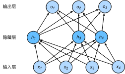

# 3.13 丟棄法

除了前一節介紹的權重衰減以外，深度學習模型常常使用丟棄法（dropout）[1] 來應對過擬合問題。丟棄法有一些不同的變體。本節中提到的丟棄法特指倒置丟棄法（inverted dropout）。

## 3.13.1 方法

回憶一下，3.8節（多層感知機）的圖3.3描述了一個單隱藏層的多層感知機。其中輸入個數為4，隱藏單元個數為5，且隱藏單元$h_i$（$i=1, \ldots, 5$）的計算表達式為

$$
h_i = \phi\left(x_1 w_{1i} + x_2 w_{2i} + x_3 w_{3i} + x_4 w_{4i} + b_i\right)
$$

這裡$\phi$是激活函數，$x_1, \ldots, x_4$是輸入，隱藏單元$i$的權重參數為$w_{1i}, \ldots, w_{4i}$，偏差參數為$b_i$。當對該隱藏層使用丟棄法時，該層的隱藏單元將有一定概率被丟棄掉。設丟棄概率為$p$，那麼有$p$的概率$h_i$會被清零，有$1-p$的概率$h_i$會除以$1-p$做拉伸。丟棄概率是丟棄法的超參數。具體來說，設隨機變量$\xi_i$為0和1的概率分別為$p$和$1-p$。使用丟棄法時我們計算新的隱藏單元$h_i'$

$$
h_i' = \frac{\xi_i}{1-p} h_i
$$

由於$E(\xi_i) = 1-p$，因此

$$
E(h_i') = \frac{E(\xi_i)}{1-p}h_i = h_i
$$

即**丟棄法不改變其輸入的期望值**。讓我們對圖3.3中的隱藏層使用丟棄法，一種可能的結果如圖3.5所示，其中$h_2$和$h_5$被清零。這時輸出值的計算不再依賴$h_2$和$h_5$，在反向傳播時，與這兩個隱藏單元相關的權重的梯度均為0。由於在訓練中隱藏層神經元的丟棄是隨機的，即$h_1, \ldots, h_5$都有可能被清零，輸出層的計算無法過度依賴$h_1, \ldots, h_5$中的任一個，從而在訓練模型時起到正則化的作用，並可以用來應對過擬合。在測試模型時，我們為了拿到更加確定性的結果，一般不使用丟棄法。

<div align=center>

</div>
<div align=center> 圖3.5 隱藏層使用了丟棄法的多層感知機</div>

## 3.13.2 從零開始實現

根據丟棄法的定義，我們可以很容易地實現它。下面的`dropout`函數將以`drop_prob`的概率丟棄`X`中的元素。

``` python
%matplotlib inline
import torch
import torch.nn as nn
import numpy as np
import sys
sys.path.append("..") 
import d2lzh_pytorch as d2l

def dropout(X, drop_prob):
    X = X.float()
    assert 0 <= drop_prob <= 1
    keep_prob = 1 - drop_prob
    # 這種情況下把全部元素都丟棄
    if keep_prob == 0:
        return torch.zeros_like(X)
    mask = (torch.rand(X.shape) < keep_prob).float()
    
    return mask * X / keep_prob
```

我們運行幾個例子來測試一下`dropout`函數。其中丟棄概率分別為0、0.5和1。

``` python
X = torch.arange(16).view(2, 8)
dropout(X, 0)
```

``` python
dropout(X, 0.5)
```

``` python
dropout(X, 1.0)
```

### 3.13.2.1 定義模型參數

實驗中，我們依然使用3.6節（softmax迴歸的從零開始實現）中介紹的Fashion-MNIST數據集。我們將定義一個包含兩個隱藏層的多層感知機，其中兩個隱藏層的輸出個數都是256。

``` python
num_inputs, num_outputs, num_hiddens1, num_hiddens2 = 784, 10, 256, 256

W1 = torch.tensor(np.random.normal(0, 0.01, size=(num_inputs, num_hiddens1)), dtype=torch.float, requires_grad=True)
b1 = torch.zeros(num_hiddens1, requires_grad=True)
W2 = torch.tensor(np.random.normal(0, 0.01, size=(num_hiddens1, num_hiddens2)), dtype=torch.float, requires_grad=True)
b2 = torch.zeros(num_hiddens2, requires_grad=True)
W3 = torch.tensor(np.random.normal(0, 0.01, size=(num_hiddens2, num_outputs)), dtype=torch.float, requires_grad=True)
b3 = torch.zeros(num_outputs, requires_grad=True)

params = [W1, b1, W2, b2, W3, b3]
```

### 3.13.2.2 定義模型

下面定義的模型將全連接層和激活函數ReLU串起來，並對每個激活函數的輸出使用丟棄法。我們可以分別設置各個層的丟棄概率。通常的建議是把靠近輸入層的丟棄概率設得小一點。在這個實驗中，我們把第一個隱藏層的丟棄概率設為0.2，把第二個隱藏層的丟棄概率設為0.5。我們可以通過參數`is_training`來判斷運行模式為訓練還是測試，並只需在訓練模式下使用丟棄法。

``` python
drop_prob1, drop_prob2 = 0.2, 0.5

def net(X, is_training=True):
    X = X.view(-1, num_inputs)
    H1 = (torch.matmul(X, W1) + b1).relu()
    if is_training:  # 只在訓練模型時使用丟棄法
        H1 = dropout(H1, drop_prob1)  # 在第一層全連接後添加丟棄層
    H2 = (torch.matmul(H1, W2) + b2).relu()
    if is_training:
        H2 = dropout(H2, drop_prob2)  # 在第二層全連接後添加丟棄層
    return torch.matmul(H2, W3) + b3
```

我們在對模型評估的時候不應該進行丟棄，所以我們修改一下`d2lzh_pytorch`中的`evaluate_accuracy`函數:
``` python
# 本函數已保存在d2lzh_pytorch
def evaluate_accuracy(data_iter, net):
    acc_sum, n = 0.0, 0
    for X, y in data_iter:
        if isinstance(net, torch.nn.Module):
            net.eval() # 評估模式, 這會關閉dropout
            acc_sum += (net(X).argmax(dim=1) == y).float().sum().item()
            net.train() # 改回訓練模式
        else: # 自定義的模型
            if('is_training' in net.__code__.co_varnames): # 如果有is_training這個參數
                # 將is_training設置成False
                acc_sum += (net(X, is_training=False).argmax(dim=1) == y).float().sum().item() 
            else:
                acc_sum += (net(X).argmax(dim=1) == y).float().sum().item() 
        n += y.shape[0]
    return acc_sum / n
```

> 注：將上訴`evaluate_accuracy`寫回`d2lzh_pytorch`後要重啟一下jupyter kernel才會生效。

### 3.13.2.3 訓練和測試模型

這部分與之前多層感知機的訓練和測試類似。

``` python
num_epochs, lr, batch_size = 5, 100.0, 256
loss = torch.nn.CrossEntropyLoss()
train_iter, test_iter = d2l.load_data_fashion_mnist(batch_size)
d2l.train_ch3(net, train_iter, test_iter, loss, num_epochs, batch_size, params, lr)
```
輸出：
```
epoch 1, loss 0.0044, train acc 0.574, test acc 0.648
epoch 2, loss 0.0023, train acc 0.786, test acc 0.786
epoch 3, loss 0.0019, train acc 0.826, test acc 0.825
epoch 4, loss 0.0017, train acc 0.839, test acc 0.831
epoch 5, loss 0.0016, train acc 0.849, test acc 0.850
```

> 注：這裡的學習率設置的很大，原因同3.9.6節。


## 3.13.3 簡潔實現

在PyTorch中，我們只需要在全連接層後添加`Dropout`層並指定丟棄概率。在訓練模型時，`Dropout`層將以指定的丟棄概率隨機丟棄上一層的輸出元素；在測試模型時（即`model.eval()`後），`Dropout`層並不發揮作用。

``` python
net = nn.Sequential(
        d2l.FlattenLayer(),
        nn.Linear(num_inputs, num_hiddens1),
        nn.ReLU(),
        nn.Dropout(drop_prob1),
        nn.Linear(num_hiddens1, num_hiddens2), 
        nn.ReLU(),
        nn.Dropout(drop_prob2),
        nn.Linear(num_hiddens2, 10)
        )

for param in net.parameters():
    nn.init.normal_(param, mean=0, std=0.01)
```

下面訓練並測試模型。

``` python
optimizer = torch.optim.SGD(net.parameters(), lr=0.5)
d2l.train_ch3(net, train_iter, test_iter, loss, num_epochs, batch_size, None, None, optimizer)
```
輸出：
```
epoch 1, loss 0.0045, train acc 0.553, test acc 0.715
epoch 2, loss 0.0023, train acc 0.784, test acc 0.793
epoch 3, loss 0.0019, train acc 0.822, test acc 0.817
epoch 4, loss 0.0018, train acc 0.837, test acc 0.830
epoch 5, loss 0.0016, train acc 0.848, test acc 0.839
```

> 注：由於這裡使用的是PyTorch的SGD而不是d2lzh_pytorch裡面的sgd，所以就不存在3.9.6節那樣學習率看起來很大的問題了。

## 小結

* 我們可以通過使用丟棄法應對過擬合。
* 丟棄法只在訓練模型時使用。

## 參考文獻
[1] Srivastava, N., Hinton, G., Krizhevsky, A., Sutskever, I., & Salakhutdinov, R. (2014). Dropout: a simple way to prevent neural networks from overfitting. JMLR

------------
> 注：本節除了代碼之外與原書基本相同，[原書傳送門](https://zh.d2l.ai/chapter_deep-learning-basics/dropout.html)

