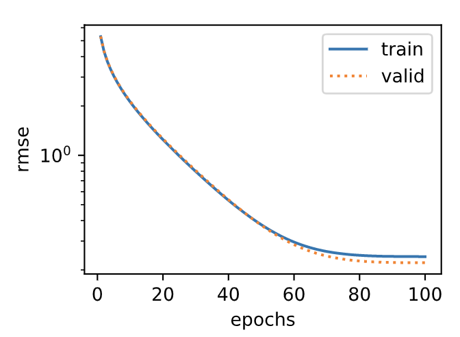
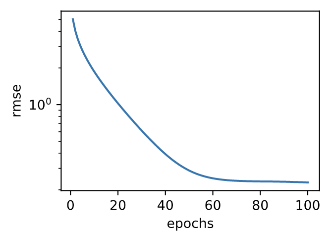

# 3.16 實戰Kaggle比賽：房價預測

作為深度學習基礎篇章的總結，我們將對本章內容學以致用。下面，讓我們動手實戰一個Kaggle比賽：房價預測。本節將提供未經調優的數據的預處理、模型的設計和超參數的選擇。我們希望讀者通過動手操作、仔細觀察實驗現象、認真分析實驗結果並不斷調整方法，得到令自己滿意的結果。

## 3.16.1 Kaggle比賽

[Kaggle](https://www.kaggle.com)是一個著名的供機器學習愛好者交流的平臺。圖3.7展示了Kaggle網站的首頁。為了便於提交結果，需要註冊Kaggle賬號。

<div align=center>

</div>
<div align=center> 圖3.7 Kaggle網站首頁</div>

我們可以在房價預測比賽的網頁上了解比賽信息和參賽者成績，也可以下載數據集並提交自己的預測結果。該比賽的網頁地址是 https://www.kaggle.com/c/house-prices-advanced-regression-techniques 。


<div align=center>

</div>
<div align=center> 圖3.8 房價預測比賽的網頁信息。比賽數據集可通過點擊“Data”標籤獲取</div>
圖3.8展示了房價預測比賽的網頁信息。

## 3.16.2 獲取和讀取數據集

比賽數據分為訓練數據集和測試數據集。兩個數據集都包括每棟房子的特徵，如街道類型、建造年份、房頂類型、地下室狀況等特徵值。這些特徵值有連續的數字、離散的標籤甚至是缺失值“na”。只有訓練數據集包括了每棟房子的價格，也就是標籤。我們可以訪問比賽網頁，點擊圖3.8中的“Data”標籤，並下載這些數據集。

我們將通過`pandas`庫讀入並處理數據。在導入本節需要的包前請確保已安裝`pandas`庫，否則請參考下面的代碼註釋。

``` python
# 如果沒有安裝pandas，則反註釋下面一行
# !pip install pandas

%matplotlib inline
import torch
import torch.nn as nn
import numpy as np
import pandas as pd
import sys
sys.path.append("..") 
import d2lzh_pytorch as d2l

print(torch.__version__)
torch.set_default_tensor_type(torch.FloatTensor)
```

假設解壓後的數據位於`../../data/kaggle_house/`目錄，它包括兩個csv文件。下面使用`pandas`讀取這兩個文件。

``` python
train_data = pd.read_csv('../../data/kaggle_house/train.csv')
test_data = pd.read_csv('../../data/kaggle_house/test.csv')
```

訓練數據集包括1460個樣本、80個特徵和1個標籤。

``` python
train_data.shape # 輸出 (1460, 81)
```

測試數據集包括1459個樣本和80個特徵。我們需要將測試數據集中每個樣本的標籤預測出來。

``` python
test_data.shape # 輸出 (1459, 80)
```

讓我們來查看前4個樣本的前4個特徵、後2個特徵和標籤（SalePrice）：

``` python
train_data.iloc[0:4, [0, 1, 2, 3, -3, -2, -1]]
```


可以看到第一個特徵是Id，它能幫助模型記住每個訓練樣本，但難以推廣到測試樣本，所以我們不使用它來訓練。我們將所有的訓練數據和測試數據的79個特徵按樣本連結。

``` python
all_features = pd.concat((train_data.iloc[:, 1:-1], test_data.iloc[:, 1:]))
```

## 3.16.3 預處理數據

我們對連續數值的特徵做標準化（standardization）：設該特徵在整個數據集上的均值為$\mu$，標準差為$\sigma$。那麼，我們可以將該特徵的每個值先減去$\mu$再除以$\sigma$得到標準化後的每個特徵值。對於缺失的特徵值，我們將其替換成該特徵的均值。

``` python
numeric_features = all_features.dtypes[all_features.dtypes != 'object'].index
all_features[numeric_features] = all_features[numeric_features].apply(
    lambda x: (x - x.mean()) / (x.std()))
# 標準化後，每個數值特徵的均值變為0，所以可以直接用0來替換缺失值
all_features[numeric_features] = all_features[numeric_features].fillna(0)
```

接下來將離散數值轉成指示特徵。舉個例子，假設特徵MSZoning裡面有兩個不同的離散值RL和RM，那麼這一步轉換將去掉MSZoning特徵，並新加兩個特徵MSZoning\_RL和MSZoning\_RM，其值為0或1。如果一個樣本原來在MSZoning裡的值為RL，那麼有MSZoning\_RL=1且MSZoning\_RM=0。

``` python
# dummy_na=True將缺失值也當作合法的特徵值併為其創建指示特徵
all_features = pd.get_dummies(all_features, dummy_na=True)
all_features.shape # (2919, 331)
```

可以看到這一步轉換將特徵數從79增加到了331。

最後，通過`values`屬性得到NumPy格式的數據，並轉成`Tensor`方便後面的訓練。

``` python
n_train = train_data.shape[0]
train_features = torch.tensor(all_features[:n_train].values, dtype=torch.float)
test_features = torch.tensor(all_features[n_train:].values, dtype=torch.float)
train_labels = torch.tensor(train_data.SalePrice.values, dtype=torch.float).view(-1, 1)
```

## 3.16.4 訓練模型

我們使用一個基本的線性迴歸模型和平方損失函數來訓練模型。

``` python
loss = torch.nn.MSELoss()

def get_net(feature_num):
    net = nn.Linear(feature_num, 1)
    for param in net.parameters():
        nn.init.normal_(param, mean=0, std=0.01)
    return net
```

下面定義比賽用來評價模型的對數均方根誤差。給定預測值$\hat y_1, \ldots, \hat y_n$和對應的真實標籤$y_1,\ldots, y_n$，它的定義為

$$\sqrt{\frac{1}{n}\sum_{i=1}^n\left(\log(y_i)-\log(\hat y_i)\right)^2}.$$

對數均方根誤差的實現如下。

``` python
def log_rmse(net, features, labels):
    with torch.no_grad():
        # 將小於1的值設成1，使得取對數時數值更穩定
        clipped_preds = torch.max(net(features), torch.tensor(1.0))
        rmse = torch.sqrt(loss(clipped_preds.log(), labels.log()))
    return rmse.item()
```

下面的訓練函數跟本章中前幾節的不同在於使用了Adam優化算法。相對之前使用的小批量隨機梯度下降，它對學習率相對不那麼敏感。我們將在之後的“優化算法”一章裡詳細介紹它。

``` python
def train(net, train_features, train_labels, test_features, test_labels,
          num_epochs, learning_rate, weight_decay, batch_size):
    train_ls, test_ls = [], []
    dataset = torch.utils.data.TensorDataset(train_features, train_labels)
    train_iter = torch.utils.data.DataLoader(dataset, batch_size, shuffle=True)
    # 這裡使用了Adam優化算法
    optimizer = torch.optim.Adam(params=net.parameters(), lr=learning_rate, weight_decay=weight_decay) 
    net = net.float()
    for epoch in range(num_epochs):
        for X, y in train_iter:
            l = loss(net(X.float()), y.float())
            optimizer.zero_grad()
            l.backward()
            optimizer.step()
        train_ls.append(log_rmse(net, train_features, train_labels))
        if test_labels is not None:
            test_ls.append(log_rmse(net, test_features, test_labels))
    return train_ls, test_ls
```

## 3.16.5 $K$折交叉驗證

我們在3.11節（模型選擇、欠擬合和過擬合）中介紹了$K$折交叉驗證。它將被用來選擇模型設計並調節超參數。下面實現了一個函數，它返回第`i`折交叉驗證時所需要的訓練和驗證數據。

``` python
def get_k_fold_data(k, i, X, y):
    # 返回第i折交叉驗證時所需要的訓練和驗證數據
    assert k > 1
    fold_size = X.shape[0] // k
    X_train, y_train = None, None
    for j in range(k):
        idx = slice(j * fold_size, (j + 1) * fold_size)
        X_part, y_part = X[idx, :], y[idx]
        if j == i:
            X_valid, y_valid = X_part, y_part
        elif X_train is None:
            X_train, y_train = X_part, y_part
        else:
            X_train = torch.cat((X_train, X_part), dim=0)
            y_train = torch.cat((y_train, y_part), dim=0)
    return X_train, y_train, X_valid, y_valid
```

在$K$折交叉驗證中我們訓練$K$次並返回訓練和驗證的平均誤差。

``` python
def k_fold(k, X_train, y_train, num_epochs,
           learning_rate, weight_decay, batch_size):
    train_l_sum, valid_l_sum = 0, 0
    for i in range(k):
        data = get_k_fold_data(k, i, X_train, y_train)
        net = get_net(X_train.shape[1])
        train_ls, valid_ls = train(net, *data, num_epochs, learning_rate,
                                   weight_decay, batch_size)
        train_l_sum += train_ls[-1]
        valid_l_sum += valid_ls[-1]
        if i == 0:
            d2l.semilogy(range(1, num_epochs + 1), train_ls, 'epochs', 'rmse',
                         range(1, num_epochs + 1), valid_ls,
                         ['train', 'valid'])
        print('fold %d, train rmse %f, valid rmse %f' % (i, train_ls[-1], valid_ls[-1]))
    return train_l_sum / k, valid_l_sum / k
```
輸出：
```
fold 0, train rmse 0.170585, valid rmse 0.156860
fold 1, train rmse 0.162552, valid rmse 0.190944
fold 2, train rmse 0.164199, valid rmse 0.168767
fold 3, train rmse 0.168698, valid rmse 0.154873
fold 4, train rmse 0.163213, valid rmse 0.183080
5-fold validation: avg train rmse 0.165849, avg valid rmse 0.170905
```



## 3.16.6 模型選擇

我們使用一組未經調優的超參數並計算交叉驗證誤差。可以改動這些超參數來儘可能減小平均測試誤差。

``` python
k, num_epochs, lr, weight_decay, batch_size = 5, 100, 5, 0, 64
train_l, valid_l = k_fold(k, train_features, train_labels, num_epochs, lr, weight_decay, batch_size)
print('%d-fold validation: avg train rmse %f, avg valid rmse %f' % (k, train_l, valid_l))
```

有時候你會發現一組參數的訓練誤差可以達到很低，但是在$K$折交叉驗證上的誤差可能反而較高。這種現象很可能是由過擬合造成的。因此，當訓練誤差降低時，我們要觀察$K$折交叉驗證上的誤差是否也相應降低。

## 3.16.7 預測並在Kaggle提交結果

下面定義預測函數。在預測之前，我們會使用完整的訓練數據集來重新訓練模型，並將預測結果存成提交所需要的格式。

``` python
def train_and_pred(train_features, test_features, train_labels, test_data,
                   num_epochs, lr, weight_decay, batch_size):
    net = get_net(train_features.shape[1])
    train_ls, _ = train(net, train_features, train_labels, None, None,
                        num_epochs, lr, weight_decay, batch_size)
    d2l.semilogy(range(1, num_epochs + 1), train_ls, 'epochs', 'rmse')
    print('train rmse %f' % train_ls[-1])
    preds = net(test_features).detach().numpy()
    test_data['SalePrice'] = pd.Series(preds.reshape(1, -1)[0])
    submission = pd.concat([test_data['Id'], test_data['SalePrice']], axis=1)
    submission.to_csv('./submission.csv', index=False)
```

設計好模型並調好超參數之後，下一步就是對測試數據集上的房屋樣本做價格預測。如果我們得到與交叉驗證時差不多的訓練誤差，那麼這個結果很可能是理想的，可以在Kaggle上提交結果。

``` python
train_and_pred(train_features, test_features, train_labels, test_data, num_epochs, lr, weight_decay, batch_size)
```
輸出：
```
train rmse 0.162085
```


上述代碼執行完之後會生成一個submission.csv文件。這個文件是符合Kaggle比賽要求的提交格式的。這時，我們可以在Kaggle上提交我們預測得出的結果，並且查看與測試數據集上真實房價（標籤）的誤差。具體來說有以下幾個步驟：登錄Kaggle網站，訪問房價預測比賽網頁，並點擊右側“Submit Predictions”或“Late Submission”按鈕；然後，點擊頁面下方“Upload Submission File”圖標所在的虛線框選擇需要提交的預測結果文件；最後，點擊頁面最下方的“Make Submission”按鈕就可以查看結果了，如圖3.9所示。

<div align=center>

</div>
<div align=center> 圖3.9 Kaggle預測房價比賽的預測結果提交頁面</div>


## 小結

* 通常需要對真實數據做預處理。
* 可以使用$K$折交叉驗證來選擇模型並調節超參數。

------------
> 注：本節除了代碼之外與原書基本相同，[原書傳送門](https://zh.d2l.ai/chapter_deep-learning-basics/kaggle-house-price.html)