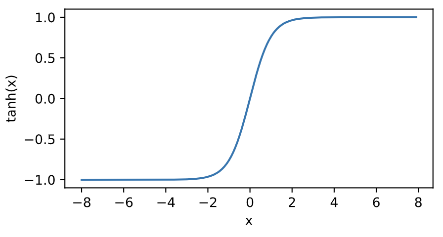

# 3.8 多層感知機

我們已經介紹了包括線性迴歸和softmax迴歸在內的單層神經網絡。然而深度學習主要關注多層模型。在本節中，我們將以多層感知機（multilayer perceptron，MLP）為例，介紹多層神經網絡的概念。

## 3.8.1 隱藏層

多層感知機在單層神經網絡的基礎上引入了一到多個隱藏層（hidden layer）。隱藏層位於輸入層和輸出層之間。圖3.3展示了一個多層感知機的神經網絡圖，它含有一個隱藏層，該層中有5個隱藏單元。

<div align=center>

</div>
<div align=center> 圖3.3 帶有隱藏層的多層感知機</div>

在圖3.3所示的多層感知機中，輸入和輸出個數分別為4和3，中間的隱藏層中包含了5個隱藏單元（hidden unit）。由於輸入層不涉及計算，圖3.3中的多層感知機的層數為2。由圖3.3可見，隱藏層中的神經元和輸入層中各個輸入完全連接，輸出層中的神經元和隱藏層中的各個神經元也完全連接。因此，多層感知機中的隱藏層和輸出層都是全連接層。


具體來說，給定一個小批量樣本$\boldsymbol{X} \in \mathbb{R}^{n \times d}$，其批量大小為$n$，輸入個數為$d$。假設多層感知機只有一個隱藏層，其中隱藏單元個數為$h$。記隱藏層的輸出（也稱為隱藏層變量或隱藏變量）為$\boldsymbol{H}$，有$\boldsymbol{H} \in \mathbb{R}^{n \times h}$。因為隱藏層和輸出層均是全連接層，可以設隱藏層的權重參數和偏差參數分別為$\boldsymbol{W}_h \in \mathbb{R}^{d \times h}$和 $\boldsymbol{b}_h \in \mathbb{R}^{1 \times h}$，輸出層的權重和偏差參數分別為$\boldsymbol{W}_o \in \mathbb{R}^{h \times q}$和$\boldsymbol{b}_o \in \mathbb{R}^{1 \times q}$。

我們先來看一種含單隱藏層的多層感知機的設計。其輸出$\boldsymbol{O} \in \mathbb{R}^{n \times q}$的計算為

$$
\begin{aligned}
\boldsymbol{H} &= \boldsymbol{X} \boldsymbol{W}_h + \boldsymbol{b}_h,\\
\boldsymbol{O} &= \boldsymbol{H} \boldsymbol{W}_o + \boldsymbol{b}_o,
\end{aligned}      
$$

也就是將隱藏層的輸出直接作為輸出層的輸入。如果將以上兩個式子聯立起來，可以得到

$$
\boldsymbol{O} = (\boldsymbol{X} \boldsymbol{W}_h + \boldsymbol{b}_h)\boldsymbol{W}_o + \boldsymbol{b}_o = \boldsymbol{X} \boldsymbol{W}_h\boldsymbol{W}_o + \boldsymbol{b}_h \boldsymbol{W}_o + \boldsymbol{b}_o.
$$

從聯立後的式子可以看出，雖然神經網絡引入了隱藏層，卻依然等價於一個單層神經網絡：其中輸出層權重參數為$\boldsymbol{W}_h\boldsymbol{W}_o$，偏差參數為$\boldsymbol{b}_h \boldsymbol{W}_o + \boldsymbol{b}_o$。不難發現，即便再添加更多的隱藏層，以上設計依然只能與僅含輸出層的單層神經網絡等價。


## 3.8.2 激活函數

上述問題的根源在於全連接層只是對數據做仿射變換（affine transformation），而多個仿射變換的疊加仍然是一個仿射變換。解決問題的一個方法是引入非線性變換，例如對隱藏變量使用按元素運算的非線性函數進行變換，然後再作為下一個全連接層的輸入。這個非線性函數被稱為激活函數（activation function）。下面我們介紹幾個常用的激活函數。

### 3.8.2.1 ReLU函數

ReLU（rectified linear unit）函數提供了一個很簡單的非線性變換。給定元素$x$，該函數定義為

$$\text{ReLU}(x) = \max(x, 0).$$

可以看出，ReLU函數只保留正數元素，並將負數元素清零。為了直觀地觀察這一非線性變換，我們先定義一個繪圖函數`xyplot`。

``` python
%matplotlib inline
import torch
import numpy as np
import matplotlib.pylab as plt
import sys
sys.path.append("..") 
import d2lzh_pytorch as d2l

def xyplot(x_vals, y_vals, name):
    d2l.set_figsize(figsize=(5, 2.5))
    d2l.plt.plot(x_vals.detach().numpy(), y_vals.detach().numpy())
    d2l.plt.xlabel('x')
    d2l.plt.ylabel(name + '(x)')
```


我們接下來通過`Tensor`提供的`relu`函數來繪製ReLU函數。可以看到，該激活函數是一個兩段線性函數。

``` python
x = torch.arange(-8.0, 8.0, 0.1, requires_grad=True)
y = x.relu()
xyplot(x, y, 'relu')
```

<div align=center>

</div>

顯然，當輸入為負數時，ReLU函數的導數為0；當輸入為正數時，ReLU函數的導數為1。儘管輸入為0時ReLU函數不可導，但是我們可以取此處的導數為0。下面繪製ReLU函數的導數。

``` python
y.sum().backward()
xyplot(x, x.grad, 'grad of relu')
```
<div align=center>

</div>

### 3.8.2.2 sigmoid函數

sigmoid函數可以將元素的值變換到0和1之間：

$$\text{sigmoid}(x) = \frac{1}{1 + \exp(-x)}.$$

sigmoid函數在早期的神經網絡中較為普遍，但它目前逐漸被更簡單的ReLU函數取代。在後面“循環神經網絡”一章中我們會介紹如何利用它值域在0到1之間這一特性來控制信息在神經網絡中的流動。下面繪製了sigmoid函數。當輸入接近0時，sigmoid函數接近線性變換。

``` python
y = x.sigmoid()
xyplot(x, y, 'sigmoid')
```
<div align=center>

</div>

依據鏈式法則，sigmoid函數的導數

$$\text{sigmoid}'(x) = \text{sigmoid}(x)\left(1-\text{sigmoid}(x)\right).$$


下面繪製了sigmoid函數的導數。當輸入為0時，sigmoid函數的導數達到最大值0.25；當輸入越偏離0時，sigmoid函數的導數越接近0。

``` python
x.grad.zero_()
y.sum().backward()
xyplot(x, x.grad, 'grad of sigmoid')
```
<div align=center>

</div>

### 3.8.2.3 tanh函數

tanh（雙曲正切）函數可以將元素的值變換到-1和1之間：

$$\text{tanh}(x) = \frac{1 - \exp(-2x)}{1 + \exp(-2x)}.$$

我們接著繪製tanh函數。當輸入接近0時，tanh函數接近線性變換。雖然該函數的形狀和sigmoid函數的形狀很像，但tanh函數在座標系的原點上對稱。

``` python
y = x.tanh()
xyplot(x, y, 'tanh')
```
<div align=center>

</div>

依據鏈式法則，tanh函數的導數

$$\text{tanh}'(x) = 1 - \text{tanh}^2(x).$$

下面繪製了tanh函數的導數。當輸入為0時，tanh函數的導數達到最大值1；當輸入越偏離0時，tanh函數的導數越接近0。

``` python
x.grad.zero_()
y.sum().backward()
xyplot(x, x.grad, 'grad of tanh')
```
<div align=center>

</div>

## 3.8.3 多層感知機

多層感知機就是含有至少一個隱藏層的由全連接層組成的神經網絡，且每個隱藏層的輸出通過激活函數進行變換。多層感知機的層數和各隱藏層中隱藏單元個數都是超參數。以單隱藏層為例並沿用本節之前定義的符號，多層感知機按以下方式計算輸出：

$$
\begin{aligned}
\boldsymbol{H} &= \phi(\boldsymbol{X} \boldsymbol{W}_h + \boldsymbol{b}_h),\\
\boldsymbol{O} &= \boldsymbol{H} \boldsymbol{W}_o + \boldsymbol{b}_o,
\end{aligned}
$$
 
其中$\phi$表示激活函數。在分類問題中，我們可以對輸出$\boldsymbol{O}$做softmax運算，並使用softmax迴歸中的交叉熵損失函數。
在迴歸問題中，我們將輸出層的輸出個數設為1，並將輸出$\boldsymbol{O}$直接提供給線性迴歸中使用的平方損失函數。


## 小結

* 多層感知機在輸出層與輸入層之間加入了一個或多個全連接隱藏層，並通過激活函數對隱藏層輸出進行變換。
* 常用的激活函數包括ReLU函數、sigmoid函數和tanh函數。


-----------
> 注：本節除了代碼之外與原書基本相同，[原書傳送門](https://zh.d2l.ai/chapter_deep-learning-basics/mlp.html)
