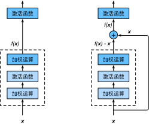

# 5.11 殘差網絡（ResNet）

讓我們先思考一個問題：對神經網絡模型添加新的層，充分訓練後的模型是否只可能更有效地降低訓練誤差？理論上，原模型解的空間只是新模型解的空間的子空間。也就是說，如果我們能將新添加的層訓練成恆等映射$f(x) = x$，新模型和原模型將同樣有效。由於新模型可能得出更優的解來擬合訓練數據集，因此添加層似乎更容易降低訓練誤差。然而在實踐中，添加過多的層後訓練誤差往往不降反升。即使利用批量歸一化帶來的數值穩定性使訓練深層模型更加容易，該問題仍然存在。針對這一問題，何愷明等人提出了殘差網絡（ResNet） [1]。它在2015年的ImageNet圖像識別挑戰賽奪魁，並深刻影響了後來的深度神經網絡的設計。


## 5.11.2 殘差塊

讓我們聚焦於神經網絡局部。如圖5.9所示，設輸入為$\boldsymbol{x}$。假設我們希望學出的理想映射為$f(\boldsymbol{x})$，從而作為圖5.9上方激活函數的輸入。左圖虛線框中的部分需要直接擬合出該映射$f(\boldsymbol{x})$，而右圖虛線框中的部分則需要擬合出有關恆等映射的殘差映射$f(\boldsymbol{x})-\boldsymbol{x}$。殘差映射在實際中往往更容易優化。以本節開頭提到的恆等映射作為我們希望學出的理想映射$f(\boldsymbol{x})$。我們只需將圖5.9中右圖虛線框內上方的加權運算（如仿射）的權重和偏差參數學成0，那麼$f(\boldsymbol{x})$即為恆等映射。實際中，當理想映射$f(\boldsymbol{x})$極接近於恆等映射時，殘差映射也易於捕捉恆等映射的細微波動。圖5.9右圖也是ResNet的基礎塊，即殘差塊（residual block）。在殘差塊中，輸入可通過跨層的數據線路更快地向前傳播。

<div align=center>

</div>
<div align=center>圖5.9 普通的網絡結構（左）與加入殘差連接的網絡結構（右）</div>

ResNet沿用了VGG全$3\times 3$卷積層的設計。殘差塊裡首先有2個有相同輸出通道數的$3\times 3$卷積層。每個卷積層後接一個批量歸一化層和ReLU激活函數。然後我們將輸入跳過這兩個卷積運算後直接加在最後的ReLU激活函數前。這樣的設計要求兩個卷積層的輸出與輸入形狀一樣，從而可以相加。如果想改變通道數，就需要引入一個額外的$1\times 1$卷積層來將輸入變換成需要的形狀後再做相加運算。

殘差塊的實現如下。它可以設定輸出通道數、是否使用額外的$1\times 1$卷積層來修改通道數以及卷積層的步幅。

``` python
import time
import torch
from torch import nn, optim
import torch.nn.functional as F

import sys
sys.path.append("..") 
import d2lzh_pytorch as d2l
device = torch.device('cuda' if torch.cuda.is_available() else 'cpu')

class Residual(nn.Module):  # 本類已保存在d2lzh_pytorch包中方便以後使用
    def __init__(self, in_channels, out_channels, use_1x1conv=False, stride=1):
        super(Residual, self).__init__()
        self.conv1 = nn.Conv2d(in_channels, out_channels, kernel_size=3, padding=1, stride=stride)
        self.conv2 = nn.Conv2d(out_channels, out_channels, kernel_size=3, padding=1)
        if use_1x1conv:
            self.conv3 = nn.Conv2d(in_channels, out_channels, kernel_size=1, stride=stride)
        else:
            self.conv3 = None
        self.bn1 = nn.BatchNorm2d(out_channels)
        self.bn2 = nn.BatchNorm2d(out_channels)

    def forward(self, X):
        Y = F.relu(self.bn1(self.conv1(X)))
        Y = self.bn2(self.conv2(Y))
        if self.conv3:
            X = self.conv3(X)
        return F.relu(Y + X)
```

下面我們來查看輸入和輸出形狀一致的情況。

``` python
blk = Residual(3, 3)
X = torch.rand((4, 3, 6, 6))
blk(X).shape # torch.Size([4, 3, 6, 6])
```

我們也可以在增加輸出通道數的同時減半輸出的高和寬。

``` python
blk = Residual(3, 6, use_1x1conv=True, stride=2)
blk(X).shape # torch.Size([4, 6, 3, 3])
```

## 5.11.2 ResNet模型

ResNet的前兩層跟之前介紹的GoogLeNet中的一樣：在輸出通道數為64、步幅為2的$7\times 7$卷積層後接步幅為2的$3\times 3$的最大池化層。不同之處在於ResNet每個卷積層後增加的批量歸一化層。

``` python
net = nn.Sequential(
        nn.Conv2d(1, 64, kernel_size=7, stride=2, padding=3),
        nn.BatchNorm2d(64), 
        nn.ReLU(),
        nn.MaxPool2d(kernel_size=3, stride=2, padding=1))
```

GoogLeNet在後面接了4個由Inception塊組成的模塊。ResNet則使用4個由殘差塊組成的模塊，每個模塊使用若干個同樣輸出通道數的殘差塊。第一個模塊的通道數同輸入通道數一致。由於之前已經使用了步幅為2的最大池化層，所以無須減小高和寬。之後的每個模塊在第一個殘差塊裡將上一個模塊的通道數翻倍，並將高和寬減半。

下面我們來實現這個模塊。注意，這裡對第一個模塊做了特別處理。

``` python
def resnet_block(in_channels, out_channels, num_residuals, first_block=False):
    if first_block:
        assert in_channels == out_channels # 第一個模塊的通道數同輸入通道數一致
    blk = []
    for i in range(num_residuals):
        if i == 0 and not first_block:
            blk.append(Residual(in_channels, out_channels, use_1x1conv=True, stride=2))
        else:
            blk.append(Residual(out_channels, out_channels))
    return nn.Sequential(*blk)
```

接著我們為ResNet加入所有殘差塊。這裡每個模塊使用兩個殘差塊。

``` python
net.add_module("resnet_block1", resnet_block(64, 64, 2, first_block=True))
net.add_module("resnet_block2", resnet_block(64, 128, 2))
net.add_module("resnet_block3", resnet_block(128, 256, 2))
net.add_module("resnet_block4", resnet_block(256, 512, 2))
```

最後，與GoogLeNet一樣，加入全局平均池化層後接上全連接層輸出。

``` python
net.add_module("global_avg_pool", d2l.GlobalAvgPool2d()) # GlobalAvgPool2d的輸出: (Batch, 512, 1, 1)
net.add_module("fc", nn.Sequential(d2l.FlattenLayer(), nn.Linear(512, 10))) 
```

這裡每個模塊裡有4個卷積層（不計算$1\times 1$卷積層），加上最開始的卷積層和最後的全連接層，共計18層。這個模型通常也被稱為ResNet-18。通過配置不同的通道數和模塊裡的殘差塊數可以得到不同的ResNet模型，例如更深的含152層的ResNet-152。雖然ResNet的主體架構跟GoogLeNet的類似，但ResNet結構更簡單，修改也更方便。這些因素都導致了ResNet迅速被廣泛使用。

在訓練ResNet之前，我們來觀察一下輸入形狀在ResNet不同模塊之間的變化。

``` python
X = torch.rand((1, 1, 224, 224))
for name, layer in net.named_children():
    X = layer(X)
    print(name, ' output shape:\t', X.shape)
```
輸出：
```
0  output shape:	 torch.Size([1, 64, 112, 112])
1  output shape:	 torch.Size([1, 64, 112, 112])
2  output shape:	 torch.Size([1, 64, 112, 112])
3  output shape:	 torch.Size([1, 64, 56, 56])
resnet_block1  output shape:	 torch.Size([1, 64, 56, 56])
resnet_block2  output shape:	 torch.Size([1, 128, 28, 28])
resnet_block3  output shape:	 torch.Size([1, 256, 14, 14])
resnet_block4  output shape:	 torch.Size([1, 512, 7, 7])
global_avg_pool  output shape:	 torch.Size([1, 512, 1, 1])
fc  output shape:	 torch.Size([1, 10])
```

## 5.11.3 獲取數據和訓練模型

下面我們在Fashion-MNIST數據集上訓練ResNet。

``` python
batch_size = 256
# 如出現“out of memory”的報錯信息，可減小batch_size或resize
train_iter, test_iter = d2l.load_data_fashion_mnist(batch_size, resize=96)

lr, num_epochs = 0.001, 5
optimizer = torch.optim.Adam(net.parameters(), lr=lr)
d2l.train_ch5(net, train_iter, test_iter, batch_size, optimizer, device, num_epochs)
```
輸出：
```
training on  cuda
epoch 1, loss 0.0015, train acc 0.853, test acc 0.885, time 31.0 sec
epoch 2, loss 0.0010, train acc 0.910, test acc 0.899, time 31.8 sec
epoch 3, loss 0.0008, train acc 0.926, test acc 0.911, time 31.6 sec
epoch 4, loss 0.0007, train acc 0.936, test acc 0.916, time 31.8 sec
epoch 5, loss 0.0006, train acc 0.944, test acc 0.926, time 31.5 sec
```

## 小結

* 殘差塊通過跨層的數據通道從而能夠訓練出有效的深度神經網絡。
* ResNet深刻影響了後來的深度神經網絡的設計。


## 參考文獻

[1] He, K., Zhang, X., Ren, S., & Sun, J. (2016). Deep residual learning for image recognition. In Proceedings of the IEEE conference on computer vision and pattern recognition (pp. 770-778).

[2] He, K., Zhang, X., Ren, S., & Sun, J. (2016, October). Identity mappings in deep residual networks. In European Conference on Computer Vision (pp. 630-645). Springer, Cham.

-----------
> 注：除代碼外本節與原書此節基本相同，[原書傳送門](https://zh.d2l.ai/chapter_convolutional-neural-networks/googlenet.html)

