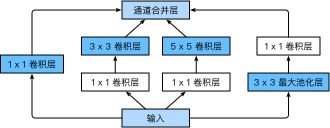

# 5.9 含並行連結的網絡（GoogLeNet）

在2014年的ImageNet圖像識別挑戰賽中，一個名叫GoogLeNet的網絡結構大放異彩 [1]。它雖然在名字上向LeNet致敬，但在網絡結構上已經很難看到LeNet的影子。GoogLeNet吸收了NiN中網絡串聯網絡的思想，並在此基礎上做了很大改進。在隨後的幾年裡，研究人員對GoogLeNet進行了數次改進，本節將介紹這個模型系列的第一個版本。


## 5.9.1 Inception 塊

GoogLeNet中的基礎卷積塊叫作Inception塊，得名於同名電影《盜夢空間》（Inception）。與上一節介紹的NiN塊相比，這個基礎塊在結構上更加複雜，如圖5.8所示。

<div align=center>

</div>
<div align=center>圖5.8 Inception塊的結構</div>

由圖5.8可以看出，Inception塊裡有4條並行的線路。前3條線路使用窗口大小分別是$1\times 1$、$3\times 3$和$5\times 5$的卷積層來抽取不同空間尺寸下的信息，其中中間2個線路會對輸入先做$1\times 1$卷積來減少輸入通道數，以降低模型複雜度。第四條線路則使用$3\times 3$最大池化層，後接$1\times 1$卷積層來改變通道數。4條線路都使用了合適的填充來使輸入與輸出的高和寬一致。最後我們將每條線路的輸出在通道維上連結，並輸入接下來的層中去。

Inception塊中可以自定義的超參數是每個層的輸出通道數，我們以此來控制模型複雜度。

``` python
import time
import torch
from torch import nn, optim
import torch.nn.functional as F

import sys
sys.path.append("..") 
import d2lzh_pytorch as d2l
device = torch.device('cuda' if torch.cuda.is_available() else 'cpu')

class Inception(nn.Module):
    # c1 - c4為每條線路里的層的輸出通道數
    def __init__(self, in_c, c1, c2, c3, c4):
        super(Inception, self).__init__()
        # 線路1，單1 x 1卷積層
        self.p1_1 = nn.Conv2d(in_c, c1, kernel_size=1)
        # 線路2，1 x 1卷積層後接3 x 3卷積層
        self.p2_1 = nn.Conv2d(in_c, c2[0], kernel_size=1)
        self.p2_2 = nn.Conv2d(c2[0], c2[1], kernel_size=3, padding=1)
        # 線路3，1 x 1卷積層後接5 x 5卷積層
        self.p3_1 = nn.Conv2d(in_c, c3[0], kernel_size=1)
        self.p3_2 = nn.Conv2d(c3[0], c3[1], kernel_size=5, padding=2)
        # 線路4，3 x 3最大池化層後接1 x 1卷積層
        self.p4_1 = nn.MaxPool2d(kernel_size=3, stride=1, padding=1)
        self.p4_2 = nn.Conv2d(in_c, c4, kernel_size=1)

    def forward(self, x):
        p1 = F.relu(self.p1_1(x))
        p2 = F.relu(self.p2_2(F.relu(self.p2_1(x))))
        p3 = F.relu(self.p3_2(F.relu(self.p3_1(x))))
        p4 = F.relu(self.p4_2(self.p4_1(x)))
        return torch.cat((p1, p2, p3, p4), dim=1)  # 在通道維上連結輸出
```

## 5.9.2 GoogLeNet模型

GoogLeNet跟VGG一樣，在主體卷積部分中使用5個模塊（block），每個模塊之間使用步幅為2的$3\times 3$最大池化層來減小輸出高寬。第一模塊使用一個64通道的$7\times 7$卷積層。

``` python
b1 = nn.Sequential(nn.Conv2d(1, 64, kernel_size=7, stride=2, padding=3),
                   nn.ReLU(),
                   nn.MaxPool2d(kernel_size=3, stride=2, padding=1))
```

第二模塊使用2個卷積層：首先是64通道的$1\times 1$卷積層，然後是將通道增大3倍的$3\times 3$卷積層。它對應Inception塊中的第二條線路。

``` python
b2 = nn.Sequential(nn.Conv2d(64, 64, kernel_size=1),
                   nn.Conv2d(64, 192, kernel_size=3, padding=1),
                   nn.MaxPool2d(kernel_size=3, stride=2, padding=1))
```

第三模塊串聯2個完整的Inception塊。第一個Inception塊的輸出通道數為$64+128+32+32=256$，其中4條線路的輸出通道數比例為$64:128:32:32=2:4:1:1$。其中第二、第三條線路先分別將輸入通道數減小至$96/192=1/2$和$16/192=1/12$後，再接上第二層卷積層。第二個Inception塊輸出通道數增至$128+192+96+64=480$，每條線路的輸出通道數之比為$128:192:96:64 = 4:6:3:2$。其中第二、第三條線路先分別將輸入通道數減小至$128/256=1/2$和$32/256=1/8$。

``` python
b3 = nn.Sequential(Inception(192, 64, (96, 128), (16, 32), 32),
                   Inception(256, 128, (128, 192), (32, 96), 64),
                   nn.MaxPool2d(kernel_size=3, stride=2, padding=1))
```

第四模塊更加複雜。它串聯了5個Inception塊，其輸出通道數分別是$192+208+48+64=512$、$160+224+64+64=512$、$128+256+64+64=512$、$112+288+64+64=528$和$256+320+128+128=832$。這些線路的通道數分配和第三模塊中的類似，首先含$3\times 3$卷積層的第二條線路輸出最多通道，其次是僅含$1\times 1$卷積層的第一條線路，之後是含$5\times 5$卷積層的第三條線路和含$3\times 3$最大池化層的第四條線路。其中第二、第三條線路都會先按比例減小通道數。這些比例在各個Inception塊中都略有不同。

``` python
b4 = nn.Sequential(Inception(480, 192, (96, 208), (16, 48), 64),
                   Inception(512, 160, (112, 224), (24, 64), 64),
                   Inception(512, 128, (128, 256), (24, 64), 64),
                   Inception(512, 112, (144, 288), (32, 64), 64),
                   Inception(528, 256, (160, 320), (32, 128), 128),
                   nn.MaxPool2d(kernel_size=3, stride=2, padding=1))
```

第五模塊有輸出通道數為$256+320+128+128=832$和$384+384+128+128=1024$的兩個Inception塊。其中每條線路的通道數的分配思路和第三、第四模塊中的一致，只是在具體數值上有所不同。需要注意的是，第五模塊的後面緊跟輸出層，該模塊同NiN一樣使用全局平均池化層來將每個通道的高和寬變成1。最後我們將輸出變成二維數組後接上一個輸出個數為標籤類別數的全連接層。

``` python
b5 = nn.Sequential(Inception(832, 256, (160, 320), (32, 128), 128),
                   Inception(832, 384, (192, 384), (48, 128), 128),
                   d2l.GlobalAvgPool2d())

net = nn.Sequential(b1, b2, b3, b4, b5, 
                    d2l.FlattenLayer(), nn.Linear(1024, 10))
```

GoogLeNet模型的計算複雜，而且不如VGG那樣便於修改通道數。本節裡我們將輸入的高和寬從224降到96來簡化計算。下面演示各個模塊之間的輸出的形狀變化。

``` python
net = nn.Sequential(b1, b2, b3, b4, b5, d2l.FlattenLayer(), nn.Linear(1024, 10))
X = torch.rand(1, 1, 96, 96)
for blk in net.children(): 
    X = blk(X)
    print('output shape: ', X.shape)
```
輸出：
```
output shape:  torch.Size([1, 64, 24, 24])
output shape:  torch.Size([1, 192, 12, 12])
output shape:  torch.Size([1, 480, 6, 6])
output shape:  torch.Size([1, 832, 3, 3])
output shape:  torch.Size([1, 1024, 1, 1])
output shape:  torch.Size([1, 1024])
output shape:  torch.Size([1, 10])
```

## 5.9.3 獲取數據和訓練模型

我們使用高和寬均為96像素的圖像來訓練GoogLeNet模型。訓練使用的圖像依然來自Fashion-MNIST數據集。

``` python
batch_size = 128
# 如出現“out of memory”的報錯信息，可減小batch_size或resize
train_iter, test_iter = d2l.load_data_fashion_mnist(batch_size, resize=96)

lr, num_epochs = 0.001, 5
optimizer = torch.optim.Adam(net.parameters(), lr=lr)
d2l.train_ch5(net, train_iter, test_iter, batch_size, optimizer, device, num_epochs)
```
輸出：
```
training on  cuda
epoch 1, loss 0.0087, train acc 0.570, test acc 0.831, time 45.5 sec
epoch 2, loss 0.0032, train acc 0.851, test acc 0.853, time 48.5 sec
epoch 3, loss 0.0026, train acc 0.880, test acc 0.883, time 45.4 sec
epoch 4, loss 0.0022, train acc 0.895, test acc 0.887, time 46.6 sec
epoch 5, loss 0.0020, train acc 0.906, test acc 0.896, time 43.5 sec
```

## 小結

* Inception塊相當於一個有4條線路的子網絡。它通過不同窗口形狀的卷積層和最大池化層來並行抽取信息，並使用$1\times 1$卷積層減少通道數從而降低模型複雜度。
* GoogLeNet將多個設計精細的Inception塊和其他層串聯起來。其中Inception塊的通道數分配之比是在ImageNet數據集上通過大量的實驗得來的。
* GoogLeNet和它的後繼者們一度是ImageNet上最高效的模型之一：在類似的測試精度下，它們的計算複雜度往往更低。

## 參考文獻

[1] Szegedy, C., Liu, W., Jia, Y., Sermanet, P., Reed, S., & Anguelov, D. & Rabinovich, A.(2015). Going deeper with convolutions. In Proceedings of the IEEE conference on computer vision and pattern recognition (pp. 1-9).

[2] Ioffe, S., & Szegedy, C. (2015). Batch normalization: Accelerating deep network training by reducing internal covariate shift. arXiv preprint arXiv:1502.03167.

[3] Szegedy, C., Vanhoucke, V., Ioffe, S., Shlens, J., & Wojna, Z. (2016). Rethinking the inception architecture for computer vision. In Proceedings of the IEEE Conference on Computer Vision and Pattern Recognition (pp. 2818-2826).

[4] Szegedy, C., Ioffe, S., Vanhoucke, V., & Alemi, A. A. (2017, February). Inception-v4, inception-resnet and the impact of residual connections on learning. In Proceedings of the AAAI Conference on Artificial Intelligence (Vol. 4, p. 12).

-----------
> 注：除代碼外本節與原書此節基本相同，[原書傳送門](https://zh.d2l.ai/chapter_convolutional-neural-networks/googlenet.html)

