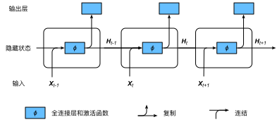

# 6.2 循環神經網絡

上一節介紹的$n$元語法中，時間步$t$的詞$w_t$基於前面所有詞的條件概率只考慮了最近時間步的$n-1$個詞。如果要考慮比$t-(n-1)$更早時間步的詞對$w_t$的可能影響，我們需要增大$n$。但這樣模型參數的數量將隨之呈指數級增長。

本節將介紹循環神經網絡。它並非剛性地記憶所有固定長度的序列，而是通過隱藏狀態來存儲之前時間步的信息。首先我們回憶一下前面介紹過的多層感知機，然後描述如何添加隱藏狀態來將它變成循環神經網絡。


## 6.2.1 不含隱藏狀態的神經網絡

讓我們考慮一個含單隱藏層的多層感知機。給定樣本數為$n$、輸入個數（特徵數或特徵向量維度）為$d$的小批量數據樣本$\boldsymbol{X} \in \mathbb{R}^{n \times d}$。設隱藏層的激活函數為$\phi$，那麼隱藏層的輸出$\boldsymbol{H} \in \mathbb{R}^{n \times h}$計算為

$$\boldsymbol{H} = \phi(\boldsymbol{X} \boldsymbol{W}_{xh} + \boldsymbol{b}_h),$$

其中隱藏層權重參數$\boldsymbol{W}_{xh} \in \mathbb{R}^{d \times h}$，隱藏層偏差參數 $\boldsymbol{b}_h \in \mathbb{R}^{1 \times h}$，$h$為隱藏單元個數。上式相加的兩項形狀不同，因此將按照廣播機制相加。把隱藏變量$\boldsymbol{H}$作為輸出層的輸入，且設輸出個數為$q$（如分類問題中的類別數），輸出層的輸出為

$$\boldsymbol{O} = \boldsymbol{H} \boldsymbol{W}_{hq} + \boldsymbol{b}_q,$$

其中輸出變量$\boldsymbol{O} \in \mathbb{R}^{n \times q}$, 輸出層權重參數$\boldsymbol{W}_{hq} \in \mathbb{R}^{h \times q}$, 輸出層偏差參數$\boldsymbol{b}_q \in \mathbb{R}^{1 \times q}$。如果是分類問題，我們可以使用$\text{softmax}(\boldsymbol{O})$來計算輸出類別的概率分佈。


## 6.2.2 含隱藏狀態的循環神經網絡

現在我們考慮輸入數據存在時間相關性的情況。假設$\boldsymbol{X}_t \in \mathbb{R}^{n \times d}$是序列中時間步$t$的小批量輸入，$\boldsymbol{H}_t  \in \mathbb{R}^{n \times h}$是該時間步的隱藏變量。與多層感知機不同的是，這裡我們保存上一時間步的隱藏變量$\boldsymbol{H}_{t-1}$，並引入一個新的權重參數$\boldsymbol{W}_{hh} \in \mathbb{R}^{h \times h}$，該參數用來描述在當前時間步如何使用上一時間步的隱藏變量。具體來說，時間步$t$的隱藏變量的計算由當前時間步的輸入和上一時間步的隱藏變量共同決定：

$$\boldsymbol{H}_t = \phi(\boldsymbol{X}_t \boldsymbol{W}_{xh} + \boldsymbol{H}_{t-1} \boldsymbol{W}_{hh}  + \boldsymbol{b}_h).$$

與多層感知機相比，我們在這裡添加了$\boldsymbol{H}_{t-1} \boldsymbol{W}_{hh}$一項。由上式中相鄰時間步的隱藏變量$\boldsymbol{H}_t$和$\boldsymbol{H}_{t-1}$之間的關係可知，這裡的隱藏變量能夠捕捉截至當前時間步的序列的歷史信息，就像是神經網絡當前時間步的狀態或記憶一樣。因此，該隱藏變量也稱為隱藏狀態。由於隱藏狀態在當前時間步的定義使用了上一時間步的隱藏狀態，上式的計算是循環的。使用循環計算的網絡即循環神經網絡（recurrent neural network）。

循環神經網絡有很多種不同的構造方法。含上式所定義的隱藏狀態的循環神經網絡是極為常見的一種。若無特別說明，本章中的循環神經網絡均基於上式中隱藏狀態的循環計算。在時間步$t$，輸出層的輸出和多層感知機中的計算類似：

$$\boldsymbol{O}_t = \boldsymbol{H}_t \boldsymbol{W}_{hq} + \boldsymbol{b}_q.$$

循環神經網絡的參數包括隱藏層的權重$\boldsymbol{W}_{xh} \in \mathbb{R}^{d \times h}$、$\boldsymbol{W}_{hh} \in \mathbb{R}^{h \times h}$和偏差 $\boldsymbol{b}_h \in \mathbb{R}^{1 \times h}$，以及輸出層的權重$\boldsymbol{W}_{hq} \in \mathbb{R}^{h \times q}$和偏差$\boldsymbol{b}_q \in \mathbb{R}^{1 \times q}$。值得一提的是，即便在不同時間步，循環神經網絡也始終使用這些模型參數。因此，循環神經網絡模型參數的數量不隨時間步的增加而增長。

圖6.1展示了循環神經網絡在3個相鄰時間步的計算邏輯。在時間步$t$，隱藏狀態的計算可以看成是將輸入$\boldsymbol{X}_t$和前一時間步隱藏狀態$\boldsymbol{H}_{t-1}$連結後輸入一個激活函數為$\phi$的全連接層。該全連接層的輸出就是當前時間步的隱藏狀態$\boldsymbol{H}_t$，且模型參數為$\boldsymbol{W}_{xh}$與$\boldsymbol{W}_{hh}$的連結，偏差為$\boldsymbol{b}_h$。當前時間步$t$的隱藏狀態$\boldsymbol{H}_t$將參與下一個時間步$t+1$的隱藏狀態$\boldsymbol{H}_{t+1}$的計算，並輸入到當前時間步的全連接輸出層。

<div align=center>

</div>
<div align=center>圖6.1 含隱藏狀態的循環神經網絡</div>

我們剛剛提到，隱藏狀態中$\boldsymbol{X}_t \boldsymbol{W}_{xh} + \boldsymbol{H}_{t-1} \boldsymbol{W}_{hh}$的計算等價於$\boldsymbol{X}_t$與$\boldsymbol{H}_{t-1}$連結後的矩陣乘以$\boldsymbol{W}_{xh}$與$\boldsymbol{W}_{hh}$連結後的矩陣。接下來，我們用一個具體的例子來驗證這一點。首先，我們構造矩陣`X`、`W_xh`、`H`和`W_hh`，它們的形狀分別為(3, 1)、(1, 4)、(3, 4)和(4, 4)。將`X`與`W_xh`、`H`與`W_hh`分別相乘，再把兩個乘法運算的結果相加，得到形狀為(3, 4)的矩陣。

``` python
import torch

X, W_xh = torch.randn(3, 1), torch.randn(1, 4)
H, W_hh = torch.randn(3, 4), torch.randn(4, 4)
torch.matmul(X, W_xh) + torch.matmul(H, W_hh)
```
輸出：
```
tensor([[ 5.2633, -3.2288,  0.6037, -1.3321],
        [ 9.4012, -6.7830,  1.0630, -0.1809],
        [ 7.0355, -2.2361,  0.7469, -3.4667]])
```

將矩陣`X`和`H`按列（維度1）連結，連結後的矩陣形狀為(3, 5)。可見，連結後矩陣在維度1的長度為矩陣`X`和`H`在維度1的長度之和（$1+4$）。然後，將矩陣`W_xh`和`W_hh`按行（維度0）連結，連結後的矩陣形狀為(5, 4)。最後將兩個連結後的矩陣相乘，得到與上面代碼輸出相同的形狀為(3, 4)的矩陣。

``` python
torch.matmul(torch.cat((X, H), dim=1), torch.cat((W_xh, W_hh), dim=0))
```
輸出：
```
tensor([[ 5.2633, -3.2288,  0.6037, -1.3321],
        [ 9.4012, -6.7830,  1.0630, -0.1809],
        [ 7.0355, -2.2361,  0.7469, -3.4667]])
```

## 6.2.3 應用：基於字符級循環神經網絡的語言模型

最後我們介紹如何應用循環神經網絡來構建一個語言模型。設小批量中樣本數為1，文本序列為“想”“要”“有”“直”“升”“機”。圖6.2演示瞭如何使用循環神經網絡基於當前和過去的字符來預測下一個字符。在訓練時，我們對每個時間步的輸出層輸出使用softmax運算，然後使用交叉熵損失函數來計算它與標籤的誤差。在圖6.2中，由於隱藏層中隱藏狀態的循環計算，時間步3的輸出$\boldsymbol{O}_3$取決於文本序列“想”“要”“有”。 由於訓練數據中該序列的下一個詞為“直”，時間步3的損失將取決於該時間步基於序列“想”“要”“有”生成下一個詞的概率分佈與該時間步的標籤“直”。

<div align=center>

</div>
<div align=center>圖6.2 基於字符級循環神經網絡的語言模型。</div>


因為每個輸入詞是一個字符，因此這個模型被稱為字符級循環神經網絡（character-level recurrent neural network）。因為不同字符的個數遠小於不同詞的個數（對於英文尤其如此），所以字符級循環神經網絡的計算通常更加簡單。在接下來的幾節裡，我們將介紹它的具體實現。


## 小結

* 使用循環計算的網絡即循環神經網絡。
* 循環神經網絡的隱藏狀態可以捕捉截至當前時間步的序列的歷史信息。
* 循環神經網絡模型參數的數量不隨時間步的增加而增長。
* 可以基於字符級循環神經網絡來創建語言模型。

-----------
> 注：除代碼外本節與原書此節基本相同，[原書傳送門](https://zh.d2l.ai/chapter_recurrent-neural-networks/rnn.html)

