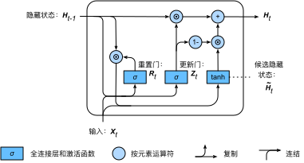

# 6.7 門控循環單元（GRU）

上一節介紹了循環神經網絡中的梯度計算方法。我們發現，當時間步數較大或者時間步較小時，循環神經網絡的梯度較容易出現衰減或爆炸。雖然裁剪梯度可以應對梯度爆炸，但無法解決梯度衰減的問題。通常由於這個原因，循環神經網絡在實際中較難捕捉時間序列中時間步距離較大的依賴關係。

門控循環神經網絡（gated recurrent neural network）的提出，正是為了更好地捕捉時間序列中時間步距離較大的依賴關係。它通過可以學習的門來控制信息的流動。其中，門控循環單元（gated recurrent unit，GRU）是一種常用的門控循環神經網絡 [1, 2]。另一種常用的門控循環神經網絡則將在下一節中介紹。


## 6.7.1 門控循環單元

下面將介紹門控循環單元的設計。它引入了重置門（reset gate）和更新門（update gate）的概念，從而修改了循環神經網絡中隱藏狀態的計算方式。

### 6.7.1.1 重置門和更新門

如圖6.4所示，門控循環單元中的重置門和更新門的輸入均為當前時間步輸入$\boldsymbol{X}_t$與上一時間步隱藏狀態$\boldsymbol{H}_{t-1}$，輸出由激活函數為sigmoid函數的全連接層計算得到。

<div align=center>

</div>
<div align=center>圖6.4 門控循環單元中重置門和更新門的計算</div>


具體來說，假設隱藏單元個數為$h$，給定時間步$t$的小批量輸入$\boldsymbol{X}_t \in \mathbb{R}^{n \times d}$（樣本數為$n$，輸入個數為$d$）和上一時間步隱藏狀態$\boldsymbol{H}_{t-1} \in \mathbb{R}^{n \times h}$。重置門$\boldsymbol{R}_t \in \mathbb{R}^{n \times h}$和更新門$\boldsymbol{Z}_t \in \mathbb{R}^{n \times h}$的計算如下：

$$
\begin{aligned}
\boldsymbol{R}_t = \sigma(\boldsymbol{X}_t \boldsymbol{W}_{xr} + \boldsymbol{H}_{t-1} \boldsymbol{W}_{hr} + \boldsymbol{b}_r),\\
\boldsymbol{Z}_t = \sigma(\boldsymbol{X}_t \boldsymbol{W}_{xz} + \boldsymbol{H}_{t-1} \boldsymbol{W}_{hz} + \boldsymbol{b}_z),
\end{aligned}
$$

其中$\boldsymbol{W}_{xr}, \boldsymbol{W}_{xz} \in \mathbb{R}^{d \times h}$和$\boldsymbol{W}_{hr}, \boldsymbol{W}_{hz} \in \mathbb{R}^{h \times h}$是權重參數，$\boldsymbol{b}_r, \boldsymbol{b}_z \in \mathbb{R}^{1 \times h}$是偏差參數。3.8節（多層感知機）節中介紹過，sigmoid函數可以將元素的值變換到0和1之間。因此，重置門$\boldsymbol{R}_t$和更新門$\boldsymbol{Z}_t$中每個元素的值域都是$[0, 1]$。

### 6.7.1.2 候選隱藏狀態

接下來，門控循環單元將計算候選隱藏狀態來輔助稍後的隱藏狀態計算。如圖6.5所示，我們將當前時間步重置門的輸出與上一時間步隱藏狀態做按元素乘法（符號為$\odot$）。如果重置門中元素值接近0，那麼意味著重置對應隱藏狀態元素為0，即丟棄上一時間步的隱藏狀態。如果元素值接近1，那麼表示保留上一時間步的隱藏狀態。然後，將按元素乘法的結果與當前時間步的輸入連結，再通過含激活函數tanh的全連接層計算出候選隱藏狀態，其所有元素的值域為$[-1, 1]$。

<div align=center>

</div>
<div align=center>圖6.5 門控循環單元中候選隱藏狀態的計算</div>

具體來說，時間步$t$的候選隱藏狀態$\tilde{\boldsymbol{H}}_t \in \mathbb{R}^{n \times h}$的計算為

$$\tilde{\boldsymbol{H}}_t = \text{tanh}(\boldsymbol{X}_t \boldsymbol{W}_{xh} + \left(\boldsymbol{R}_t \odot \boldsymbol{H}_{t-1}\right) \boldsymbol{W}_{hh} + \boldsymbol{b}_h),$$

其中$\boldsymbol{W}_{xh} \in \mathbb{R}^{d \times h}$和$\boldsymbol{W}_{hh} \in \mathbb{R}^{h \times h}$是權重參數，$\boldsymbol{b}_h \in \mathbb{R}^{1 \times h}$是偏差參數。從上面這個公式可以看出，重置門控制了上一時間步的隱藏狀態如何流入當前時間步的候選隱藏狀態。而上一時間步的隱藏狀態可能包含了時間序列截至上一時間步的全部歷史信息。因此，重置門可以用來丟棄與預測無關的歷史信息。

### 6.7.1.3 隱藏狀態

最後，時間步$t$的隱藏狀態$\boldsymbol{H}_t \in \mathbb{R}^{n \times h}$的計算使用當前時間步的更新門$\boldsymbol{Z}_t$來對上一時間步的隱藏狀態$\boldsymbol{H}_{t-1}$和當前時間步的候選隱藏狀態$\tilde{\boldsymbol{H}}_t$做組合：

$$\boldsymbol{H}_t = \boldsymbol{Z}_t \odot \boldsymbol{H}_{t-1}  + (1 - \boldsymbol{Z}_t) \odot \tilde{\boldsymbol{H}}_t.$$

<div align=center>

</div>
<div align=center>圖6.6 門控循環單元中隱藏狀態的計算</div>


值得注意的是，更新門可以控制隱藏狀態應該如何被包含當前時間步信息的候選隱藏狀態所更新，如圖6.6所示。假設更新門在時間步$t'$到$t$（$t' < t$）之間一直近似1。那麼，在時間步$t'$到$t$之間的輸入信息幾乎沒有流入時間步$t$的隱藏狀態$\boldsymbol{H}_t$。實際上，這可以看作是較早時刻的隱藏狀態$\boldsymbol{H}_{t'-1}$一直通過時間保存並傳遞至當前時間步$t$。這個設計可以應對循環神經網絡中的梯度衰減問題，並更好地捕捉時間序列中時間步距離較大的依賴關係。

我們對門控循環單元的設計稍作總結：

* 重置門有助於捕捉時間序列裡短期的依賴關係；
* 更新門有助於捕捉時間序列里長期的依賴關係。

## 6.7.2 讀取數據集

為了實現並展示門控循環單元，下面依然使用周杰倫歌詞數據集來訓練模型作詞。這裡除門控循環單元以外的實現已在6.2節（循環神經網絡）中介紹過。以下為讀取數據集部分。

``` python
import numpy as np
import torch
from torch import nn, optim
import torch.nn.functional as F

import sys
sys.path.append("..") 
import d2lzh_pytorch as d2l
device = torch.device('cuda' if torch.cuda.is_available() else 'cpu')

(corpus_indices, char_to_idx, idx_to_char, vocab_size) = d2l.load_data_jay_lyrics()
```

## 6.7.3 從零開始實現

我們先介紹如何從零開始實現門控循環單元。

### 6.7.3.1 初始化模型參數

下面的代碼對模型參數進行初始化。超參數`num_hiddens`定義了隱藏單元的個數。

``` python
num_inputs, num_hiddens, num_outputs = vocab_size, 256, vocab_size
print('will use', device)

def get_params():
    def _one(shape):
        ts = torch.tensor(np.random.normal(0, 0.01, size=shape), device=device, dtype=torch.float32)
        return torch.nn.Parameter(ts, requires_grad=True)
    def _three():
        return (_one((num_inputs, num_hiddens)),
                _one((num_hiddens, num_hiddens)),
                torch.nn.Parameter(torch.zeros(num_hiddens, device=device, dtype=torch.float32), requires_grad=True))
    
    W_xz, W_hz, b_z = _three()  # 更新門參數
    W_xr, W_hr, b_r = _three()  # 重置門參數
    W_xh, W_hh, b_h = _three()  # 候選隱藏狀態參數
    
    # 輸出層參數
    W_hq = _one((num_hiddens, num_outputs))
    b_q = torch.nn.Parameter(torch.zeros(num_outputs, device=device, dtype=torch.float32), requires_grad=True)
    return nn.ParameterList([W_xz, W_hz, b_z, W_xr, W_hr, b_r, W_xh, W_hh, b_h, W_hq, b_q])
```

### 6.7.3.2 定義模型

下面的代碼定義隱藏狀態初始化函數`init_gru_state`。同6.4節（循環神經網絡的從零開始實現）中定義的`init_rnn_state`函數一樣，它返回由一個形狀為(批量大小, 隱藏單元個數)的值為0的`Tensor`組成的元組。

``` python
def init_gru_state(batch_size, num_hiddens, device):
    return (torch.zeros((batch_size, num_hiddens), device=device), )
```

下面根據門控循環單元的計算表達式定義模型。

``` python
def gru(inputs, state, params):
    W_xz, W_hz, b_z, W_xr, W_hr, b_r, W_xh, W_hh, b_h, W_hq, b_q = params
    H, = state
    outputs = []
    for X in inputs:
        Z = torch.sigmoid(torch.matmul(X, W_xz) + torch.matmul(H, W_hz) + b_z)
        R = torch.sigmoid(torch.matmul(X, W_xr) + torch.matmul(H, W_hr) + b_r)
        H_tilda = torch.tanh(torch.matmul(X, W_xh) + torch.matmul(R * H, W_hh) + b_h)
        H = Z * H + (1 - Z) * H_tilda
        Y = torch.matmul(H, W_hq) + b_q
        outputs.append(Y)
    return outputs, (H,)
```

### 6.7.3.3 訓練模型並創作歌詞

我們在訓練模型時只使用相鄰採樣。設置好超參數後，我們將訓練模型並根據前綴“分開”和“不分開”分別創作長度為50個字符的一段歌詞。

``` python
num_epochs, num_steps, batch_size, lr, clipping_theta = 160, 35, 32, 1e2, 1e-2
pred_period, pred_len, prefixes = 40, 50, ['分開', '不分開']
```

我們每過40個迭代週期便根據當前訓練的模型創作一段歌詞。

```python
d2l.train_and_predict_rnn(gru, get_params, init_gru_state, num_hiddens,
                          vocab_size, device, corpus_indices, idx_to_char,
                          char_to_idx, False, num_epochs, num_steps, lr,
                          clipping_theta, batch_size, pred_period, pred_len,
                          prefixes)
```
輸出：
```
epoch 40, perplexity 149.477598, time 1.08 sec
 - 分開 我不不你 我想你你的愛我 你不你的讓我 你不你的讓我 你不你的讓我 你不你的讓我 你不你的讓我 你
 - 不分開 我想你你的讓我 你不你的讓我 你不你的讓我 你不你的讓我 你不你的讓我 你不你的讓我 你不你的讓我
epoch 80, perplexity 31.689210, time 1.10 sec
 - 分開 我想要你 我不要再想 我不要再想 我不要再想 我不要再想 我不要再想 我不要再想 我不要再想 我不
 - 不分開 我想要你 我不要再想 我不要再想 我不要再想 我不要再想 我不要再想 我不要再想 我不要再想 我不
epoch 120, perplexity 4.866115, time 1.08 sec
 - 分開 我想要這樣牽著你的手不放開 愛過 讓我來的肩膀 一起好酒 你來了這節秋 後知後覺 我該好好生活 我
 - 不分開 你已經不了我不要 我不要再想你 我不要再想你 我不要再想你 不知不覺 我跟了這節奏 後知後覺 又過
epoch 160, perplexity 1.442282, time 1.51 sec
 - 分開 我一定好生憂 唱著歌 一直走 我想就這樣牽著你的手不放開 愛可不可以簡簡單單沒有傷害 你 靠著我的
 - 不分開 你已經離開我 不知不覺 我跟了這節奏 後知後覺 又過了一個秋 後知後覺 我該好好生活 我該好好生活
```

## 6.7.4 簡潔實現

在PyTorch中我們直接調用`nn`模塊中的`GRU`類即可。

``` python
lr = 1e-2 # 注意調整學習率
gru_layer = nn.GRU(input_size=vocab_size, hidden_size=num_hiddens)
model = d2l.RNNModel(gru_layer, vocab_size).to(device)
d2l.train_and_predict_rnn_pytorch(model, num_hiddens, vocab_size, device,
                                corpus_indices, idx_to_char, char_to_idx,
                                num_epochs, num_steps, lr, clipping_theta,
                                batch_size, pred_period, pred_len, prefixes)
```
輸出：
```
epoch 40, perplexity 1.022157, time 1.02 sec
 - 分開手牽手 一步兩步三步四步望著天 看星星 一顆兩顆三顆四顆 連成線背著背默默許下心願 看遠方的星是否聽
 - 不分開暴風圈來不及逃 我不能再想 我不能再想 我不 我不 我不能 愛情走的太快就像龍捲風 不能承受我已無處
epoch 80, perplexity 1.014535, time 1.04 sec
 - 分開始想像 爸和媽當年的模樣 說著一口吳儂軟語的姑娘緩緩走過外灘 消失的 舊時光 一九四三 在回憶 的路
 - 不分開始愛像  不知不覺 你已經離開我 不知不覺 我跟了這節奏 後知後覺 又過了一個秋 後知後覺 我該好好
epoch 120, perplexity 1.147843, time 1.04 sec
 - 分開都靠我 你拿著球不投 又不會掩護我 選你這種隊友 瞎透了我 說你說 分數怎麼停留 所有回憶對著我進攻
 - 不分開球我有多煩惱多 牧草有沒有危險 一場夢 我面對我 甩開球我滿腔的怒火 我想揍你已經很久 別想躲 說你
epoch 160, perplexity 1.018370, time 1.05 sec
 - 分開愛上你 那場悲劇 是你完美演出的一場戲 寧願心碎哭泣 再狠狠忘記 你愛過我的證據 讓晶瑩的淚滴 閃爍
 - 不分開始 擔心今天的你過得好不好 整個畫面是你 想你想的睡不著 嘴嘟嘟那可愛的模樣 還有在你身上香香的味道
```

## 小結

* 門控循環神經網絡可以更好地捕捉時間序列中時間步距離較大的依賴關係。
* 門控循環單元引入了門的概念，從而修改了循環神經網絡中隱藏狀態的計算方式。它包括重置門、更新門、候選隱藏狀態和隱藏狀態。
* 重置門有助於捕捉時間序列裡短期的依賴關係。
* 更新門有助於捕捉時間序列里長期的依賴關係。


## 參考文獻

[1] Cho, K., Van Merriënboer, B., Bahdanau, D., & Bengio, Y. (2014). On the properties of neural machine translation: Encoder-decoder approaches. arXiv preprint arXiv:1409.1259.

[2] Chung, J., Gulcehre, C., Cho, K., & Bengio, Y. (2014). Empirical evaluation of gated recurrent neural networks on sequence modeling. arXiv preprint arXiv:1412.3555.

-----------
> 注：除代碼外本節與原書此節基本相同，[原書傳送門](https://zh.d2l.ai/chapter_recurrent-neural-networks/gru.html)

