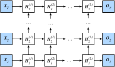

# 6.9 深度循環神經網絡

本章到目前為止介紹的循環神經網絡只有一個單向的隱藏層，在深度學習應用裡，我們通常會用到含有多個隱藏層的循環神經網絡，也稱作深度循環神經網絡。圖6.11演示了一個有$L$個隱藏層的深度循環神經網絡，每個隱藏狀態不斷傳遞至當前層的下一時間步和當前時間步的下一層。

圖6.11 深度循環神經網絡的架構

具體來說，在時間步$t$裡，設小批量輸入$\boldsymbol{X}_t \in \mathbb{R}^{n \times d}$（樣本數為$n$，輸入個數為$d$），第$\ell$隱藏層（$\ell=1,\ldots,L$）的隱藏狀態為$\boldsymbol{H}_t^{(\ell)}  \in \mathbb{R}^{n \times h}$（隱藏單元個數為$h$），輸出層變量為$\boldsymbol{O}_t \in \mathbb{R}^{n \times q}$（輸出個數為$q$），且隱藏層的激活函數為$\phi$。第1隱藏層的隱藏狀態和之前的計算一樣：

$$\boldsymbol{H}_t^{(1)} = \phi(\boldsymbol{X}_t \boldsymbol{W}_{xh}^{(1)} + \boldsymbol{H}_{t-1}^{(1)} \boldsymbol{W}_{hh}^{(1)}  + \boldsymbol{b}_h^{(1)}),$$

其中權重$\boldsymbol{W}_{xh}^{(1)} \in \mathbb{R}^{d \times h}$、$\boldsymbol{W}_{hh}^{(1)} \in \mathbb{R}^{h \times h}$和偏差 $\boldsymbol{b}_h^{(1)} \in \mathbb{R}^{1 \times h}$分別為第1隱藏層的模型參數。

當$1 < \ell \leq L$時，第$\ell$隱藏層的隱藏狀態的表達式為

$$\boldsymbol{H}_t^{(\ell)} = \phi(\boldsymbol{H}_t^{(\ell-1)} \boldsymbol{W}_{xh}^{(\ell)} + \boldsymbol{H}_{t-1}^{(\ell)} \boldsymbol{W}_{hh}^{(\ell)}  + \boldsymbol{b}_h^{(\ell)}),$$

其中權重$\boldsymbol{W}_{xh}^{(\ell)} \in \mathbb{R}^{h \times h}$、$\boldsymbol{W}_{hh}^{(\ell)} \in \mathbb{R}^{h \times h}$和偏差 $\boldsymbol{b}_h^{(\ell)} \in \mathbb{R}^{1 \times h}$分別為第$\ell$隱藏層的模型參數。

最終，輸出層的輸出只需基於第$L$隱藏層的隱藏狀態：

$$\boldsymbol{O}_t = \boldsymbol{H}_t^{(L)} \boldsymbol{W}_{hq} + \boldsymbol{b}_q,$$

其中權重$\boldsymbol{W}_{hq} \in \mathbb{R}^{h \times q}$和偏差$\boldsymbol{b}_q \in \mathbb{R}^{1 \times q}$為輸出層的模型參數。

同多層感知機一樣，隱藏層個數$L$和隱藏單元個數$h$都是超參數。此外，如果將隱藏狀態的計算換成門控循環單元或者長短期記憶的計算，我們可以得到深度門控循環神經網絡。

## 小結

* 在深度循環神經網絡中，隱藏狀態的信息不斷傳遞至當前層的下一時間步和當前時間步的下一層。

------------
> 注：本節與原書基本相同，[原書傳送門](https://zh.d2l.ai/chapter_recurrent-neural-networks/deep-rnn.html)