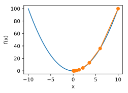
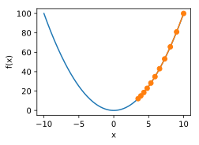

# 7.2 梯度下降和隨機梯度下降

在本節中，我們將介紹梯度下降（gradient descent）的工作原理。雖然梯度下降在深度學習中很少被直接使用，但理解梯度的意義以及沿著梯度反方向更新自變量可能降低目標函數值的原因是學習後續優化算法的基礎。隨後，我們將引出隨機梯度下降（stochastic gradient descent）。

## 7.2.1 一維梯度下降

我們先以簡單的一維梯度下降為例，解釋梯度下降算法可能降低目標函數值的原因。假設連續可導的函數$f: \mathbb{R} \rightarrow \mathbb{R}$的輸入和輸出都是標量。給定絕對值足夠小的數$\epsilon$，根據泰勒展開公式，我們得到以下的近似：

$$f(x + \epsilon) \approx f(x) + \epsilon f'(x) .$$

這裡$f'(x)$是函數$f$在$x$處的梯度。一維函數的梯度是一個標量，也稱導數。

接下來，找到一個常數$\eta > 0$，使得$\left|\eta f'(x)\right|$足夠小，那麼可以將$\epsilon$替換為$-\eta f'(x)$並得到

$$f(x - \eta f'(x)) \approx f(x) -  \eta f'(x)^2.$$

如果導數$f'(x) \neq 0$，那麼$\eta f'(x)^2>0$，所以

$$f(x - \eta f'(x)) \lesssim f(x).$$

這意味著，如果通過

$$x \leftarrow x - \eta f'(x)$$

來迭代$x$，函數$f(x)$的值可能會降低。因此在梯度下降中，我們先選取一個初始值$x$和常數$\eta > 0$，然後不斷通過上式來迭代$x$，直到達到停止條件，例如$f'(x)^2$的值已足夠小或迭代次數已達到某個值。

下面我們以目標函數$f(x)=x^2$為例來看一看梯度下降是如何工作的。雖然我們知道最小化$f(x)$的解為$x=0$，這裡依然使用這個簡單函數來觀察$x$是如何被迭代的。首先，導入本節實驗所需的包或模塊。

``` python
%matplotlib inline
import numpy as np
import torch
import math
import sys
sys.path.append("..") 
import d2lzh_pytorch as d2l
```

接下來使用$x=10$作為初始值，並設$\eta=0.2$。使用梯度下降對$x$迭代10次，可見最終$x$的值較接近最優解。

``` python
def gd(eta):
    x = 10
    results = [x]
    for i in range(10):
        x -= eta * 2 * x  # f(x) = x * x的導數為f'(x) = 2 * x
        results.append(x)
    print('epoch 10, x:', x)
    return results

res = gd(0.2)
```
輸出：
```
epoch 10, x: 0.06046617599999997
```

下面將繪製出自變量$x$的迭代軌跡。

``` python
def show_trace(res):
    n = max(abs(min(res)), abs(max(res)), 10)
    f_line = np.arange(-n, n, 0.1)
    d2l.set_figsize()
    d2l.plt.plot(f_line, [x * x for x in f_line])
    d2l.plt.plot(res, [x * x for x in res], '-o')
    d2l.plt.xlabel('x')
    d2l.plt.ylabel('f(x)')

show_trace(res)
```
<div align=center>

</div>

## 7.2.2 學習率

上述梯度下降算法中的正數$\eta$通常叫作學習率。這是一個超參數，需要人工設定。如果使用過小的學習率，會導致$x$更新緩慢從而需要更多的迭代才能得到較好的解。

下面展示使用學習率$\eta=0.05$時自變量$x$的迭代軌跡。可見，同樣迭代10次後，當學習率過小時，最終$x$的值依然與最優解存在較大偏差。

``` python
show_trace(gd(0.05))
```
輸出：
```
epoch 10, x: 3.4867844009999995
```
<div align=center>

</div>

如果使用過大的學習率，$\left|\eta f'(x)\right|$可能會過大從而使前面提到的一階泰勒展開公式不再成立：這時我們無法保證迭代$x$會降低$f(x)$的值。

舉個例子，當設學習率$\eta=1.1$時，可以看到$x$不斷越過（overshoot）最優解$x=0$並逐漸發散。

``` python
show_trace(gd(1.1))
```
輸出：
```
epoch 10, x: 61.917364224000096
```
<div align=center>

</div>

## 7.2.3 多維梯度下降

在瞭解了一維梯度下降之後，我們再考慮一種更廣義的情況：目標函數的輸入為向量，輸出為標量。假設目標函數$f: \mathbb{R}^d \rightarrow \mathbb{R}$的輸入是一個$d$維向量$\boldsymbol{x} = [x_1, x_2, \ldots, x_d]^\top$。目標函數$f(\boldsymbol{x})$有關$\boldsymbol{x}$的梯度是一個由$d$個偏導數組成的向量：

$$\nabla_{\boldsymbol{x}} f(\boldsymbol{x}) = \bigg[\frac{\partial f(\boldsymbol{x})}{\partial x_1}, \frac{\partial f(\boldsymbol{x})}{\partial x_2}, \ldots, \frac{\partial f(\boldsymbol{x})}{\partial x_d}\bigg]^\top.$$


為表示簡潔，我們用$\nabla f(\boldsymbol{x})$代替$\nabla_{\boldsymbol{x}} f(\boldsymbol{x})$。梯度中每個偏導數元素$\partial f(\boldsymbol{x})/\partial x_i$代表著$f$在$\boldsymbol{x}$有關輸入$x_i$的變化率。為了測量$f$沿著單位向量$\boldsymbol{u}$（即$\|\boldsymbol{u}\|=1$）方向上的變化率，在多元微積分中，我們定義$f$在$\boldsymbol{x}$上沿著$\boldsymbol{u}$方向的方向導數為

$$\text{D}_{\boldsymbol{u}} f(\boldsymbol{x}) = \lim_{h \rightarrow 0}  \frac{f(\boldsymbol{x} + h \boldsymbol{u}) - f(\boldsymbol{x})}{h}.$$

依據方向導數性質[1，14.6節定理三]，以上方向導數可以改寫為

$$\text{D}_{\boldsymbol{u}} f(\boldsymbol{x}) = \nabla f(\boldsymbol{x}) \cdot \boldsymbol{u}.$$

方向導數$\text{D}_{\boldsymbol{u}} f(\boldsymbol{x})$給出了$f$在$\boldsymbol{x}$上沿著所有可能方向的變化率。為了最小化$f$，我們希望找到$f$能被降低最快的方向。因此，我們可以通過單位向量$\boldsymbol{u}$來最小化方向導數$\text{D}_{\boldsymbol{u}} f(\boldsymbol{x})$。

由於$\text{D}_{\boldsymbol{u}} f(\boldsymbol{x}) = \|\nabla f(\boldsymbol{x})\| \cdot \|\boldsymbol{u}\|  \cdot \text{cos} (\theta) = \|\nabla f(\boldsymbol{x})\|  \cdot \text{cos} (\theta)$，
其中$\theta$為梯度$\nabla f(\boldsymbol{x})$和單位向量$\boldsymbol{u}$之間的夾角，當$\theta = \pi$時，$\text{cos}(\theta)$取得最小值$-1$。因此，當$\boldsymbol{u}$在梯度方向$\nabla f(\boldsymbol{x})$的相反方向時，方向導數$\text{D}_{\boldsymbol{u}} f(\boldsymbol{x})$被最小化。因此，我們可能通過梯度下降算法來不斷降低目標函數$f$的值：

$$\boldsymbol{x} \leftarrow \boldsymbol{x} - \eta \nabla f(\boldsymbol{x}).$$

同樣，其中$\eta$（取正數）稱作學習率。

下面我們構造一個輸入為二維向量$\boldsymbol{x} = [x_1, x_2]^\top$和輸出為標量的目標函數$f(\boldsymbol{x})=x_1^2+2x_2^2$。那麼，梯度$\nabla f(\boldsymbol{x}) = [2x_1, 4x_2]^\top$。我們將觀察梯度下降從初始位置$[-5,-2]$開始對自變量$\boldsymbol{x}$的迭代軌跡。我們先定義兩個輔助函數，第一個函數使用給定的自變量更新函數，從初始位置$[-5,-2]$開始迭代自變量$\boldsymbol{x}$共20次，第二個函數對自變量$\boldsymbol{x}$的迭代軌跡進行可視化。

``` python
def train_2d(trainer):  # 本函數將保存在d2lzh_pytorch包中方便以後使用
    x1, x2, s1, s2 = -5, -2, 0, 0  # s1和s2是自變量狀態，本章後續幾節會使用
    results = [(x1, x2)]
    for i in range(20):
        x1, x2, s1, s2 = trainer(x1, x2, s1, s2)
        results.append((x1, x2))
    print('epoch %d, x1 %f, x2 %f' % (i + 1, x1, x2))
    return results

def show_trace_2d(f, results):  # 本函數將保存在d2lzh_pytorch包中方便以後使用
    d2l.plt.plot(*zip(*results), '-o', color='#ff7f0e')
    x1, x2 = np.meshgrid(np.arange(-5.5, 1.0, 0.1), np.arange(-3.0, 1.0, 0.1))
    d2l.plt.contour(x1, x2, f(x1, x2), colors='#1f77b4')
    d2l.plt.xlabel('x1')
    d2l.plt.ylabel('x2')
```

然後，觀察學習率為$0.1$時自變量的迭代軌跡。使用梯度下降對自變量$\boldsymbol{x}$迭代20次後，可見最終$\boldsymbol{x}$的值較接近最優解$[0,0]$。

``` python
eta = 0.1

def f_2d(x1, x2):  # 目標函數
    return x1 ** 2 + 2 * x2 ** 2

def gd_2d(x1, x2, s1, s2):
    return (x1 - eta * 2 * x1, x2 - eta * 4 * x2, 0, 0)

show_trace_2d(f_2d, train_2d(gd_2d))
```
輸出：
```
epoch 20, x1 -0.057646, x2 -0.000073
```
<div align=center>

</div>

## 7.2.4 隨機梯度下降

在深度學習裡，目標函數通常是訓練數據集中有關各個樣本的損失函數的平均。設$f_i(\boldsymbol{x})$是有關索引為$i$的訓練數據樣本的損失函數，$n$是訓練數據樣本數，$\boldsymbol{x}$是模型的參數向量，那麼目標函數定義為

$$f(\boldsymbol{x}) = \frac{1}{n} \sum_{i = 1}^n f_i(\boldsymbol{x}).$$

目標函數在$\boldsymbol{x}$處的梯度計算為

$$\nabla f(\boldsymbol{x}) = \frac{1}{n} \sum_{i = 1}^n \nabla f_i(\boldsymbol{x}).$$

如果使用梯度下降，每次自變量迭代的計算開銷為$\mathcal{O}(n)$，它隨著$n$線性增長。因此，當訓練數據樣本數很大時，梯度下降每次迭代的計算開銷很高。

隨機梯度下降（stochastic gradient descent，SGD）減少了每次迭代的計算開銷。在隨機梯度下降的每次迭代中，我們隨機均勻採樣的一個樣本索引$i\in\{1,\ldots,n\}$，並計算梯度$\nabla f_i(\boldsymbol{x})$來迭代$\boldsymbol{x}$：

$$\boldsymbol{x} \leftarrow \boldsymbol{x} - \eta \nabla f_i(\boldsymbol{x}).$$

這裡$\eta$同樣是學習率。可以看到每次迭代的計算開銷從梯度下降的$\mathcal{O}(n)$降到了常數$\mathcal{O}(1)$。值得強調的是，隨機梯度$\nabla f_i(\boldsymbol{x})$是對梯度$\nabla f(\boldsymbol{x})$的無偏估計：

$$E_i \nabla f_i(\boldsymbol{x}) = \frac{1}{n} \sum_{i = 1}^n \nabla f_i(\boldsymbol{x}) = \nabla f(\boldsymbol{x}).$$

這意味著，平均來說，隨機梯度是對梯度的一個良好的估計。

下面我們通過在梯度中添加均值為0的隨機噪聲來模擬隨機梯度下降，以此來比較它與梯度下降的區別。

``` python
def sgd_2d(x1, x2, s1, s2):
    return (x1 - eta * (2 * x1 + np.random.normal(0.1)),
            x2 - eta * (4 * x2 + np.random.normal(0.1)), 0, 0)

show_trace_2d(f_2d, train_2d(sgd_2d))
```
輸出：
```
epoch 20, x1 -0.047150, x2 -0.075628
```
<div align=center>

</div>

可以看到，隨機梯度下降中自變量的迭代軌跡相對於梯度下降中的來說更為曲折。這是由於實驗所添加的噪聲使模擬的隨機梯度的準確度下降。在實際中，這些噪聲通常指訓練數據集中的無意義的干擾。


## 小結

* 使用適當的學習率，沿著梯度反方向更新自變量可能降低目標函數值。梯度下降重複這一更新過程直到得到滿足要求的解。
* 學習率過大或過小都有問題。一個合適的學習率通常是需要通過多次實驗找到的。
* 當訓練數據集的樣本較多時，梯度下降每次迭代的計算開銷較大，因而隨機梯度下降通常更受青睞。


## 參考文獻

[1] Stewart, J. (2010). Calculus: early transcendentals. 7th ed. Cengage Learning.

------------
> 注：本節與原書基本相同，[原書傳送門](https://zh.d2l.ai/chapter_optimization/gd-sgd.html)