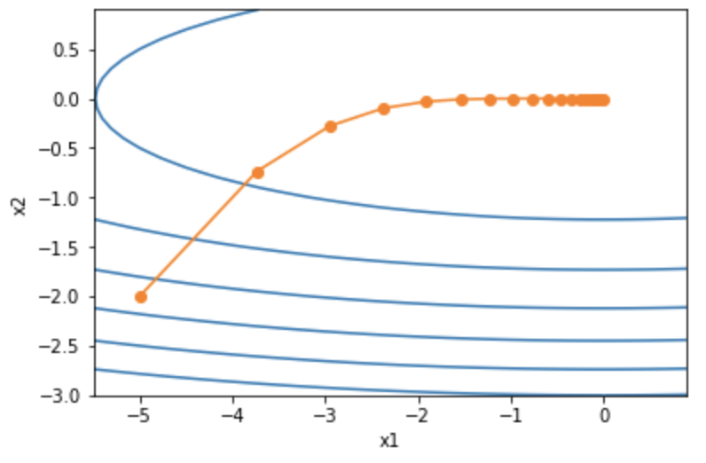
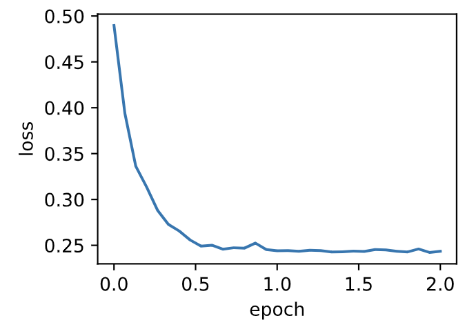
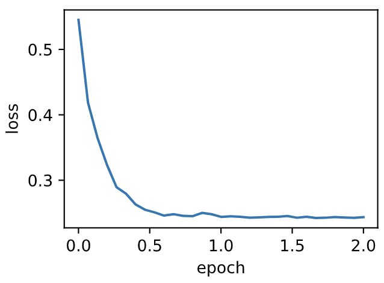

# 7.6 RMSProp算法

我們在7.5節（AdaGrad算法）中提到，因為調整學習率時分母上的變量$\boldsymbol{s}_t$一直在累加按元素平方的小批量隨機梯度，所以目標函數自變量每個元素的學習率在迭代過程中一直在降低（或不變）。因此，當學習率在迭代早期降得較快且當前解依然不佳時，AdaGrad算法在迭代後期由於學習率過小，可能較難找到一個有用的解。為了解決這一問題，RMSProp算法對AdaGrad算法做了一點小小的修改。該算法源自Coursera上的一門課程，即“機器學習的神經網絡” [1]。

## 7.6.1 算法

我們在7.4節（動量法）裡介紹過指數加權移動平均。不同於AdaGrad算法裡狀態變量$\boldsymbol{s}_t$是截至時間步$t$所有小批量隨機梯度$\boldsymbol{g}_t$按元素平方和，RMSProp算法將這些梯度按元素平方做指數加權移動平均。具體來說，給定超參數$0 \leq \gamma < 1$，RMSProp算法在時間步$t>0$計算

$$\boldsymbol{s}_t \leftarrow \gamma \boldsymbol{s}_{t-1} + (1 - \gamma) \boldsymbol{g}_t \odot \boldsymbol{g}_t. $$

和AdaGrad算法一樣，RMSProp算法將目標函數自變量中每個元素的學習率通過按元素運算重新調整，然後更新自變量

$$\boldsymbol{x}_t \leftarrow \boldsymbol{x}_{t-1} - \frac{\eta}{\sqrt{\boldsymbol{s}_t + \epsilon}} \odot \boldsymbol{g}_t, $$

其中$\eta$是學習率，$\epsilon$是為了維持數值穩定性而添加的常數，如$10^{-6}$。因為RMSProp算法的狀態變量$\boldsymbol{s}_t$是對平方項$\boldsymbol{g}_t \odot \boldsymbol{g}_t$的指數加權移動平均，所以可以看作是最近$1/(1-\gamma)$個時間步的小批量隨機梯度平方項的加權平均。如此一來，自變量每個元素的學習率在迭代過程中就不再一直降低（或不變）。

照例，讓我們先觀察RMSProp算法對目標函數$f(\boldsymbol{x})=0.1x_1^2+2x_2^2$中自變量的迭代軌跡。回憶在7.5節（AdaGrad算法）使用的學習率為0.4的AdaGrad算法，自變量在迭代後期的移動幅度較小。但在同樣的學習率下，RMSProp算法可以更快逼近最優解。

``` python
%matplotlib inline
import math
import torch
import sys
sys.path.append("..") 
import d2lzh_pytorch as d2l

def rmsprop_2d(x1, x2, s1, s2):
    g1, g2, eps = 0.2 * x1, 4 * x2, 1e-6
    s1 = gamma * s1 + (1 - gamma) * g1 ** 2
    s2 = gamma * s2 + (1 - gamma) * g2 ** 2
    x1 -= eta / math.sqrt(s1 + eps) * g1
    x2 -= eta / math.sqrt(s2 + eps) * g2
    return x1, x2, s1, s2

def f_2d(x1, x2):
    return 0.1 * x1 ** 2 + 2 * x2 ** 2

eta, gamma = 0.4, 0.9
d2l.show_trace_2d(f_2d, d2l.train_2d(rmsprop_2d))
```

輸出：
```
epoch 20, x1 -0.010599, x2 0.000000
```
<div align=center>

</div>

## 7.6.2 從零開始實現

接下來按照RMSProp算法中的公式實現該算法。

``` python
features, labels = d2l.get_data_ch7()

def init_rmsprop_states():
    s_w = torch.zeros((features.shape[1], 1), dtype=torch.float32)
    s_b = torch.zeros(1, dtype=torch.float32)
    return (s_w, s_b)

def rmsprop(params, states, hyperparams):
    gamma, eps = hyperparams['gamma'], 1e-6
    for p, s in zip(params, states):
        s.data = gamma * s.data + (1 - gamma) * (p.grad.data)**2
        p.data -= hyperparams['lr'] * p.grad.data / torch.sqrt(s + eps)
```

我們將初始學習率設為0.01，並將超參數$\gamma$設為0.9。此時，變量$\boldsymbol{s}_t$可看作是最近$1/(1-0.9) = 10$個時間步的平方項$\boldsymbol{g}_t \odot \boldsymbol{g}_t$的加權平均。

``` python
d2l.train_ch7(rmsprop, init_rmsprop_states(), {'lr': 0.01, 'gamma': 0.9},
              features, labels)
```

輸出：
```
loss: 0.243452, 0.049984 sec per epoch
```
<div align=center>

</div>

## 7.6.3 簡潔實現

通過名稱為`RMSprop`的優化器方法，我們便可使用PyTorch提供的RMSProp算法來訓練模型。注意，超參數$\gamma$通過`alpha`指定。

``` python
d2l.train_pytorch_ch7(torch.optim.RMSprop, {'lr': 0.01, 'alpha': 0.9},
                    features, labels)
```

輸出：
```
loss: 0.243676, 0.043637 sec per epoch
```
<div align=center>

</div>

## 小結

* RMSProp算法和AdaGrad算法的不同在於，RMSProp算法使用了小批量隨機梯度按元素平方的指數加權移動平均來調整學習率。


## 參考文獻

[1] Tieleman, T., & Hinton, G. (2012). Lecture 6.5-rmsprop: Divide the gradient by a running average of its recent magnitude. COURSERA: Neural networks for machine learning, 4(2), 26-31.

-----------
> 注：除代碼外本節與原書此節基本相同，[原書傳送門](https://zh.d2l.ai/chapter_optimization/rmsprop.html)
