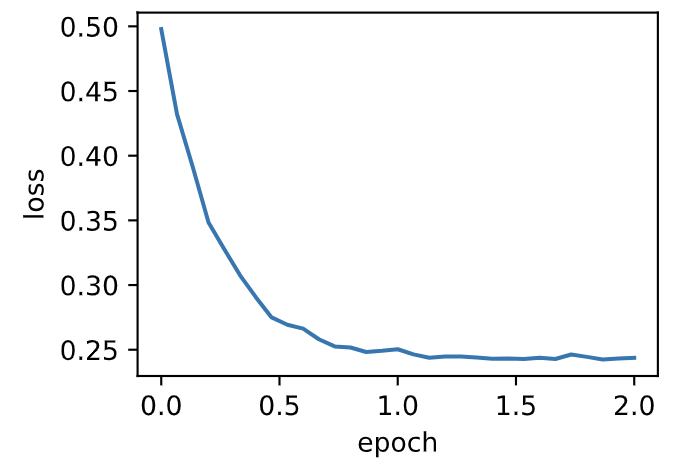

# 7.7 AdaDelta算法

除了RMSProp算法以外，另一個常用優化算法AdaDelta算法也針對AdaGrad算法在迭代後期可能較難找到有用解的問題做了改進 [1]。有意思的是，**AdaDelta算法沒有學習率這一超參數**。

## 7.7.1 算法

AdaDelta算法也像RMSProp算法一樣，使用了小批量隨機梯度$\boldsymbol{g}_t$按元素平方的指數加權移動平均變量$\boldsymbol{s}_t$。在時間步0，它的所有元素被初始化為0。給定超參數$0 \leq \rho < 1$（對應RMSProp算法中的$\gamma$），在時間步$t>0$，同RMSProp算法一樣計算

$$\boldsymbol{s}_t \leftarrow \rho \boldsymbol{s}_{t-1} + (1 - \rho) \boldsymbol{g}_t \odot \boldsymbol{g}_t. $$

與RMSProp算法不同的是，AdaDelta算法還維護一個額外的狀態變量$\Delta\boldsymbol{x}_t$，其元素同樣在時間步0時被初始化為0。我們使用$\Delta\boldsymbol{x}_{t-1}$來計算自變量的變化量：

$$ \boldsymbol{g}_t' \leftarrow \sqrt{\frac{\Delta\boldsymbol{x}_{t-1} + \epsilon}{\boldsymbol{s}_t + \epsilon}}   \odot \boldsymbol{g}_t, $$

其中$\epsilon$是為了維持數值穩定性而添加的常數，如$10^{-5}$。接著更新自變量：

$$\boldsymbol{x}_t \leftarrow \boldsymbol{x}_{t-1} - \boldsymbol{g}'_t. $$

最後，我們使用$\Delta\boldsymbol{x}_t$來記錄自變量變化量$\boldsymbol{g}'_t$按元素平方的指數加權移動平均：

$$\Delta\boldsymbol{x}_t \leftarrow \rho \Delta\boldsymbol{x}_{t-1} + (1 - \rho) \boldsymbol{g}'_t \odot \boldsymbol{g}'_t. $$

可以看到，如不考慮$\epsilon$的影響，**AdaDelta算法跟RMSProp算法的不同之處在於使用$\sqrt{\Delta\boldsymbol{x}_{t-1}}$來替代學習率$\eta$**。


## 7.7.2 從零開始實現

AdaDelta算法需要對每個自變量維護兩個狀態變量，即$\boldsymbol{s}_t$和$\Delta\boldsymbol{x}_t$。我們按AdaDelta算法中的公式實現該算法。

``` python
%matplotlib inline
import torch
import sys
sys.path.append("..") 
import d2lzh_pytorch as d2l

features, labels = d2l.get_data_ch7()

def init_adadelta_states():
    s_w, s_b = torch.zeros((features.shape[1], 1), dtype=torch.float32), torch.zeros(1, dtype=torch.float32)
    delta_w, delta_b = torch.zeros((features.shape[1], 1), dtype=torch.float32), torch.zeros(1, dtype=torch.float32)
    return ((s_w, delta_w), (s_b, delta_b))

def adadelta(params, states, hyperparams):
    rho, eps = hyperparams['rho'], 1e-5
    for p, (s, delta) in zip(params, states):
        s[:] = rho * s + (1 - rho) * (p.grad.data**2)
        g =  p.grad.data * torch.sqrt((delta + eps) / (s + eps))
        p.data -= g
        delta[:] = rho * delta + (1 - rho) * g * g
```

使用超參數$\rho=0.9$來訓練模型。

``` python
d2l.train_ch7(adadelta, init_adadelta_states(), {'rho': 0.9}, features, labels)
```
輸出：
```
loss: 0.243728, 0.062991 sec per epoch
```
<div align=center>

</div>

## 7.7.3 簡潔實現

通過名稱為`Adadelta`的優化器方法，我們便可使用PyTorch提供的AdaDelta算法。它的超參數可以通過`rho`來指定。

``` python
d2l.train_pytorch_ch7(torch.optim.Adadelta, {'rho': 0.9}, features, labels)
```

輸出：
```
loss: 0.242104, 0.047702 sec per epoch
```
<div align=center>

</div>

## 小結

* AdaDelta算法沒有學習率超參數，它通過使用有關自變量更新量平方的指數加權移動平均的項來替代RMSProp算法中的學習率。


## 參考文獻

[1] Zeiler, M. D. (2012). ADADELTA: an adaptive learning rate method. arXiv preprint arXiv:1212.5701.

-----------
> 注：除代碼外本節與原書此節基本相同，[原書傳送門](https://zh.d2l.ai/chapter_optimization/adadelta.html)

