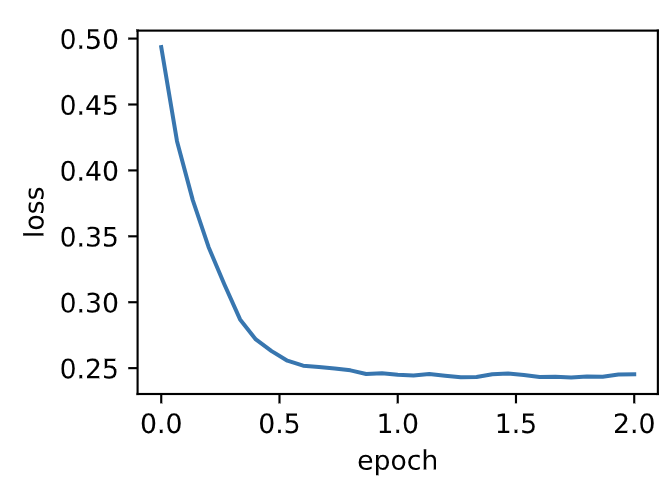
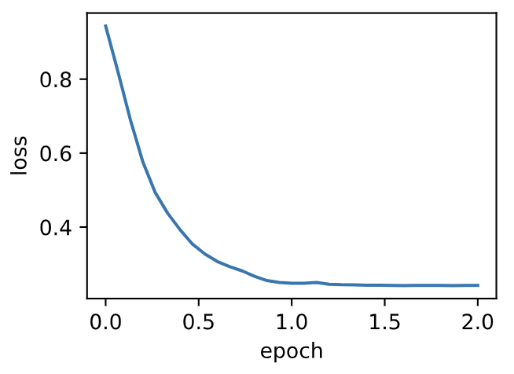

# 7.8 Adam算法

Adam算法在RMSProp算法基礎上對小批量隨機梯度也做了指數加權移動平均 [1]。下面我們來介紹這個算法。
> 所以Adam算法可以看做是RMSProp算法與動量法的結合。

## 7.8.1 算法

Adam算法使用了動量變量$\boldsymbol{v}_t$和RMSProp算法中小批量隨機梯度按元素平方的指數加權移動平均變量$\boldsymbol{s}_t$，並在時間步0將它們中每個元素初始化為0。給定超參數$0 \leq \beta_1 < 1$（算法作者建議設為0.9），時間步$t$的動量變量$\boldsymbol{v}_t$即小批量隨機梯度$\boldsymbol{g}_t$的指數加權移動平均：

$$\boldsymbol{v}_t \leftarrow \beta_1 \boldsymbol{v}_{t-1} + (1 - \beta_1) \boldsymbol{g}_t. $$

和RMSProp算法中一樣，給定超參數$0 \leq \beta_2 < 1$（算法作者建議設為0.999），
將小批量隨機梯度按元素平方後的項$\boldsymbol{g}_t \odot \boldsymbol{g}_t$做指數加權移動平均得到$\boldsymbol{s}_t$：

$$\boldsymbol{s}_t \leftarrow \beta_2 \boldsymbol{s}_{t-1} + (1 - \beta_2) \boldsymbol{g}_t \odot \boldsymbol{g}_t. $$

由於我們將$\boldsymbol{v}_0$和$\boldsymbol{s}_0$中的元素都初始化為0，
在時間步$t$我們得到$\boldsymbol{v}_t =  (1-\beta_1) \sum_{i=1}^t \beta_1^{t-i} \boldsymbol{g}_i$。將過去各時間步小批量隨機梯度的權值相加，得到 $(1-\beta_1) \sum_{i=1}^t \beta_1^{t-i} = 1 - \beta_1^t$。需要注意的是，當$t$較小時，過去各時間步小批量隨機梯度權值之和會較小。例如，當$\beta_1 = 0.9$時，$\boldsymbol{v}_1 = 0.1\boldsymbol{g}_1$。為了消除這樣的影響，對於任意時間步$t$，我們可以將$\boldsymbol{v}_t$再除以$1 - \beta_1^t$，從而使過去各時間步小批量隨機梯度權值之和為1。這也叫作偏差修正。在Adam算法中，我們對變量$\boldsymbol{v}_t$和$\boldsymbol{s}_t$均作偏差修正：

$$\hat{\boldsymbol{v}}_t \leftarrow \frac{\boldsymbol{v}_t}{1 - \beta_1^t}, $$

$$\hat{\boldsymbol{s}}_t \leftarrow \frac{\boldsymbol{s}_t}{1 - \beta_2^t}. $$


接下來，Adam算法使用以上偏差修正後的變量$\hat{\boldsymbol{v}}_t$和$\hat{\boldsymbol{s}}_t$，將模型參數中每個元素的學習率通過按元素運算重新調整：

$$\boldsymbol{g}_t' \leftarrow \frac{\eta \hat{\boldsymbol{v}}_t}{\sqrt{\hat{\boldsymbol{s}}_t} + \epsilon},$$

其中$\eta$是學習率，$\epsilon$是為了維持數值穩定性而添加的常數，如$10^{-8}$。和AdaGrad算法、RMSProp算法以及AdaDelta算法一樣，目標函數自變量中每個元素都分別擁有自己的學習率。最後，使用$\boldsymbol{g}_t'$迭代自變量：

$$\boldsymbol{x}_t \leftarrow \boldsymbol{x}_{t-1} - \boldsymbol{g}_t'. $$

## 7.8.2 從零開始實現

我們按照Adam算法中的公式實現該算法。其中時間步$t$通過`hyperparams`參數傳入`adam`函數。

``` python
%matplotlib inline
import torch
import sys
sys.path.append("..") 
import d2lzh_pytorch as d2l

features, labels = d2l.get_data_ch7()

def init_adam_states():
    v_w, v_b = torch.zeros((features.shape[1], 1), dtype=torch.float32), torch.zeros(1, dtype=torch.float32)
    s_w, s_b = torch.zeros((features.shape[1], 1), dtype=torch.float32), torch.zeros(1, dtype=torch.float32)
    return ((v_w, s_w), (v_b, s_b))

def adam(params, states, hyperparams):
    beta1, beta2, eps = 0.9, 0.999, 1e-6
    for p, (v, s) in zip(params, states):
        v[:] = beta1 * v + (1 - beta1) * p.grad.data
        s[:] = beta2 * s + (1 - beta2) * p.grad.data**2
        v_bias_corr = v / (1 - beta1 ** hyperparams['t'])
        s_bias_corr = s / (1 - beta2 ** hyperparams['t'])
        p.data -= hyperparams['lr'] * v_bias_corr / (torch.sqrt(s_bias_corr) + eps)
    hyperparams['t'] += 1
```

使用學習率為0.01的Adam算法來訓練模型。

``` python
d2l.train_ch7(adam, init_adam_states(), {'lr': 0.01, 't': 1}, features, labels)
```

輸出：
```
loss: 0.245370, 0.065155 sec per epoch
```
<div align=center>

</div>


## 7.8.3 簡潔實現

通過名稱為“Adam”的優化器實例，我們便可使用PyTorch提供的Adam算法。

``` python
d2l.train_pytorch_ch7(torch.optim.Adam, {'lr': 0.01}, features, labels)
```
輸出：
```
loss: 0.242066, 0.056867 sec per epoch
```
<div align=center>

</div>

## 小結

* Adam算法在RMSProp算法的基礎上對小批量隨機梯度也做了指數加權移動平均。
* Adam算法使用了偏差修正。


## 參考文獻

[1] Kingma, D. P., & Ba, J. (2014). Adam: A method for stochastic optimization. arXiv preprint arXiv:1412.6980.

-----------
> 注：除代碼外本節與原書此節基本相同，[原書傳送門](https://zh.d2l.ai/chapter_optimization/adam.html)

