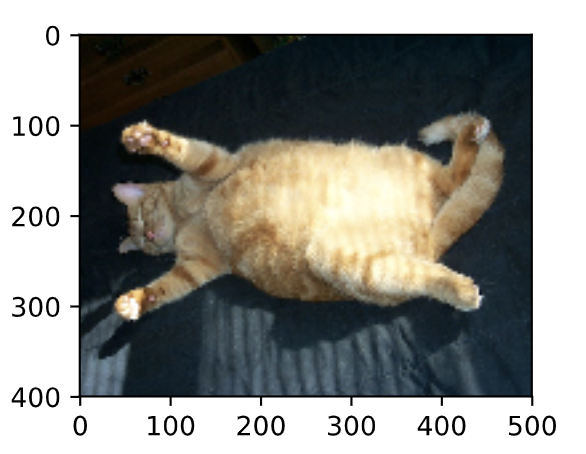
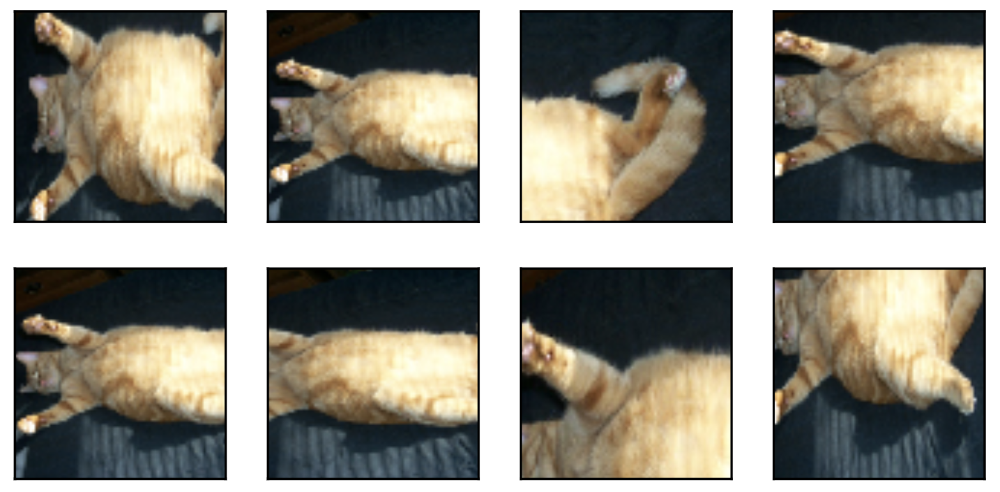
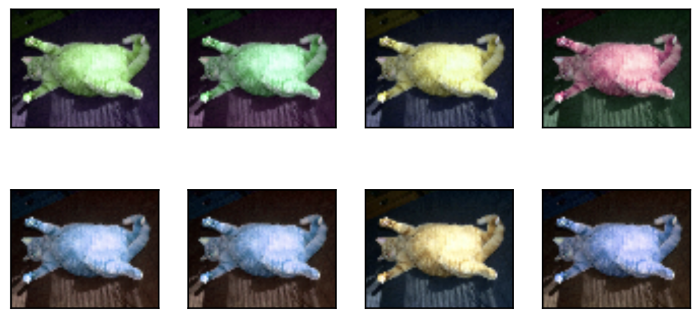
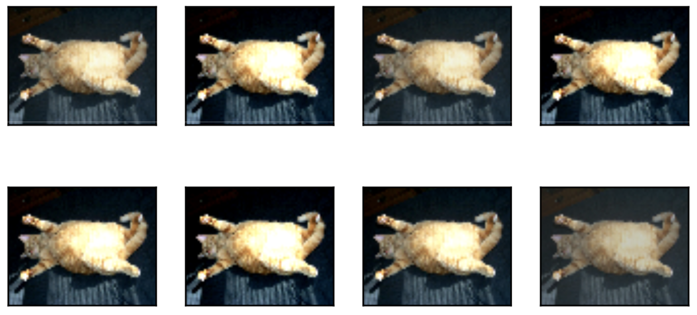
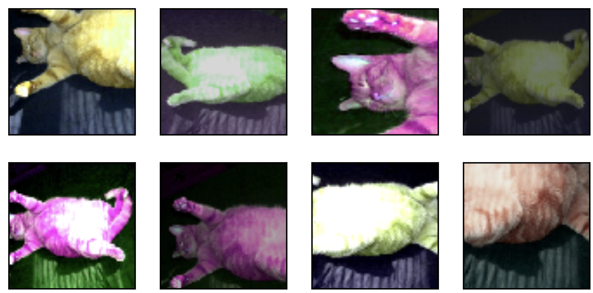

# 9.1 圖像增廣

在5.6節（深度卷積神經網絡）裡我們提到過，大規模數據集是成功應用深度神經網絡的前提。圖像增廣（image augmentation）技術通過對訓練圖像做一系列隨機改變，來產生相似但又不同的訓練樣本，從而擴大訓練數據集的規模。圖像增廣的另一種解釋是，隨機改變訓練樣本可以降低模型對某些屬性的依賴，從而提高模型的泛化能力。例如，我們可以對圖像進行不同方式的裁剪，使感興趣的物體出現在不同位置，從而減輕模型對物體出現位置的依賴性。我們也可以調整亮度、色彩等因素來降低模型對色彩的敏感度。可以說，在當年AlexNet的成功中，圖像增廣技術功不可沒。本節我們將討論這個在計算機視覺裡被廣泛使用的技術。

首先，導入實驗所需的包或模塊。

``` python
%matplotlib inline
import time
import torch
from torch import nn, optim
from torch.utils.data import Dataset, DataLoader
import torchvision
from PIL import Image

import sys
sys.path.append("..") 
import d2lzh_pytorch as d2l
device = torch.device('cuda' if torch.cuda.is_available() else 'cpu')
```

## 9.1.1 常用的圖像增廣方法

我們來讀取一張形狀為$400\times 500$（高和寬分別為400像素和500像素）的圖像作為實驗的樣例。

``` python
d2l.set_figsize()
img = Image.open('../img/cat1.jpg')
d2l.plt.imshow(img)
```

下面定義繪圖函數`show_images`。

``` python
# 本函數已保存在d2lzh_pytorch包中方便以後使用
def show_images(imgs, num_rows, num_cols, scale=2):
    figsize = (num_cols * scale, num_rows * scale)
    _, axes = d2l.plt.subplots(num_rows, num_cols, figsize=figsize)
    for i in range(num_rows):
        for j in range(num_cols):
            axes[i][j].imshow(imgs[i * num_cols + j])
            axes[i][j].axes.get_xaxis().set_visible(False)
            axes[i][j].axes.get_yaxis().set_visible(False)
    return axes
```

大部分圖像增廣方法都有一定的隨機性。為了方便觀察圖像增廣的效果，接下來我們定義一個輔助函數`apply`。這個函數對輸入圖像`img`多次運行圖像增廣方法`aug`並展示所有的結果。

``` python
def apply(img, aug, num_rows=2, num_cols=4, scale=1.5):
    Y = [aug(img) for _ in range(num_rows * num_cols)]
    show_images(Y, num_rows, num_cols, scale)
```
<div align=center>

</div>

### 9.1.1.1 翻轉和裁剪

左右翻轉圖像通常不改變物體的類別。它是最早也是最廣泛使用的一種圖像增廣方法。下面我們通過`torchvision.transforms`模塊創建`RandomHorizontalFlip`實例來實現一半概率的圖像水平（左右）翻轉。

``` python
apply(img, torchvision.transforms.RandomHorizontalFlip())
```
<div align=center>

</div>

上下翻轉不如左右翻轉通用。但是至少對於樣例圖像，上下翻轉不會造成識別障礙。下面我們創建`RandomVerticalFlip`實例來實現一半概率的圖像垂直（上下）翻轉。

``` python
apply(img, torchvision.transforms.RandomVerticalFlip())
```
<div align=center>

</div>

在我們使用的樣例圖像裡，貓在圖像正中間，但一般情況下可能不是這樣。在5.4節（池化層）裡我們解釋了池化層能降低卷積層對目標位置的敏感度。除此之外，我們還可以通過對圖像隨機裁剪來讓物體以不同的比例出現在圖像的不同位置，這同樣能夠降低模型對目標位置的敏感性。

在下面的代碼裡，我們每次隨機裁剪出一塊麵積為原面積$10\% \sim 100\%$的區域，且該區域的寬和高之比隨機取自$0.5 \sim 2$，然後再將該區域的寬和高分別縮放到200像素。若無特殊說明，本節中$a$和$b$之間的隨機數指的是從區間$[a,b]$中隨機均勻採樣所得到的連續值。

``` python
shape_aug = torchvision.transforms.RandomResizedCrop(200, scale=(0.1, 1), ratio=(0.5, 2))
apply(img, shape_aug)
```
<div align=center>

</div>

### 9.1.1.2 變化顏色

另一類增廣方法是變化顏色。我們可以從4個方面改變圖像的顏色：亮度（`brightness`）、對比度（`contrast`）、飽和度（`saturation`）和色調（`hue`）。在下面的例子裡，我們將圖像的亮度隨機變化為原圖亮度的$50\%$（$1-0.5$）$\sim 150\%$（$1+0.5$）。

``` python
apply(img, torchvision.transforms.ColorJitter(brightness=0.5))
```
<div align=center>

</div>

我們也可以隨機變化圖像的色調。
``` python
apply(img, torchvision.transforms.ColorJitter(hue=0.5))
```
<div align=center>

</div>

類似地，我們也可以隨機變化圖像的對比度。
``` python
apply(img, torchvision.transforms.ColorJitter(contrast=0.5))
```
<div align=center>

</div>

我們也可以同時設置如何隨機變化圖像的亮度（`brightness`）、對比度（`contrast`）、飽和度（`saturation`）和色調（`hue`）。

``` python
color_aug = torchvision.transforms.ColorJitter(
    brightness=0.5, contrast=0.5, saturation=0.5, hue=0.5)
apply(img, color_aug)
```
<div align=center>

</div>

### 9.1.1.3 疊加多個圖像增廣方法

實際應用中我們會將多個圖像增廣方法疊加使用。我們可以通過`Compose`實例將上面定義的多個圖像增廣方法疊加起來，再應用到每張圖像之上。

``` python
augs = torchvision.transforms.Compose([
    torchvision.transforms.RandomHorizontalFlip(), color_aug, shape_aug])
apply(img, augs)
```
<div align=center>

</div>

## 9.1.2 使用圖像增廣訓練模型

下面我們來看一個將圖像增廣應用在實際訓練中的例子。這裡我們使用CIFAR-10數據集，而不是之前我們一直使用的Fashion-MNIST數據集。這是因為Fashion-MNIST數據集中物體的位置和尺寸都已經經過歸一化處理，而CIFAR-10數據集中物體的顏色和大小區別更加顯著。下面展示了CIFAR-10數據集中前32張訓練圖像。

``` python
all_imges = torchvision.datasets.CIFAR10(train=True, root="~/Datasets/CIFAR", download=True)
# all_imges的每一個元素都是(image, label)
show_images([all_imges[i][0] for i in range(32)], 4, 8, scale=0.8);
```
<div align=center>

</div>

**為了在預測時得到確定的結果，我們通常只將圖像增廣應用在訓練樣本上，而不在預測時使用含隨機操作的圖像增廣**。在這裡我們只使用最簡單的隨機左右翻轉。此外，我們使用`ToTensor`將小批量圖像轉成PyTorch需要的格式，即形狀為(批量大小, 通道數, 高, 寬)、值域在0到1之間且類型為32位浮點數。

``` python
flip_aug = torchvision.transforms.Compose([
     torchvision.transforms.RandomHorizontalFlip(),
     torchvision.transforms.ToTensor()])

no_aug = torchvision.transforms.Compose([
     torchvision.transforms.ToTensor()])
```

接下來我們定義一個輔助函數來方便讀取圖像並應用圖像增廣。有關`DataLoader`的詳細介紹，可參考更早的3.5節圖像分類數據集(Fashion-MNIST)。

``` python
num_workers = 0 if sys.platform.startswith('win32') else 4
def load_cifar10(is_train, augs, batch_size, root="~/Datasets/CIFAR"):
    dataset = torchvision.datasets.CIFAR10(root=root, train=is_train, transform=augs, download=True)
    return DataLoader(dataset, batch_size=batch_size, shuffle=is_train, num_workers=num_workers)
```

### 9.1.2.1 使用圖像增廣訓練模型

> 原書本節使用的多GPU, 由於我這裡卡比較緊張就不使用多GPU了...關於PyTorch多GPU的使用可參考8.4節。

我們在CIFAR-10數據集上訓練5.11節（殘差網絡）中介紹的ResNet-18模型。

我們先定義`train`函數使用GPU訓練並評價模型。

``` python
# 本函數已保存在d2lzh_pytorch包中方便以後使用
def train(train_iter, test_iter, net, loss, optimizer, device, num_epochs):
    net = net.to(device)
    print("training on ", device)
    batch_count = 0
    for epoch in range(num_epochs):
        train_l_sum, train_acc_sum, n, start = 0.0, 0.0, 0, time.time()
        for X, y in train_iter:
            X = X.to(device)
            y = y.to(device)
            y_hat = net(X)
            l = loss(y_hat, y)
            optimizer.zero_grad()
            l.backward()
            optimizer.step()
            train_l_sum += l.cpu().item()
            train_acc_sum += (y_hat.argmax(dim=1) == y).sum().cpu().item()
            n += y.shape[0]
            batch_count += 1
        test_acc = d2l.evaluate_accuracy(test_iter, net)
        print('epoch %d, loss %.4f, train acc %.3f, test acc %.3f, time %.1f sec'
              % (epoch + 1, train_l_sum / batch_count, train_acc_sum / n, test_acc, time.time() - start))
```

然後就可以定義`train_with_data_aug`函數使用圖像增廣來訓練模型了。該函數使用Adam算法作為訓練使用的優化算法，然後將圖像增廣應用於訓練數據集之上，最後調用剛才定義的`train`函數訓練並評價模型。

``` python
def train_with_data_aug(train_augs, test_augs, lr=0.001):
    batch_size, net = 256, d2l.resnet18(10)
    optimizer = torch.optim.Adam(net.parameters(), lr=lr)
    loss = torch.nn.CrossEntropyLoss()
    train_iter = load_cifar10(True, train_augs, batch_size)
    test_iter = load_cifar10(False, test_augs, batch_size)
    train(train_iter, test_iter, net, loss, optimizer, device, num_epochs=10)
```

下面使用隨機左右翻轉的圖像增廣來訓練模型。

``` python
train_with_data_aug(flip_aug, no_aug)
```
輸出：
```
training on  cuda
epoch 1, loss 1.3615, train acc 0.505, test acc 0.493, time 123.2 sec
epoch 2, loss 0.5003, train acc 0.645, test acc 0.620, time 123.0 sec
epoch 3, loss 0.2811, train acc 0.703, test acc 0.616, time 123.1 sec
epoch 4, loss 0.1890, train acc 0.735, test acc 0.686, time 123.0 sec
epoch 5, loss 0.1346, train acc 0.765, test acc 0.671, time 123.1 sec
epoch 6, loss 0.1029, train acc 0.787, test acc 0.674, time 123.1 sec
epoch 7, loss 0.0803, train acc 0.804, test acc 0.749, time 123.1 sec
epoch 8, loss 0.0644, train acc 0.822, test acc 0.717, time 123.1 sec
epoch 9, loss 0.0526, train acc 0.836, test acc 0.750, time 123.0 sec
epoch 10, loss 0.0433, train acc 0.851, test acc 0.754, time 123.1 sec
```

## 小結

* 圖像增廣基於現有訓練數據生成隨機圖像從而應對過擬合。
* 為了在預測時得到確定的結果，通常只將圖像增廣應用在訓練樣本上，而不在預測時使用含隨機操作的圖像增廣。
* 可以從torchvision的`transforms`模塊中獲取有關圖片增廣的類。


-----------
> 注：本節與原書有一些不同，[原書傳送門](https://zh.d2l.ai/chapter_computer-vision/image-augmentation.html)


