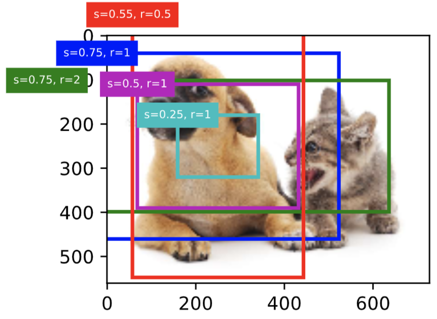
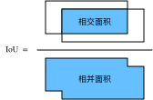

# 9.4 錨框

目標檢測算法通常會在輸入圖像中採樣大量的區域，然後判斷這些區域中是否包含我們感興趣的目標，並調整區域邊緣從而更準確地預測目標的真實邊界框（ground-truth bounding box）。不同的模型使用的區域採樣方法可能不同。這裡我們介紹其中的一種方法：它以每個像素為中心生成多個大小和寬高比（aspect ratio）不同的邊界框。這些邊界框被稱為錨框（anchor box）。我們將在後面基於錨框實踐目標檢測。
> 注: 建議想學習用PyTorch做檢測的童鞋閱讀一下倉庫[a-PyTorch-Tutorial-to-Object-Detection](https://github.com/sgrvinod/a-PyTorch-Tutorial-to-Object-Detection)。

先導入一下相關包。

``` python
%matplotlib inline
from PIL import Image
import numpy as np
import math
import torch

import sys
sys.path.append("..") 
import d2lzh_pytorch as d2l
print(torch.__version__) # 1.2.0
```

## 9.4.1 生成多個錨框

假設輸入圖像高為$h$，寬為$w$。我們分別以圖像的每個像素為中心生成不同形狀的錨框。設大小為$s\in (0,1]$且寬高比為$r > 0$，那麼錨框的寬和高將分別為$ws\sqrt{r}$和$hs/\sqrt{r}$。當中心位置給定時，已知寬和高的錨框是確定的。

下面我們分別設定好一組大小$s_1,\ldots,s_n$和一組寬高比$r_1,\ldots,r_m$。如果以每個像素為中心時使用所有的大小與寬高比的組合，輸入圖像將一共得到$whnm$個錨框。雖然這些錨框可能覆蓋了所有的真實邊界框，但計算複雜度容易過高。因此，我們通常只對包含$s_1$或$r_1$的大小與寬高比的組合感興趣，即

$$(s_1, r_1), (s_1, r_2), \ldots, (s_1, r_m), (s_2, r_1), (s_3, r_1), \ldots, (s_n, r_1).$$

也就是說，以相同像素為中心的錨框的數量為$n+m-1$。對於整個輸入圖像，我們將一共生成$wh(n+m-1)$個錨框。

以上生成錨框的方法實現在下面的`MultiBoxPrior`函數中。指定輸入、一組大小和一組寬高比，該函數將返回輸入的所有錨框。

> 注: PyTorch官方在[torchvision.models.detection.rpn](https://github.com/pytorch/vision/blob/master/torchvision/models/detection/rpn.py)裡有一個AnchorGenerator類可以用來生成anchor，但是和這裡講的不一樣，感興趣的可以去看看。

``` python
d2l.set_figsize()
img = Image.open('../img/catdog.jpg')
w, h = img.size
print("w = %d, h = %d" % (w, h)) # w = 728, h = 561

# 本函數已保存在d2lzh_pytorch包中方便以後使用
def MultiBoxPrior(feature_map, sizes=[0.75, 0.5, 0.25], ratios=[1, 2, 0.5]):
    """
    # 按照「9.4.1. 生成多個錨框」所講的實現, anchor表示成(xmin, ymin, xmax, ymax).
    https://zh.d2l.ai/chapter_computer-vision/anchor.html
    Args:
        feature_map: torch tensor, Shape: [N, C, H, W].
        sizes: List of sizes (0~1) of generated MultiBoxPriores. 
        ratios: List of aspect ratios (non-negative) of generated MultiBoxPriores. 
    Returns:
        anchors of shape (1, num_anchors, 4). 由於batch裡每個都一樣, 所以第一維為1
    """
    pairs = [] # pair of (size, sqrt(ration))
    for r in ratios:
        pairs.append([sizes[0], math.sqrt(r)])
    for s in sizes[1:]:
        pairs.append([s, math.sqrt(ratios[0])])
    
    pairs = np.array(pairs)
    
    ss1 = pairs[:, 0] * pairs[:, 1] # size * sqrt(ration)
    ss2 = pairs[:, 0] / pairs[:, 1] # size / sqrt(ration)
    
    base_anchors = np.stack([-ss1, -ss2, ss1, ss2], axis=1) / 2
    
    h, w = feature_map.shape[-2:]
    shifts_x = np.arange(0, w) / w
    shifts_y = np.arange(0, h) / h
    shift_x, shift_y = np.meshgrid(shifts_x, shifts_y)
    shift_x = shift_x.reshape(-1)
    shift_y = shift_y.reshape(-1)
    shifts = np.stack((shift_x, shift_y, shift_x, shift_y), axis=1)
    
    anchors = shifts.reshape((-1, 1, 4)) + base_anchors.reshape((1, -1, 4))
    
    return torch.tensor(anchors, dtype=torch.float32).view(1, -1, 4)


X = torch.Tensor(1, 3, h, w)  # 構造輸入數據
Y = MultiBoxPrior(X, sizes=[0.75, 0.5, 0.25], ratios=[1, 2, 0.5])
Y.shape # torch.Size([1, 2042040, 4])
```

我們看到，返回錨框變量`y`的形狀為（1，錨框個數，4）。將錨框變量`y`的形狀變為（圖像高，圖像寬，以相同像素為中心的錨框個數，4）後，我們就可以通過指定像素位置來獲取所有以該像素為中心的錨框了。下面的例子裡我們訪問以（250，250）為中心的第一個錨框。它有4個元素，分別是錨框左上角的$x$和$y$軸座標和右下角的$x$和$y$軸座標，其中$x$和$y$軸的座標值分別已除以圖像的寬和高，因此值域均為0和1之間。

``` python
boxes = Y.reshape((h, w, 5, 4))
boxes[250, 250, 0, :]# * torch.tensor([w, h, w, h], dtype=torch.float32)
```
輸出：
```
tensor([-0.0316,  0.0706,  0.7184,  0.8206])
```
> 可以驗證一下以上輸出對不對：size和ratio分別為0.75和1, 則(歸一化後的)寬高均為0.75, 所以輸出是正確的（0.75 = 0.7184 + 0.0316 = 0.8206 - 0.0706）。

為了描繪圖像中以某個像素為中心的所有錨框，我們先定義`show_bboxes`函數以便在圖像上畫出多個邊界框。

``` python
# 本函數已保存在d2lzh_pytorch包中方便以後使用
def show_bboxes(axes, bboxes, labels=None, colors=None):
    def _make_list(obj, default_values=None):
        if obj is None:
            obj = default_values
        elif not isinstance(obj, (list, tuple)):
            obj = [obj]
        return obj

    labels = _make_list(labels)
    colors = _make_list(colors, ['b', 'g', 'r', 'm', 'c'])
    for i, bbox in enumerate(bboxes):
        color = colors[i % len(colors)]
        rect = d2l.bbox_to_rect(bbox.detach().cpu().numpy(), color)
        axes.add_patch(rect)
        if labels and len(labels) > i:
            text_color = 'k' if color == 'w' else 'w'
            axes.text(rect.xy[0], rect.xy[1], labels[i],
                      va='center', ha='center', fontsize=6, color=text_color,
                      bbox=dict(facecolor=color, lw=0))
```

剛剛我們看到，變量`boxes`中$x$和$y$軸的座標值分別已除以圖像的寬和高。在繪圖時，我們需要恢復錨框的原始座標值，並因此定義了變量`bbox_scale`。現在，我們可以畫出圖像中以(250, 250)為中心的所有錨框了。可以看到，大小為0.75且寬高比為1的錨框較好地覆蓋了圖像中的狗。

``` python
d2l.set_figsize()
fig = d2l.plt.imshow(img)
bbox_scale = torch.tensor([[w, h, w, h]], dtype=torch.float32)
show_bboxes(fig.axes, boxes[250, 250, :, :] * bbox_scale,
            ['s=0.75, r=1', 's=0.75, r=2', 's=0.55, r=0.5', 's=0.5, r=1', 's=0.25, r=1'])
```
<div align=center>

</div>

## 9.4.2 交併比

我們剛剛提到某個錨框較好地覆蓋了圖像中的狗。如果該目標的真實邊界框已知，這裡的“較好”該如何量化呢？一種直觀的方法是衡量錨框和真實邊界框之間的相似度。我們知道，Jaccard係數（Jaccard index）可以衡量兩個集合的相似度。給定集合$\mathcal{A}$和$\mathcal{B}$，它們的Jaccard係數即二者交集大小除以二者並集大小：

$$J(\mathcal{A},\mathcal{B}) = \frac{\left|\mathcal{A} \cap \mathcal{B}\right|}{\left| \mathcal{A} \cup \mathcal{B}\right|}.$$


實際上，我們可以把邊界框內的像素區域看成是像素的集合。如此一來，我們可以用兩個邊界框的像素集合的Jaccard係數衡量這兩個邊界框的相似度。當衡量兩個邊界框的相似度時，我們通常將Jaccard係數稱為交併比（Intersection over Union，IoU），即兩個邊界框相交面積與相併面積之比，如圖9.2所示。交併比的取值範圍在0和1之間：0表示兩個邊界框無重合像素，1表示兩個邊界框相等。
<div align=center>

</div>
<div align=center>圖9.2 交併比是兩個邊界框相交面積與相併面積之比</div>

下面我們對其進行實現。

``` python 
# 以下函數已保存在d2lzh_pytorch包中方便以後使用
# 參考https://github.com/sgrvinod/a-PyTorch-Tutorial-to-Object-Detection/blob/master/utils.py#L356
def compute_intersection(set_1, set_2):
    """
    計算anchor之間的交集
    Args:
        set_1: a tensor of dimensions (n1, 4), anchor表示成(xmin, ymin, xmax, ymax)
        set_2: a tensor of dimensions (n2, 4), anchor表示成(xmin, ymin, xmax, ymax)
    Returns:
        intersection of each of the boxes in set 1 with respect to each of the boxes in set 2, shape: (n1, n2)
    """
    # PyTorch auto-broadcasts singleton dimensions
    lower_bounds = torch.max(set_1[:, :2].unsqueeze(1), set_2[:, :2].unsqueeze(0))  # (n1, n2, 2)
    upper_bounds = torch.min(set_1[:, 2:].unsqueeze(1), set_2[:, 2:].unsqueeze(0))  # (n1, n2, 2)
    intersection_dims = torch.clamp(upper_bounds - lower_bounds, min=0)  # (n1, n2, 2)
    return intersection_dims[:, :, 0] * intersection_dims[:, :, 1]  # (n1, n2)


def compute_jaccard(set_1, set_2):
    """
    計算anchor之間的Jaccard係數(IoU)
    Args:
        set_1: a tensor of dimensions (n1, 4), anchor表示成(xmin, ymin, xmax, ymax)
        set_2: a tensor of dimensions (n2, 4), anchor表示成(xmin, ymin, xmax, ymax)
    Returns:
        Jaccard Overlap of each of the boxes in set 1 with respect to each of the boxes in set 2, shape: (n1, n2)
    """
    # Find intersections
    intersection = compute_intersection(set_1, set_2)  # (n1, n2)

    # Find areas of each box in both sets
    areas_set_1 = (set_1[:, 2] - set_1[:, 0]) * (set_1[:, 3] - set_1[:, 1])  # (n1)
    areas_set_2 = (set_2[:, 2] - set_2[:, 0]) * (set_2[:, 3] - set_2[:, 1])  # (n2)

    # Find the union
    # PyTorch auto-broadcasts singleton dimensions
    union = areas_set_1.unsqueeze(1) + areas_set_2.unsqueeze(0) - intersection  # (n1, n2)

    return intersection / union  # (n1, n2)
```

在本節的剩餘部分，我們將使用交併比來衡量錨框與真實邊界框以及錨框與錨框之間的相似度。

## 9.4.3 標註訓練集的錨框


在訓練集中，我們將每個錨框視為一個訓練樣本。為了訓練目標檢測模型，我們需要為每個錨框標註兩類標籤：一是錨框所含目標的類別，簡稱類別；二是真實邊界框相對錨框的偏移量，簡稱偏移量（offset）。在目標檢測時，我們首先生成多個錨框，然後為每個錨框預測類別以及偏移量，接著根據預測的偏移量調整錨框位置從而得到預測邊界框，最後篩選需要輸出的預測邊界框。


我們知道，在目標檢測的訓練集中，每個圖像已標註了真實邊界框的位置以及所含目標的類別。在生成錨框之後，我們主要依據與錨框相似的真實邊界框的位置和類別信息為錨框標註。那麼，該如何為錨框分配與其相似的真實邊界框呢？


假設圖像中錨框分別為$A_1, A_2, \ldots, A_{n_a}$，真實邊界框分別為$B_1, B_2, \ldots, B_{n_b}$，且$n_a \geq n_b$。定義矩陣$\boldsymbol{X} \in \mathbb{R}^{n_a \times n_b}$，其中第$i$行第$j$列的元素$x_{ij}$為錨框$A_i$與真實邊界框$B_j$的交併比。
首先，我們找出矩陣$\boldsymbol{X}$中最大元素，並將該元素的行索引與列索引分別記為$i_1,j_1$。我們為錨框$A_{i_1}$分配真實邊界框$B_{j_1}$。顯然，錨框$A_{i_1}$和真實邊界框$B_{j_1}$在所有的“錨框—真實邊界框”的配對中相似度最高。接下來，將矩陣$\boldsymbol{X}$中第$i_1$行和第$j_1$列上的所有元素丟棄。找出矩陣$\boldsymbol{X}$中剩餘的最大元素，並將該元素的行索引與列索引分別記為$i_2,j_2$。我們為錨框$A_{i_2}$分配真實邊界框$B_{j_2}$，再將矩陣$\boldsymbol{X}$中第$i_2$行和第$j_2$列上的所有元素丟棄。此時矩陣$\boldsymbol{X}$中已有兩行兩列的元素被丟棄。
依此類推，直到矩陣$\boldsymbol{X}$中所有$n_b$列元素全部被丟棄。這個時候，我們已為$n_b$個錨框各分配了一個真實邊界框。
接下來，我們只遍歷剩餘的$n_a - n_b$個錨框：給定其中的錨框$A_i$，根據矩陣$\boldsymbol{X}$的第$i$行找到與$A_i$交併比最大的真實邊界框$B_j$，且只有當該交併比大於預先設定的閾值時，才為錨框$A_i$分配真實邊界框$B_j$。


如圖9.3（左）所示，假設矩陣$\boldsymbol{X}$中最大值為$x_{23}$，我們將為錨框$A_2$分配真實邊界框$B_3$。然後，丟棄矩陣中第2行和第3列的所有元素，找出剩餘陰影部分的最大元素$x_{71}$，為錨框$A_7$分配真實邊界框$B_1$。接著如圖9.3（中）所示，丟棄矩陣中第7行和第1列的所有元素，找出剩餘陰影部分的最大元素$x_{54}$，為錨框$A_5$分配真實邊界框$B_4$。最後如圖9.3（右）所示，丟棄矩陣中第5行和第4列的所有元素，找出剩餘陰影部分的最大元素$x_{92}$，為錨框$A_9$分配真實邊界框$B_2$。之後，我們只需遍歷除去$A_2, A_5, A_7, A_9$的剩餘錨框，並根據閾值判斷是否為剩餘錨框分配真實邊界框。

<div align=center>

</div>
<div align=center>圖9.3 為錨框分配真實邊界框</div>

現在我們可以標註錨框的類別和偏移量了。如果一個錨框$A$被分配了真實邊界框$B$，將錨框$A$的類別設為$B$的類別，並根據$B$和$A$的中心座標的相對位置以及兩個框的相對大小為錨框$A$標註偏移量。由於數據集中各個框的位置和大小各異，因此這些相對位置和相對大小通常需要一些特殊變換，才能使偏移量的分佈更均勻從而更容易擬合。設錨框$A$及其被分配的真實邊界框$B$的中心座標分別為$(x_a, y_a)$和$(x_b, y_b)$，$A$和$B$的寬分別為$w_a$和$w_b$，高分別為$h_a$和$h_b$，一個常用的技巧是將$A$的偏移量標註為

$$
\left( \frac{ \frac{x_b - x_a}{w_a} - \mu_x }{\sigma_x},
\frac{ \frac{y_b - y_a}{h_a} - \mu_y }{\sigma_y},
\frac{ \log \frac{w_b}{w_a} - \mu_w }{\sigma_w},
\frac{ \log \frac{h_b}{h_a} - \mu_h }{\sigma_h}\right),
$$

其中常數的默認值為$\mu_x = \mu_y = \mu_w = \mu_h = 0, \sigma_x=\sigma_y=0.1, \sigma_w=\sigma_h=0.2$。如果一個錨框沒有被分配真實邊界框，我們只需將該錨框的類別設為背景。類別為背景的錨框通常被稱為負類錨框，其餘則被稱為正類錨框。


下面演示一個具體的例子。我們為讀取的圖像中的貓和狗定義真實邊界框，其中第一個元素為類別（0為狗，1為貓），剩餘4個元素分別為左上角的$x$和$y$軸座標以及右下角的$x$和$y$軸座標（值域在0到1之間）。這裡通過左上角和右下角的座標構造了5個需要標註的錨框，分別記為$A_0, \ldots, A_4$（程序中索引從0開始）。先畫出這些錨框與真實邊界框在圖像中的位置。

``` python
bbox_scale = torch.tensor((w, h, w, h), dtype=torch.float32)
ground_truth = torch.tensor([[0, 0.1, 0.08, 0.52, 0.92],
                            [1, 0.55, 0.2, 0.9, 0.88]])
anchors = torch.tensor([[0, 0.1, 0.2, 0.3], [0.15, 0.2, 0.4, 0.4],
                    [0.63, 0.05, 0.88, 0.98], [0.66, 0.45, 0.8, 0.8],
                    [0.57, 0.3, 0.92, 0.9]])

fig = d2l.plt.imshow(img)
show_bboxes(fig.axes, ground_truth[:, 1:] * bbox_scale, ['dog', 'cat'], 'k')
show_bboxes(fig.axes, anchors * bbox_scale, ['0', '1', '2', '3', '4']);
```
<div align=center>

</div>


下面實現`MultiBoxTarget`函數來為錨框標註類別和偏移量。該函數將背景類別設為0，並令從零開始的目標類別的整數索引自加1（1為狗，2為貓）。

``` python
# 以下函數已保存在d2lzh_pytorch包中方便以後使用
def assign_anchor(bb, anchor, jaccard_threshold=0.5):
    """
    # 按照「9.4.1. 生成多個錨框」圖9.3所講為每個anchor分配真實的bb, anchor表示成歸一化(xmin, ymin, xmax, ymax).
    https://zh.d2l.ai/chapter_computer-vision/anchor.html
    Args:
        bb: 真實邊界框(bounding box), shape:（nb, 4）
        anchor: 待分配的anchor, shape:（na, 4）
        jaccard_threshold: 預先設定的閾值
    Returns:
        assigned_idx: shape: (na, ), 每個anchor分配的真實bb對應的索引, 若未分配任何bb則為-1
    """
    na = anchor.shape[0]
    nb = bb.shape[0]
    jaccard = compute_jaccard(anchor, bb).detach().cpu().numpy() # shape: (na, nb)
    assigned_idx = np.ones(na) * -1  # 初始全為-1
    
    # 先為每個bb分配一個anchor(不要求滿足jaccard_threshold)
    jaccard_cp = jaccard.copy()
    for j in range(nb):
        i = np.argmax(jaccard_cp[:, j])
        assigned_idx[i] = j
        jaccard_cp[i, :] = float("-inf") # 賦值為負無窮, 相當於去掉這一行
     
    # 處理還未被分配的anchor, 要求滿足jaccard_threshold
    for i in range(na):
        if assigned_idx[i] == -1:
            j = np.argmax(jaccard[i, :])
            if jaccard[i, j] >= jaccard_threshold:
                assigned_idx[i] = j
    
    return torch.tensor(assigned_idx, dtype=torch.long)

def xy_to_cxcy(xy):
    """
    將(x_min, y_min, x_max, y_max)形式的anchor轉換成(center_x, center_y, w, h)形式的.
    https://github.com/sgrvinod/a-PyTorch-Tutorial-to-Object-Detection/blob/master/utils.py
    Args:
        xy: bounding boxes in boundary coordinates, a tensor of size (n_boxes, 4)
    Returns: 
        bounding boxes in center-size coordinates, a tensor of size (n_boxes, 4)
    """
    return torch.cat([(xy[:, 2:] + xy[:, :2]) / 2,  # c_x, c_y
                      xy[:, 2:] - xy[:, :2]], 1)  # w, h

def MultiBoxTarget(anchor, label):
    """
    # 按照「9.4.1. 生成多個錨框」所講的實現, anchor表示成歸一化(xmin, ymin, xmax, ymax).
    https://zh.d2l.ai/chapter_computer-vision/anchor.html
    Args:
        anchor: torch tensor, 輸入的錨框, 一般是通過MultiBoxPrior生成, shape:（1，錨框總數，4）
        label: 真實標籤, shape為(bn, 每張圖片最多的真實錨框數, 5)
               第二維中，如果給定圖片沒有這麼多錨框, 可以先用-1填充空白, 最後一維中的元素為[類別標籤, 四個座標值]
    Returns:
        列表, [bbox_offset, bbox_mask, cls_labels]
        bbox_offset: 每個錨框的標註偏移量，形狀為(bn，錨框總數*4)
        bbox_mask: 形狀同bbox_offset, 每個錨框的掩碼, 一一對應上面的偏移量, 負類錨框(背景)對應的掩碼均為0, 正類錨框的掩碼均為1
        cls_labels: 每個錨框的標註類別, 其中0表示為背景, 形狀為(bn，錨框總數)
    """
    assert len(anchor.shape) == 3 and len(label.shape) == 3
    bn = label.shape[0]
    
    def MultiBoxTarget_one(anc, lab, eps=1e-6):
        """
        MultiBoxTarget函數的輔助函數, 處理batch中的一個
        Args:
            anc: shape of (錨框總數, 4)
            lab: shape of (真實錨框數, 5), 5代表[類別標籤, 四個座標值]
            eps: 一個極小值, 防止log0
        Returns:
            offset: (錨框總數*4, )
            bbox_mask: (錨框總數*4, ), 0代表背景, 1代表非背景
            cls_labels: (錨框總數, 4), 0代表背景
        """
        an = anc.shape[0]
        assigned_idx = assign_anchor(lab[:, 1:], anc) # (錨框總數, )
        bbox_mask = ((assigned_idx >= 0).float().unsqueeze(-1)).repeat(1, 4) # (錨框總數, 4)

        cls_labels = torch.zeros(an, dtype=torch.long) # 0表示背景
        assigned_bb = torch.zeros((an, 4), dtype=torch.float32) # 所有anchor對應的bb座標
        for i in range(an):
            bb_idx = assigned_idx[i]
            if bb_idx >= 0: # 即非背景
                cls_labels[i] = lab[bb_idx, 0].long().item() + 1 # 注意要加一
                assigned_bb[i, :] = lab[bb_idx, 1:]

        center_anc = xy_to_cxcy(anc) # (center_x, center_y, w, h)
        center_assigned_bb = xy_to_cxcy(assigned_bb)

        offset_xy = 10.0 * (center_assigned_bb[:, :2] - center_anc[:, :2]) / center_anc[:, 2:]
        offset_wh = 5.0 * torch.log(eps + center_assigned_bb[:, 2:] / center_anc[:, 2:])
        offset = torch.cat([offset_xy, offset_wh], dim = 1) * bbox_mask # (錨框總數, 4)

        return offset.view(-1), bbox_mask.view(-1), cls_labels
    
    batch_offset = []
    batch_mask = []
    batch_cls_labels = []
    for b in range(bn):
        offset, bbox_mask, cls_labels = MultiBoxTarget_one(anchor[0, :, :], label[b, :, :])
        
        batch_offset.append(offset)
        batch_mask.append(bbox_mask)
        batch_cls_labels.append(cls_labels)
    
    bbox_offset = torch.stack(batch_offset)
    bbox_mask = torch.stack(batch_mask)
    cls_labels = torch.stack(batch_cls_labels)
    
    return [bbox_offset, bbox_mask, cls_labels]
```

我們通過`unsqueeze`函數為錨框和真實邊界框添加樣本維。
``` python
labels = MultiBoxTarget(anchors.unsqueeze(dim=0),
                        ground_truth.unsqueeze(dim=0))
```

返回的結果裡有3項，均為`Tensor`。第三項表示為錨框標註的類別。

``` python
labels[2] 
```
輸出：
```
tensor([[0, 1, 2, 0, 2]])
```

我們根據錨框與真實邊界框在圖像中的位置來分析這些標註的類別。首先，在所有的“錨框—真實邊界框”的配對中，錨框$A_4$與貓的真實邊界框的交併比最大，因此錨框$A_4$的類別標註為貓。不考慮錨框$A_4$或貓的真實邊界框，在剩餘的“錨框—真實邊界框”的配對中，最大交併比的配對為錨框$A_1$和狗的真實邊界框，因此錨框$A_1$的類別標註為狗。接下來遍歷未標註的剩餘3個錨框：與錨框$A_0$交併比最大的真實邊界框的類別為狗，但交併比小於閾值（默認為0.5），因此類別標註為背景；與錨框$A_2$交併比最大的真實邊界框的類別為貓，且交併比大於閾值，因此類別標註為貓；與錨框$A_3$交併比最大的真實邊界框的類別為貓，但交併比小於閾值，因此類別標註為背景。


返回值的第二項為掩碼（mask）變量，形狀為(批量大小, 錨框個數的四倍)。掩碼變量中的元素與每個錨框的4個偏移量一一對應。
由於我們不關心對背景的檢測，有關負類的偏移量不應影響目標函數。通過按元素乘法，掩碼變量中的0可以在計算目標函數之前過濾掉負類的偏移量。

``` python
labels[1]
```
輸出：
```
tensor([[0., 0., 0., 0., 1., 1., 1., 1., 1., 1., 1., 1., 0., 0., 0., 0., 1., 1.,
         1., 1.]])
```

返回的第一項是為每個錨框標註的四個偏移量，其中負類錨框的偏移量標註為0。

``` python
labels[0]
```
輸出：
```
tensor([[-0.0000e+00, -0.0000e+00, -0.0000e+00, -0.0000e+00,  1.4000e+00,
          1.0000e+01,  2.5940e+00,  7.1754e+00, -1.2000e+00,  2.6882e-01,
          1.6824e+00, -1.5655e+00, -0.0000e+00, -0.0000e+00, -0.0000e+00,
         -0.0000e+00, -5.7143e-01, -1.0000e+00,  4.1723e-06,  6.2582e-01]])
```

## 9.4.4 輸出預測邊界框

在模型預測階段，我們先為圖像生成多個錨框，併為這些錨框一一預測類別和偏移量。隨後，我們根據錨框及其預測偏移量得到預測邊界框。當錨框數量較多時，同一個目標上可能會輸出較多相似的預測邊界框。為了使結果更加簡潔，我們可以移除相似的預測邊界框。常用的方法叫作非極大值抑制（non-maximum suppression，NMS）。

我們來描述一下非極大值抑制的工作原理。對於一個預測邊界框$B$，模型會計算各個類別的預測概率。設其中最大的預測概率為$p$，該概率所對應的類別即$B$的預測類別。我們也將$p$稱為預測邊界框$B$的置信度。在同一圖像上，我們將預測類別非背景的預測邊界框按置信度從高到低排序，得到列表$L$。從$L$中選取置信度最高的預測邊界框$B_1$作為基準，將所有與$B_1$的交併比大於某閾值的非基準預測邊界框從$L$中移除。這裡的閾值是預先設定的超參數。此時，$L$保留了置信度最高的預測邊界框並移除了與其相似的其他預測邊界框。
接下來，從$L$中選取置信度第二高的預測邊界框$B_2$作為基準，將所有與$B_2$的交併比大於某閾值的非基準預測邊界框從$L$中移除。重複這一過程，直到$L$中所有的預測邊界框都曾作為基準。此時$L$中任意一對預測邊界框的交併比都小於閾值。最終，輸出列表$L$中的所有預測邊界框。

下面來看一個具體的例子。先構造4個錨框。簡單起見，我們假設預測偏移量全是0：預測邊界框即錨框。最後，我們構造每個類別的預測概率。

``` python
anchors = torch.tensor([[0.1, 0.08, 0.52, 0.92], [0.08, 0.2, 0.56, 0.95],
                        [0.15, 0.3, 0.62, 0.91], [0.55, 0.2, 0.9, 0.88]])
offset_preds = torch.tensor([0.0] * (4 * len(anchors)))
cls_probs = torch.tensor([[0., 0., 0., 0.,],  # 背景的預測概率
                          [0.9, 0.8, 0.7, 0.1],  # 狗的預測概率
                          [0.1, 0.2, 0.3, 0.9]])  # 貓的預測概率
```

在圖像上打印預測邊界框和它們的置信度。

``` python
fig = d2l.plt.imshow(img)
show_bboxes(fig.axes, anchors * bbox_scale,
            ['dog=0.9', 'dog=0.8', 'dog=0.7', 'cat=0.9'])
```
<div align=center>

</div>


下面我們實現`MultiBoxDetection`函數來執行非極大值抑制。

``` python
# 以下函數已保存在d2lzh_pytorch包中方便以後使用
from collections import namedtuple
Pred_BB_Info = namedtuple("Pred_BB_Info", ["index", "class_id", "confidence", "xyxy"])

def non_max_suppression(bb_info_list, nms_threshold = 0.5):
    """
    非極大抑制處理預測的邊界框
    Args:
        bb_info_list: Pred_BB_Info的列表, 包含預測類別、置信度等信息
        nms_threshold: 閾值
    Returns:
        output: Pred_BB_Info的列表, 只保留過濾後的邊界框信息
    """
    output = []
    # 先根據置信度從高到低排序
    sorted_bb_info_list = sorted(bb_info_list, key = lambda x: x.confidence, reverse=True)

    while len(sorted_bb_info_list) != 0:
        best = sorted_bb_info_list.pop(0)
        output.append(best)
        
        if len(sorted_bb_info_list) == 0:
            break

        bb_xyxy = []
        for bb in sorted_bb_info_list:
            bb_xyxy.append(bb.xyxy)
        
        iou = compute_jaccard(torch.tensor([best.xyxy]), 
                              torch.tensor(bb_xyxy))[0] # shape: (len(sorted_bb_info_list), )
        
        n = len(sorted_bb_info_list)
        sorted_bb_info_list = [sorted_bb_info_list[i] for i in range(n) if iou[i] <= nms_threshold]
    return output

def MultiBoxDetection(cls_prob, loc_pred, anchor, nms_threshold = 0.5):
    """
    # 按照「9.4.1. 生成多個錨框」所講的實現, anchor表示成歸一化(xmin, ymin, xmax, ymax).
    https://zh.d2l.ai/chapter_computer-vision/anchor.html
    Args:
        cls_prob: 經過softmax後得到的各個錨框的預測概率, shape:(bn, 預測總類別數+1, 錨框個數)
        loc_pred: 預測的各個錨框的偏移量, shape:(bn, 錨框個數*4)
        anchor: MultiBoxPrior輸出的默認錨框, shape: (1, 錨框個數, 4)
        nms_threshold: 非極大抑制中的閾值
    Returns:
        所有錨框的信息, shape: (bn, 錨框個數, 6)
        每個錨框信息由[class_id, confidence, xmin, ymin, xmax, ymax]表示
        class_id=-1 表示背景或在非極大值抑制中被移除了
    """
    assert len(cls_prob.shape) == 3 and len(loc_pred.shape) == 2 and len(anchor.shape) == 3
    bn = cls_prob.shape[0]
    
    def MultiBoxDetection_one(c_p, l_p, anc, nms_threshold = 0.5):
        """
        MultiBoxDetection的輔助函數, 處理batch中的一個
        Args:
            c_p: (預測總類別數+1, 錨框個數)
            l_p: (錨框個數*4, )
            anc: (錨框個數, 4)
            nms_threshold: 非極大抑制中的閾值
        Return:
            output: (錨框個數, 6)
        """
        pred_bb_num = c_p.shape[1]
        anc = (anc + l_p.view(pred_bb_num, 4)).detach().cpu().numpy() # 加上偏移量
        
        confidence, class_id = torch.max(c_p, 0)
        confidence = confidence.detach().cpu().numpy()
        class_id = class_id.detach().cpu().numpy()
        
        pred_bb_info = [Pred_BB_Info(
                            index = i,
                            class_id = class_id[i] - 1, # 正類label從0開始
                            confidence = confidence[i],
                            xyxy=[*anc[i]]) # xyxy是個列表
                        for i in range(pred_bb_num)]
        
        # 正類的index
        obj_bb_idx = [bb.index for bb in non_max_suppression(pred_bb_info, nms_threshold)]
        
        output = []
        for bb in pred_bb_info:
            output.append([
                (bb.class_id if bb.index in obj_bb_idx else -1.0),
                bb.confidence,
                *bb.xyxy
            ])
            
        return torch.tensor(output) # shape: (錨框個數, 6)
    
    batch_output = []
    for b in range(bn):
        batch_output.append(MultiBoxDetection_one(cls_prob[b], loc_pred[b], anchor[0], nms_threshold))
    
    return torch.stack(batch_output)
```

然後我們運行`MultiBoxDetection`函數並設閾值為0.5。這裡為輸入都增加了樣本維。我們看到，返回的結果的形狀為(批量大小, 錨框個數, 6)。其中每一行的6個元素代表同一個預測邊界框的輸出信息。第一個元素是索引從0開始計數的預測類別（0為狗，1為貓），其中-1表示背景或在非極大值抑制中被移除。第二個元素是預測邊界框的置信度。剩餘的4個元素分別是預測邊界框左上角的$x$和$y$軸座標以及右下角的$x$和$y$軸座標（值域在0到1之間）。

``` python
output = MultiBoxDetection(
    cls_probs.unsqueeze(dim=0), offset_preds.unsqueeze(dim=0),
    anchors.unsqueeze(dim=0), nms_threshold=0.5)
output
```
輸出：
```
tensor([[[ 0.0000,  0.9000,  0.1000,  0.0800,  0.5200,  0.9200],
         [-1.0000,  0.8000,  0.0800,  0.2000,  0.5600,  0.9500],
         [-1.0000,  0.7000,  0.1500,  0.3000,  0.6200,  0.9100],
         [ 1.0000,  0.9000,  0.5500,  0.2000,  0.9000,  0.8800]]])
```

我們移除掉類別為-1的預測邊界框，並可視化非極大值抑制保留的結果。

``` python
fig = d2l.plt.imshow(img)
for i in output[0].detach().cpu().numpy():
    if i[0] == -1:
        continue
    label = ('dog=', 'cat=')[int(i[0])] + str(i[1])
    show_bboxes(fig.axes, [torch.tensor(i[2:]) * bbox_scale], label)
```
<div align=center>

</div>

實踐中，我們可以在執行非極大值抑制前將置信度較低的預測邊界框移除，從而減小非極大值抑制的計算量。我們還可以篩選非極大值抑制的輸出，例如，只保留其中置信度較高的結果作為最終輸出。


## 小結

* 以每個像素為中心，生成多個大小和寬高比不同的錨框。
* 交併比是兩個邊界框相交面積與相併面積之比。
* 在訓練集中，為每個錨框標註兩類標籤：一是錨框所含目標的類別；二是真實邊界框相對錨框的偏移量。
* 預測時，可以使用非極大值抑制來移除相似的預測邊界框，從而令結果簡潔。


-----------
> 注：除代碼外本節與原書基本相同，[原書傳送門](http://zh.d2l.ai/chapter_computer-vision/anchor.html)
