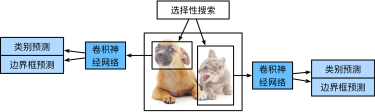

# 9.8 區域卷積神經網絡（R-CNN）系列


區域卷積神經網絡（region-based CNN或regions with CNN features，R-CNN）是將深度模型應用於目標檢測的開創性工作之一 [1]。在本節中，我們將介紹R-CNN和它的一系列改進方法：快速的R-CNN（Fast R-CNN）[3]、更快的R-CNN（Faster R-CNN）[4] 以及掩碼R-CNN（Mask R-CNN）[5]。限於篇幅，這裡只介紹這些模型的設計思路。


## 9.8.1 R-CNN

R-CNN首先對圖像選取若干提議區域（如錨框也是一種選取方法）並標註它們的類別和邊界框（如偏移量）。然後，用卷積神經網絡對每個提議區域做前向計算抽取特徵。之後，我們用每個提議區域的特徵預測類別和邊界框。圖9.5描述了R-CNN模型。

<div align=center>

</div>
<div align=center>圖9.5 R-CNN模型</div>

具體來說，R-CNN主要由以下4步構成。

1. 對輸入圖像使用選擇性搜索（selective search）來選取多個高質量的提議區域 [2]。這些提議區域通常是在多個尺度下選取的，並具有不同的形狀和大小。每個提議區域將被標註類別和真實邊界框。
1. 選取一個預訓練的卷積神經網絡，並將其在輸出層之前截斷。將每個提議區域變形為網絡需要的輸入尺寸，並通過前向計算輸出抽取的提議區域特徵。
1. 將每個提議區域的特徵連同其標註的類別作為一個樣本，訓練多個支持向量機對目標分類。其中每個支持向量機用來判斷樣本是否屬於某一個類別。
1. 將每個提議區域的特徵連同其標註的邊界框作為一個樣本，訓練線性迴歸模型來預測真實邊界框。

R-CNN雖然通過預訓練的卷積神經網絡有效抽取了圖像特徵，但它的主要缺點是速度慢。想象一下，我們可能從一張圖像中選出上千個提議區域，對該圖像做目標檢測將導致上千次的卷積神經網絡的前向計算。這個巨大的計算量令R-CNN難以在實際應用中被廣泛採用。


## 9.8.2 Fast R-CNN

R-CNN的主要性能瓶頸在於需要對每個提議區域獨立抽取特徵。由於這些區域通常有大量重疊，獨立的特徵抽取會導致大量的重複計算。Fast R-CNN對R-CNN的一個主要改進在於只對整個圖像做卷積神經網絡的前向計算。

圖9.6描述了Fast R-CNN模型。

<div align=center>

</div>
<div align=center>圖9.6 Fast R-CNN模型</div>

它的主要計算步驟如下。

1. 與R-CNN相比，Fast R-CNN用來提取特徵的卷積神經網絡的輸入是整個圖像，而不是各個提議區域。而且，這個網絡通常會參與訓練，即更新模型參數。設輸入為一張圖像，將卷積神經網絡的輸出的形狀記為$1 \times c \times h_1 \times w_1$。
1. 假設選擇性搜索生成$n$個提議區域。這些形狀各異的提議區域在卷積神經網絡的輸出上分別標出形狀各異的興趣區域。這些興趣區域需要抽取出形狀相同的特徵（假設高和寬均分別指定為$h_2$和$w_2$）以便於連結後輸出。Fast R-CNN引入興趣區域池化（Region of Interest Pooling，RoI池化）層，將卷積神經網絡的輸出和提議區域作為輸入，輸出連結後的各個提議區域抽取的特徵，形狀為$n \times c \times h_2 \times w_2$。
1. 通過全連接層將輸出形狀變換為$n \times d$，其中超參數$d$取決於模型設計。
1. 預測類別時，將全連接層的輸出的形狀再變換為$n \times q$並使用softmax迴歸（$q$為類別個數）。預測邊界框時，將全連接層的輸出的形狀變換為$n \times 4$。也就是說，我們為每個提議區域預測類別和邊界框。

Fast R-CNN中提出的興趣區域池化層跟我們在5.4節（池化層）中介紹過的池化層有所不同。在池化層中，我們通過設置池化窗口、填充和步幅來控制輸出形狀。而興趣區域池化層對每個區域的輸出形狀是可以直接指定的，例如，指定每個區域輸出的高和寬分別為$h_2$和$w_2$。假設某一興趣區域窗口的高和寬分別為$h$和$w$，該窗口將被劃分為形狀為$h_2 \times w_2$的子窗口網格，且每個子窗口的大小大約為$(h/h_2) \times (w/w_2)$。任一子窗口的高和寬要取整，其中的最大元素作為該子窗口的輸出。因此，興趣區域池化層可從形狀各異的興趣區域中均抽取出形狀相同的特徵。

圖9.7中，我們在$4 \times 4$的輸入上選取了左上角的$3\times 3$區域作為興趣區域。對於該興趣區域，我們通過$2\times 2$興趣區域池化層得到一個$2\times 2$的輸出。4個劃分後的子窗口分別含有元素0、1、4、5（5最大），2、6（6最大），8、9（9最大），10。

<div align=center>

</div>
<div align=center>圖9.7 2×2興趣區域池化層</div>

我們使用`ROIPooling`函數來演示興趣區域池化層的計算。假設卷積神經網絡抽取的特徵`X`的高和寬均為4且只有單通道。

``` python
import torch
import torchvision

X = torch.arange(16, dtype=torch.float).view(1, 1, 4, 4)
X
```
輸出:
```
tensor([[[[ 0.,  1.,  2.,  3.],
          [ 4.,  5.,  6.,  7.],
          [ 8.,  9., 10., 11.],
          [12., 13., 14., 15.]]]])
```

假設圖像的高和寬均為40像素。再假設選擇性搜索在圖像上生成了兩個提議區域：每個區域由5個元素表示，分別為區域目標類別、左上角的$x$和$y$軸座標以及右下角的$x$和$y$軸座標。

``` python
rois = torch.tensor([[0, 0, 0, 20, 20], [0, 0, 10, 30, 30]], dtype=torch.float)
```

由於`X`的高和寬是圖像的高和寬的$1/10$，以上兩個提議區域中的座標先按`spatial_scale`自乘0.1，然後在`X`上分別標出興趣區域`X[:,:,0:3,0:3]`和`X[:,:,1:4,0:4]`。最後對這兩個興趣區域分別劃分子窗口網格並抽取高和寬為2的特徵。

``` python
torchvision.ops.roi_pool(X, rois, output_size=(2, 2), spatial_scale=0.1)
```
輸出:
```
tensor([[[[ 5.,  6.],
          [ 9., 10.]]],

        [[[ 9., 11.],
          [13., 15.]]]])
```

## 9.8.3 Faster R-CNN

Fast R-CNN通常需要在選擇性搜索中生成較多的提議區域，以獲得較精確的目標檢測結果。Faster R-CNN提出將選擇性搜索替換成區域提議網絡（region proposal network），從而減少提議區域的生成數量，並保證目標檢測的精度。


<div align=center>

</div>
<div align=center>圖9.8 Faster R-CNN模型</div>


圖9.8描述了Faster R-CNN模型。與Fast R-CNN相比，只有生成提議區域的方法從選擇性搜索變成了區域提議網絡，而其他部分均保持不變。具體來說，區域提議網絡的計算步驟如下。

1. 使用填充為1的$3\times 3$卷積層變換卷積神經網絡的輸出，並將輸出通道數記為$c$。這樣，卷積神經網絡為圖像抽取的特徵圖中的每個單元均得到一個長度為$c$的新特徵。
1. 以特徵圖每個單元為中心，生成多個不同大小和寬高比的錨框並標註它們。
1. 用錨框中心單元長度為$c$的特徵分別預測該錨框的二元類別（含目標還是背景）和邊界框。
1. 使用非極大值抑制，從預測類別為目標的預測邊界框中移除相似的結果。最終輸出的預測邊界框即興趣區域池化層所需要的提議區域。


值得一提的是，區域提議網絡作為Faster R-CNN的一部分，是和整個模型一起訓練得到的。也就是說，Faster R-CNN的目標函數既包括目標檢測中的類別和邊界框預測，又包括區域提議網絡中錨框的二元類別和邊界框預測。最終，區域提議網絡能夠學習到如何生成高質量的提議區域，從而在減少提議區域數量的情況下也能保證目標檢測的精度。


## 9.8.4 Mask R-CNN

如果訓練數據還標註了每個目標在圖像上的像素級位置，那麼Mask R-CNN能有效利用這些詳盡的標註信息進一步提升目標檢測的精度。

<div align=center>

</div>
<div align=center>圖9.9 Mask R-CNN模型</div>

如圖9.9所示，Mask R-CNN在Faster R-CNN的基礎上做了修改。Mask R-CNN將興趣區域池化層替換成了興趣區域對齊層，即通過雙線性插值（bilinear interpolation）來保留特徵圖上的空間信息，從而更適於像素級預測。興趣區域對齊層的輸出包含了所有興趣區域的形狀相同的特徵圖。它們既用來預測興趣區域的類別和邊界框，又通過額外的全卷積網絡預測目標的像素級位置。我們將在9.10節（全卷積網絡）介紹如何使用全卷積網絡預測圖像中像素級的語義。


## 小結

* R-CNN對圖像選取若干提議區域，然後用卷積神經網絡對每個提議區域做前向計算抽取特徵，再用這些特徵預測提議區域的類別和邊界框。
* Fast R-CNN對R-CNN的一個主要改進在於只對整個圖像做卷積神經網絡的前向計算。它引入了興趣區域池化層，從而令興趣區域能夠抽取出形狀相同的特徵。
* Faster R-CNN將Fast R-CNN中的選擇性搜索替換成區域提議網絡，從而減少提議區域的生成數量，並保證目標檢測的精度。
* Mask R-CNN在Faster R-CNN基礎上引入一個全卷積網絡，從而藉助目標的像素級位置進一步提升目標檢測的精度。


## 參考文獻

[1] Girshick, R., Donahue, J., Darrell, T., & Malik, J. (2014). Rich feature hierarchies for accurate object detection and semantic segmentation. In Proceedings of the IEEE conference on computer vision and pattern recognition (pp. 580-587).

[2] Uijlings, J. R., Van De Sande, K. E., Gevers, T., & Smeulders, A. W. (2013). Selective search for object recognition. International journal of computer vision, 104(2), 154-171.

[3] Girshick, R. (2015). Fast r-cnn. arXiv preprint arXiv:1504.08083.

[4] Ren, S., He, K., Girshick, R., & Sun, J. (2015). Faster r-cnn: Towards real-time object detection with region proposal networks. In Advances in neural information processing systems (pp. 91-99).

[5] He, K., Gkioxari, G., Dollár, P., & Girshick, R. (2017, October). Mask r-cnn. In Computer Vision (ICCV), 2017 IEEE International Conference on (pp. 2980-2988). IEEE.

-----------
> 注：除代碼外本節與原書基本相同，[原書傳送門](http://zh.d2l.ai/chapter_computer-vision/rcnn.html)
