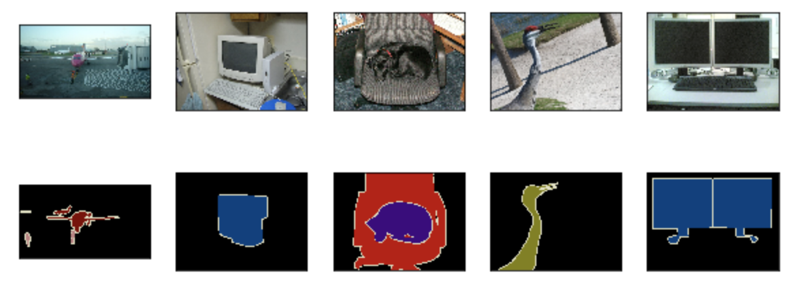

# 9.9 語義分割和數據集

在前幾節討論的目標檢測問題中，我們一直使用方形邊界框來標註和預測圖像中的目標。本節將探討語義分割（semantic segmentation）問題，它關注如何將圖像分割成屬於不同語義類別的區域。值得一提的是，這些語義區域的標註和預測都是像素級的。圖9.10展示了語義分割中圖像有關狗、貓和背景的標籤。可以看到，與目標檢測相比，語義分割標註的像素級的邊框顯然更加精細。

<div align=center>

</div>
<div align=center>圖9.10 語義分割中圖像有關狗、貓和背景的標籤</div>

## 9.9.1 圖像分割和實例分割

計算機視覺領域還有2個與語義分割相似的重要問題，即圖像分割（image segmentation）和實例分割（instance segmentation）。我們在這裡將它們與語義分割簡單區分一下。

* 圖像分割將圖像分割成若干組成區域。這類問題的方法通常利用圖像中像素之間的相關性。它在訓練時不需要有關圖像像素的標籤信息，在預測時也無法保證分割出的區域具有我們希望得到的語義。以圖9.10的圖像為輸入，圖像分割可能將狗分割成兩個區域：一個覆蓋以黑色為主的嘴巴和眼睛，而另一個覆蓋以黃色為主的其餘部分身體。
* 實例分割又叫同時檢測並分割（simultaneous detection and segmentation）。它研究如何識別圖像中各個目標實例的像素級區域。與語義分割有所不同，實例分割不僅需要區分語義，還要區分不同的目標實例。如果圖像中有兩隻狗，實例分割需要區分像素屬於這兩隻狗中的哪一隻。


## 9.9.2 Pascal VOC2012語義分割數據集

語義分割的一個重要數據集叫作Pascal VOC2012 [1]。為了更好地瞭解這個數據集，我們先導入實驗所需的包或模塊。

``` python
%matplotlib inline
import time
import torch
import torch.nn.functional as F
import torchvision
import numpy as np
from PIL import Image
from tqdm import tqdm

import sys
sys.path.append("..") 
import d2lzh_pytorch as d2l
```

我們先下載這個數據集的壓縮包（[下載地址](http://host.robots.ox.ac.uk/pascal/VOC/voc2012/VOCtrainval_11-May-2012.tar)）。壓縮包大小是2 GB左右，下載需要一定時間。下載後解壓得到`VOCdevkit/VOC2012`文件夾，然後將其放置在`data`文件夾下。

``` python
!ls ../../data/VOCdevkit/VOC2012
```
```
Annotations        JPEGImages         SegmentationObject
ImageSets          SegmentationClass
```

進入`../../data/VOCdevkit/VOC2012`路徑後，我們可以獲取數據集的不同組成部分。其中`ImageSets/Segmentation`路徑包含了指定訓練和測試樣本的文本文件，而`JPEGImages`和`SegmentationClass`路徑下分別包含了樣本的輸入圖像和標籤。這裡的標籤也是圖像格式，其尺寸和它所標註的輸入圖像的尺寸相同。標籤中顏色相同的像素屬於同一個語義類別。下面定義`read_voc_images`函數將輸入圖像和標籤讀進內存。

``` python
# 本函數已保存在d2lzh_pytorch中方便以後使用
def read_voc_images(root="../../data/VOCdevkit/VOC2012", 
                    is_train=True, max_num=None):
    txt_fname = '%s/ImageSets/Segmentation/%s' % (
        root, 'train.txt' if is_train else 'val.txt')
    with open(txt_fname, 'r') as f:
        images = f.read().split()
    if max_num is not None:
        images = images[:min(max_num, len(images))]
    features, labels = [None] * len(images), [None] * len(images)
    for i, fname in tqdm(enumerate(images)):
        features[i] = Image.open('%s/JPEGImages/%s.jpg' % (root, fname)).convert("RGB")
        labels[i] = Image.open('%s/SegmentationClass/%s.png' % (root, fname)).convert("RGB")
    return features, labels # PIL image

voc_dir = "../../data/VOCdevkit/VOC2012"
train_features, train_labels = read_voc_images(voc_dir, max_num=100)
```

我們畫出前5張輸入圖像和它們的標籤。在標籤圖像中，白色和黑色分別代表邊框和背景，而其他不同的顏色則對應不同的類別。

``` python
n = 5
imgs = train_features[0:n] + train_labels[0:n]
d2l.show_images(imgs, 2, n);
```
<div align=center>

</div>

接下來，我們列出標籤中每個RGB顏色的值及其標註的類別。

``` python
# 本函數已保存在d2lzh_pytorch中方便以後使用
VOC_COLORMAP = [[0, 0, 0], [128, 0, 0], [0, 128, 0], [128, 128, 0],
                [0, 0, 128], [128, 0, 128], [0, 128, 128], [128, 128, 128],
                [64, 0, 0], [192, 0, 0], [64, 128, 0], [192, 128, 0],
                [64, 0, 128], [192, 0, 128], [64, 128, 128], [192, 128, 128],
                [0, 64, 0], [128, 64, 0], [0, 192, 0], [128, 192, 0],
                [0, 64, 128]]
# 本函數已保存在d2lzh_pytorch中方便以後使用
VOC_CLASSES = ['background', 'aeroplane', 'bicycle', 'bird', 'boat',
               'bottle', 'bus', 'car', 'cat', 'chair', 'cow',
               'diningtable', 'dog', 'horse', 'motorbike', 'person',
               'potted plant', 'sheep', 'sofa', 'train', 'tv/monitor']
```

有了上面定義的兩個常量以後，我們可以很容易地查找標籤中每個像素的類別索引。

``` python
colormap2label = torch.zeros(256 ** 3, dtype=torch.uint8)
for i, colormap in enumerate(VOC_COLORMAP):
    colormap2label[(colormap[0] * 256 + colormap[1]) * 256 + colormap[2]] = i

# 本函數已保存在d2lzh_pytorch中方便以後使用
def voc_label_indices(colormap, colormap2label):
    """
    convert colormap (PIL image) to colormap2label (uint8 tensor).
    """
    colormap = np.array(colormap.convert("RGB")).astype('int32')
    idx = ((colormap[:, :, 0] * 256 + colormap[:, :, 1]) * 256
           + colormap[:, :, 2])
    return colormap2label[idx]
```

例如，第一張樣本圖像中飛機頭部區域的類別索引為1，而背景全是0。

``` python
y = voc_label_indices(train_labels[0], colormap2label)
y[105:115, 130:140], VOC_CLASSES[1]
```
輸出:
```
(tensor([[0, 0, 0, 0, 0, 0, 0, 0, 0, 1],
         [0, 0, 0, 0, 0, 0, 0, 1, 1, 1],
         [0, 0, 0, 0, 0, 0, 1, 1, 1, 1],
         [0, 0, 0, 0, 0, 1, 1, 1, 1, 1],
         [0, 0, 0, 0, 0, 1, 1, 1, 1, 1],
         [0, 0, 0, 0, 1, 1, 1, 1, 1, 1],
         [0, 0, 0, 0, 0, 1, 1, 1, 1, 1],
         [0, 0, 0, 0, 0, 1, 1, 1, 1, 1],
         [0, 0, 0, 0, 0, 0, 1, 1, 1, 1],
         [0, 0, 0, 0, 0, 0, 0, 0, 1, 1]], dtype=torch.uint8), 'aeroplane')
```

### 9.9.2.1 預處理數據

在之前的章節中，我們通過縮放圖像使其符合模型的輸入形狀。然而在語義分割裡，這樣做需要將預測的像素類別重新映射回原始尺寸的輸入圖像。這樣的映射難以做到精確，尤其在不同語義的分割區域。為了避免這個問題，我們將圖像裁剪成固定尺寸而不是縮放。具體來說，我們使用圖像增廣裡的隨機裁剪，並對輸入圖像和標籤裁剪相同區域。

``` python
# 本函數已保存在d2lzh_pytorch中方便以後使用
def voc_rand_crop(feature, label, height, width):
    """
    Random crop feature (PIL image) and label (PIL image).
    """
    i, j, h, w = torchvision.transforms.RandomCrop.get_params(
            feature, output_size=(height, width))
    
    feature = torchvision.transforms.functional.crop(feature, i, j, h, w)
    label = torchvision.transforms.functional.crop(label, i, j, h, w)    

    return feature, label

imgs = []
for _ in range(n):
    imgs += voc_rand_crop(train_features[0], train_labels[0], 200, 300)
d2l.show_images(imgs[::2] + imgs[1::2], 2, n);
```
<div align=center>

</div>

### 9.9.2.2 自定義語義分割數據集類

我們通過繼承PyTorch提供的`Dataset`類自定義了一個語義分割數據集類`VOCSegDataset`。通過實現`__getitem__`函數，我們可以任意訪問數據集中索引為`idx`的輸入圖像及其每個像素的類別索引。由於數據集中有些圖像的尺寸可能小於隨機裁剪所指定的輸出尺寸，這些樣本需要通過自定義的`filter`函數所移除。此外，我們還對輸入圖像的RGB三個通道的值分別做標準化。

``` python
# 本函數已保存在d2lzh_pytorch中方便以後使用
class VOCSegDataset(torch.utils.data.Dataset):
    def __init__(self, is_train, crop_size, voc_dir, colormap2label, max_num=None):
        """
        crop_size: (h, w)
        """
        self.rgb_mean = np.array([0.485, 0.456, 0.406])
        self.rgb_std = np.array([0.229, 0.224, 0.225])
        self.tsf = torchvision.transforms.Compose([
            torchvision.transforms.ToTensor(),
            torchvision.transforms.Normalize(mean=self.rgb_mean, 
                                             std=self.rgb_std)
        ])
        
        self.crop_size = crop_size # (h, w)
        features, labels = read_voc_images(root=voc_dir, 
                                           is_train=is_train, 
                                           max_num=max_num)
        self.features = self.filter(features) # PIL image
        self.labels = self.filter(labels)     # PIL image
        self.colormap2label = colormap2label
        print('read ' + str(len(self.features)) + ' valid examples')

    def filter(self, imgs):
        return [img for img in imgs if (
            img.size[1] >= self.crop_size[0] and
            img.size[0] >= self.crop_size[1])]

    def __getitem__(self, idx):
        feature, label = voc_rand_crop(self.features[idx], self.labels[idx],
                                       *self.crop_size)
        
        return (self.tsf(feature), # float32 tensor
                voc_label_indices(label, self.colormap2label)) # uint8 tensor

    def __len__(self):
        return len(self.features)
```

### 9.9.2.3 讀取數據集

我們通過自定義的`VOCSegDataset`類來分別創建訓練集和測試集的實例。假設我們指定隨機裁剪的輸出圖像的形狀為$320\times 480$。下面我們可以查看訓練集和測試集所保留的樣本個數。

``` python
crop_size = (320, 480)
max_num = 100
voc_train = VOCSegDataset(True, crop_size, voc_dir, colormap2label, max_num)
voc_test = VOCSegDataset(False, crop_size, voc_dir, colormap2label, max_num)
```
輸出:
```
read 75 valid examples
read 77 valid examples
```

設批量大小為64，分別定義訓練集和測試集的迭代器。

``` python
batch_size = 64
num_workers = 0 if sys.platform.startswith('win32') else 4
train_iter = torch.utils.data.DataLoader(voc_train, batch_size, shuffle=True,
                              drop_last=True, num_workers=num_workers)
test_iter = torch.utils.data.DataLoader(voc_test, batch_size, drop_last=True,
                             num_workers=num_workers)
```

打印第一個小批量的類型和形狀。不同於圖像分類和目標識別，這裡的標籤是一個三維數組。

``` python
for X, Y in train_iter:
    print(X.dtype, X.shape)
    print(y.dtype, Y.shape)
    break
```
輸出:
```
torch.float32 torch.Size([64, 3, 320, 480])
torch.uint8 torch.Size([64, 320, 480])
```

## 小結

* 語義分割關注如何將圖像分割成屬於不同語義類別的區域。
* 語義分割的一個重要數據集叫作Pascal VOC2012。
* 由於語義分割的輸入圖像和標籤在像素上一一對應，所以將圖像隨機裁剪成固定尺寸而不是縮放。

## 練習

* 回憶9.1節（圖像增廣）中的內容。哪些在圖像分類中使用的圖像增廣方法難以用於語義分割？

##  參考文獻

[1] Pascal VOC2012數據集。http://host.robots.ox.ac.uk/pascal/VOC/voc2012/


-----------
> 注：除代碼外本節與原書基本相同，[原書傳送門](http://zh.d2l.ai/chapter_computer-vision/semantic-segmentation-and-dataset.html)

