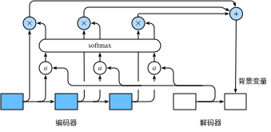

# 10.11 注意力機制

在10.9節（編碼器—解碼器（seq2seq））裡，解碼器在各個時間步依賴相同的背景變量來獲取輸入序列信息。當編碼器為循環神經網絡時，背景變量來自它最終時間步的隱藏狀態。

現在，讓我們再次思考那一節提到的翻譯例子：輸入為英語序列“They”“are”“watching”“.”，輸出為法語序列“Ils”“regardent”“.”。不難想到，解碼器在生成輸出序列中的每一個詞時可能只需利用輸入序列某一部分的信息。例如，在輸出序列的時間步1，解碼器可以主要依賴“They”“are”的信息來生成“Ils”，在時間步2則主要使用來自“watching”的編碼信息生成“regardent”，最後在時間步3則直接映射句號“.”。這看上去就像是在解碼器的每一時間步對輸入序列中不同時間步的表徵或編碼信息分配不同的注意力一樣。這也是注意力機制的由來 [1]。

仍然以循環神經網絡為例，注意力機制通過對編碼器所有時間步的隱藏狀態做加權平均來得到背景變量。解碼器在每一時間步調整這些權重，即注意力權重，從而能夠在不同時間步分別關注輸入序列中的不同部分並編碼進相應時間步的背景變量。本節我們將討論注意力機制是怎麼工作的。

在10.9節（編碼器—解碼器（seq2seq））裡我們區分了輸入序列或編碼器的索引$t$與輸出序列或解碼器的索引$t'$。該節中，解碼器在時間步$t'$的隱藏狀態$\boldsymbol{s}_{t'} = g(\boldsymbol{y}_{t'-1}, \boldsymbol{c}, \boldsymbol{s}_{t'-1})$，其中$\boldsymbol{y}_{t'-1}$是上一時間步$t'-1$的輸出$y_{t'-1}$的表徵，且任一時間步$t'$使用相同的背景變量$\boldsymbol{c}$。但在注意力機制中，解碼器的每一時間步將使用可變的背景變量。記$\boldsymbol{c}_{t'}$是解碼器在時間步$t'$的背景變量，那麼解碼器在該時間步的隱藏狀態可以改寫為

$$\boldsymbol{s}_{t'} = g(\boldsymbol{y}_{t'-1}, \boldsymbol{c}_{t'}, \boldsymbol{s}_{t'-1}).$$

這裡的關鍵是如何計算背景變量$\boldsymbol{c}_{t'}$和如何利用它來更新隱藏狀態$\boldsymbol{s}_{t'}$。下面將分別描述這兩個關鍵點。

## 10.11.1 計算背景變量

我們先描述第一個關鍵點，即計算背景變量。圖10.12描繪了注意力機制如何為解碼器在時間步2計算背景變量。首先，函數$a$根據解碼器在時間步1的隱藏狀態和編碼器在各個時間步的隱藏狀態計算softmax運算的輸入。softmax運算輸出概率分佈並對編碼器各個時間步的隱藏狀態做加權平均，從而得到背景變量。

圖10.12 編碼器—解碼器上的注意力機制

具體來說，令編碼器在時間步$t$的隱藏狀態為$\boldsymbol{h}_t$，且總時間步數為$T$。那麼解碼器在時間步$t'$的背景變量為所有編碼器隱藏狀態的加權平均：

$$
\boldsymbol{c}_{t'} = \sum_{t=1}^T \alpha_{t' t} \boldsymbol{h}_t,
$$

其中給定$t'$時，權重$\alpha_{t' t}$在$t=1,\ldots,T$的值是一個概率分佈。為了得到概率分佈，我們可以使用softmax運算:

$$
\alpha_{t' t} = \frac{\exp(e_{t' t})}{ \sum_{k=1}^T \exp(e_{t' k}) },\quad t=1,\ldots,T.
$$

現在，我們需要定義如何計算上式中softmax運算的輸入$e_{t' t}$。由於$e_{t' t}$同時取決於解碼器的時間步$t'$和編碼器的時間步$t$，我們不妨以解碼器在時間步$t'-1$的隱藏狀態$\boldsymbol{s}_{t' - 1}$與編碼器在時間步$t$的隱藏狀態$\boldsymbol{h}_t$為輸入，並通過函數$a$計算$e_{t' t}$：

$$
e_{t' t} = a(\boldsymbol{s}_{t' - 1}, \boldsymbol{h}_t).
$$

這裡函數$a$有多種選擇，如果兩個輸入向量長度相同，一個簡單的選擇是計算它們的內積$a(\boldsymbol{s}, \boldsymbol{h})=\boldsymbol{s}^\top \boldsymbol{h}$。而最早提出注意力機制的論文則將輸入連結後通過含單隱藏層的多層感知機變換 [1]：

$$
a(\boldsymbol{s}, \boldsymbol{h}) = \boldsymbol{v}^\top \tanh(\boldsymbol{W}_s \boldsymbol{s} + \boldsymbol{W}_h \boldsymbol{h}),
$$

其中$\boldsymbol{v}$、$\boldsymbol{W}_s$、$\boldsymbol{W}_h$都是可以學習的模型參數。

### 10.11.1.1 矢量化計算

我們還可以對注意力機制採用更高效的矢量化計算。廣義上，注意力機制的輸入包括查詢項以及一一對應的鍵項和值項，其中值項是需要加權平均的一組項。在加權平均中，值項的權重來自查詢項以及與該值項對應的鍵項的計算。

在上面的例子中，查詢項為解碼器的隱藏狀態，鍵項和值項均為編碼器的隱藏狀態。
讓我們考慮一個常見的簡單情形，即編碼器和解碼器的隱藏單元個數均為$h$，且函數$a(\boldsymbol{s}, \boldsymbol{h})=\boldsymbol{s}^\top \boldsymbol{h}$。假設我們希望根據解碼器單個隱藏狀態$\boldsymbol{s}_{t' - 1} \in \mathbb{R}^{h}$和編碼器所有隱藏狀態$\boldsymbol{h}_t \in \mathbb{R}^{h}, t = 1,\ldots,T$來計算背景向量$\boldsymbol{c}_{t'}\in \mathbb{R}^{h}$。
我們可以將查詢項矩陣$\boldsymbol{Q} \in \mathbb{R}^{1 \times h}$設為$\boldsymbol{s}_{t' - 1}^\top$，並令鍵項矩陣$\boldsymbol{K} \in \mathbb{R}^{T \times h}$和值項矩陣$\boldsymbol{V} \in \mathbb{R}^{T \times h}$相同且第$t$行均為$\boldsymbol{h}_t^\top$。此時，我們只需要通過矢量化計算

$$\text{softmax}(\boldsymbol{Q}\boldsymbol{K}^\top)\boldsymbol{V}$$

即可算出轉置後的背景向量$\boldsymbol{c}_{t'}^\top$。當查詢項矩陣$\boldsymbol{Q}$的行數為$n$時，上式將得到$n$行的輸出矩陣。輸出矩陣與查詢項矩陣在相同行上一一對應。

## 10.11.2 更新隱藏狀態

現在我們描述第二個關鍵點，即更新隱藏狀態。以門控循環單元為例，在解碼器中我們可以對6.7節（門控循環單元（GRU））中門控循環單元的設計稍作修改，從而變換上一時間步$t'-1$的輸出$\boldsymbol{y}_{t'-1}$、隱藏狀態$\boldsymbol{s}_{t' - 1}$和當前時間步$t'$的含注意力機制的背景變量$\boldsymbol{c}_{t'}$ [1]。解碼器在時間步$t'$的隱藏狀態為

$$\boldsymbol{s}_{t'} = \boldsymbol{z}_{t'} \odot \boldsymbol{s}_{t'-1}  + (1 - \boldsymbol{z}_{t'}) \odot \tilde{\boldsymbol{s}}_{t'},$$

其中的重置門、更新門和候選隱藏狀態分別為

$$
\begin{aligned}
\boldsymbol{r}_{t'} &= \sigma(\boldsymbol{W}_{yr} \boldsymbol{y}_{t'-1} + \boldsymbol{W}_{sr} \boldsymbol{s}_{t' - 1} + \boldsymbol{W}_{cr} \boldsymbol{c}_{t'} + \boldsymbol{b}_r),\\
\boldsymbol{z}_{t'} &= \sigma(\boldsymbol{W}_{yz} \boldsymbol{y}_{t'-1} + \boldsymbol{W}_{sz} \boldsymbol{s}_{t' - 1} + \boldsymbol{W}_{cz} \boldsymbol{c}_{t'} + \boldsymbol{b}_z),\\
\tilde{\boldsymbol{s}}_{t'} &= \text{tanh}(\boldsymbol{W}_{ys} \boldsymbol{y}_{t'-1} + \boldsymbol{W}_{ss} (\boldsymbol{s}_{t' - 1} \odot \boldsymbol{r}_{t'}) + \boldsymbol{W}_{cs} \boldsymbol{c}_{t'} + \boldsymbol{b}_s),
\end{aligned}
$$

其中含下標的$\boldsymbol{W}$和$\boldsymbol{b}$分別為門控循環單元的權重參數和偏差參數。

## 10.11.3 發展

本質上，注意力機制能夠為表徵中較有價值的部分分配較多的計算資源。這個有趣的想法自提出後得到了快速發展，特別是啟發了依靠注意力機制來編碼輸入序列並解碼出輸出序列的變換器（Transformer）模型的設計 [2]。變換器拋棄了卷積神經網絡和循環神經網絡的架構。它在計算效率上比基於循環神經網絡的編碼器—解碼器模型通常更具明顯優勢。含注意力機制的變換器的編碼結構在後來的BERT預訓練模型中得以應用並令後者大放異彩：微調後的模型在多達11項自然語言處理任務中取得了當時最先進的結果 [3]。不久後，同樣是基於變換器設計的GPT-2模型於新收集的語料數據集預訓練後，在7個未參與訓練的語言模型數據集上均取得了當時最先進的結果 [4]。除了自然語言處理領域，注意力機制還被廣泛用於圖像分類、自動圖像描述、脣語解讀以及語音識別。

## 小結

* 可以在解碼器的每個時間步使用不同的背景變量，並對輸入序列中不同時間步編碼的信息分配不同的注意力。
* 廣義上，注意力機制的輸入包括查詢項以及一一對應的鍵項和值項。
* 注意力機制可以採用更為高效的矢量化計算。

## 參考文獻

[1] Bahdanau, D., Cho, K., & Bengio, Y. (2014). Neural machine translation by jointly learning to align and translate. arXiv preprint arXiv:1409.0473.

[2] Vaswani, A., Shazeer, N., Parmar, N., Uszkoreit, J., Jones, L., Gomez, A. N., ... & Polosukhin, I. (2017). Attention is all you need. In Advances in Neural Information Processing Systems (pp. 5998-6008).

[3] Devlin, J., Chang, M. W., Lee, K., & Toutanova, K. (2018). Bert: Pre-training of deep bidirectional transformers for language understanding. arXiv preprint arXiv:1810.04805.

[4] Radford, A., Wu, J., Child, R., Luan, D., Amodei, D., Sutskever I. (2019). Language Models are Unsupervised Multitask Learners. OpenAI.

-----------
> 注：本節與原書基本相同，[原書傳送門](https://zh.d2l.ai/chapter_natural-language-processing/attention.html)

