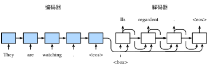

# 10.9 編碼器—解碼器（seq2seq）

我們已經在前兩節中表徵並變換了不定長的輸入序列。但在自然語言處理的很多應用中，輸入和輸出都可以是不定長序列。以機器翻譯為例，輸入可以是一段不定長的英語文本序列，輸出可以是一段不定長的法語文本序列，例如

> 英語輸入：“They”、“are”、“watching”、“.”

> 法語輸出：“Ils”、“regardent”、“.”

當輸入和輸出都是不定長序列時，我們可以使用編碼器—解碼器（encoder-decoder）[1] 或者seq2seq模型 [2]。這兩個模型本質上都用到了兩個循環神經網絡，分別叫做編碼器和解碼器。編碼器用來分析輸入序列，解碼器用來生成輸出序列。

圖10.8描述了使用編碼器—解碼器將上述英語句子翻譯成法語句子的一種方法。在訓練數據集中，我們可以在每個句子後附上特殊符號“&lt;eos&gt;”（end of sequence）以表示序列的終止。編碼器每個時間步的輸入依次為英語句子中的單詞、標點和特殊符號“&lt;eos&gt;”。圖10.8中使用了編碼器在最終時間步的隱藏狀態作為輸入句子的表徵或編碼信息。解碼器在各個時間步中使用輸入句子的編碼信息和上個時間步的輸出以及隱藏狀態作為輸入。我們希望解碼器在各個時間步能正確依次輸出翻譯後的法語單詞、標點和特殊符號"&lt;eos&gt;"。需要注意的是，解碼器在最初時間步的輸入用到了一個表示序列開始的特殊符號"&lt;bos&gt;"（beginning of sequence）。

圖10.8 使用編碼器—解碼器將句子由英語翻譯成法語。編碼器和解碼器分別為循環神經網絡

接下來，我們分別介紹編碼器和解碼器的定義。

## 10.9.1 編碼器

編碼器的作用是把一個不定長的輸入序列變換成一個定長的背景變量$\boldsymbol{c}$，並在該背景變量中編碼輸入序列信息。常用的編碼器是循環神經網絡。

讓我們考慮批量大小為1的時序數據樣本。假設輸入序列是$x_1,\ldots,x_T$，例如$x_i$是輸入句子中的第$i$個詞。在時間步$t$，循環神經網絡將輸入$x_t$的特徵向量$\boldsymbol{x}_t$和上個時間步的隱藏狀態$\boldsymbol{h}_{t-1}$變換為當前時間步的隱藏狀態$\boldsymbol{h}_t$。我們可以用函數$f$表達循環神經網絡隱藏層的變換：

$$
\boldsymbol{h}_t = f(\boldsymbol{x}_t, \boldsymbol{h}_{t-1}).
$$

接下來，編碼器通過自定義函數$q$將各個時間步的隱藏狀態變換為背景變量

$$
\boldsymbol{c} =  q(\boldsymbol{h}_1, \ldots, \boldsymbol{h}_T).
$$

例如，當選擇$q(\boldsymbol{h}_1, \ldots, \boldsymbol{h}_T) = \boldsymbol{h}_T$時，背景變量是輸入序列最終時間步的隱藏狀態$\boldsymbol{h}_T$。

以上描述的編碼器是一個單向的循環神經網絡，每個時間步的隱藏狀態只取決於該時間步及之前的輸入子序列。我們也可以使用雙向循環神經網絡構造編碼器。在這種情況下，編碼器每個時間步的隱藏狀態同時取決於該時間步之前和之後的子序列（包括當前時間步的輸入），並編碼了整個序列的信息。

## 10.9.2 解碼器

剛剛已經介紹，編碼器輸出的背景變量$\boldsymbol{c}$編碼了整個輸入序列$x_1, \ldots, x_T$的信息。給定訓練樣本中的輸出序列$y_1, y_2, \ldots, y_{T'}$，對每個時間步$t'$（符號與輸入序列或編碼器的時間步$t$有區別），解碼器輸出$y_{t'}$的條件概率將基於之前的輸出序列$y_1,\ldots,y_{t'-1}$和背景變量$\boldsymbol{c}$，即$P(y_{t'} \mid y_1, \ldots, y_{t'-1}, \boldsymbol{c})$。

為此，我們可以使用另一個循環神經網絡作為解碼器。在輸出序列的時間步$t^\prime$，解碼器將上一時間步的輸出$y_{t^\prime-1}$以及背景變量$\boldsymbol{c}$作為輸入，並將它們與上一時間步的隱藏狀態$\boldsymbol{s}_{t^\prime-1}$變換為當前時間步的隱藏狀態$\boldsymbol{s}_{t^\prime}$。因此，我們可以用函數$g$表達解碼器隱藏層的變換：

$$
\boldsymbol{s}_{t^\prime} = g(y_{t^\prime-1}, \boldsymbol{c}, \boldsymbol{s}_{t^\prime-1}).
$$

有了解碼器的隱藏狀態後，我們可以使用自定義的輸出層和softmax運算來計算$P(y_{t^\prime} \mid y_1, \ldots, y_{t^\prime-1}, \boldsymbol{c})$，例如，基於當前時間步的解碼器隱藏狀態 $\boldsymbol{s}_{t^\prime}$、上一時間步的輸出$y_{t^\prime-1}$以及背景變量$\boldsymbol{c}$來計算當前時間步輸出$y_{t^\prime}$的概率分佈。

## 10.9.3 訓練模型

根據最大似然估計，我們可以最大化輸出序列基於輸入序列的條件概率

$$
\begin{aligned}
P(y_1, \ldots, y_{T'} \mid x_1, \ldots, x_T)
&= \prod_{t'=1}^{T'} P(y_{t'} \mid y_1, \ldots, y_{t'-1}, x_1, \ldots, x_T)\\
&= \prod_{t'=1}^{T'} P(y_{t'} \mid y_1, \ldots, y_{t'-1}, \boldsymbol{c}),
\end{aligned}
$$

並得到該輸出序列的損失

$$
-\log P(y_1, \ldots, y_{T'} \mid x_1, \ldots, x_T) = -\sum_{t'=1}^{T'} \log P(y_{t'} \mid y_1, \ldots, y_{t'-1}, \boldsymbol{c}),
$$

在模型訓練中，所有輸出序列損失的均值通常作為需要最小化的損失函數。在圖10.8所描述的模型預測中，我們需要將解碼器在上一個時間步的輸出作為當前時間步的輸入。與此不同，在訓練中我們也可以將標籤序列（訓練集的真實輸出序列）在上一個時間步的標籤作為解碼器在當前時間步的輸入。這叫作強制教學（teacher forcing）。

## 小結

* 編碼器-解碼器（seq2seq）可以輸入並輸出不定長的序列。
* 編碼器—解碼器使用了兩個循環神經網絡。
* 在編碼器—解碼器的訓練中，可以採用強制教學。

## 參考文獻

[1] Cho, K., Van Merriënboer, B., Gulcehre, C., Bahdanau, D., Bougares, F., Schwenk, H., & Bengio, Y. (2014). Learning phrase representations using RNN encoder-decoder for statistical machine translation. arXiv preprint arXiv:1406.1078.

[2] Sutskever, I., Vinyals, O., & Le, Q. V. (2014). Sequence to sequence learning with neural networks. In Advances in neural information processing systems (pp. 3104-3112).

-----------
> 注：本節與原書基本相同，[原書傳送門](https://zh.d2l.ai/chapter_natural-language-processing/seq2seq.html)
