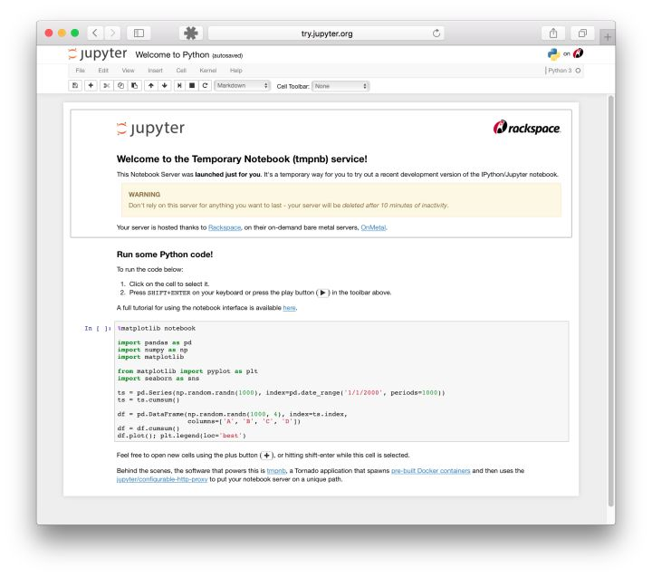

# 2.1 環境配置
本節簡單介紹一些必要的軟件的安裝與配置，由於不同機器軟硬件配置不同，所以不詳述，遇到問題請善用Google。
## 2.1.1 Anaconda
Anaconda是Python的一個開源發行版本，主要面向科學計算。我們可以簡單理解為，Anaconda是一個預裝了很多我們用的到或用不到的第三方庫的Python。而且相比於大家熟悉的pip install命令，Anaconda中增加了conda install命令。當你熟悉了Anaconda以後會發現，conda install會比pip install更方便一些。
強烈建議先去看看[最省心的Python版本和第三方庫管理——初探Anaconda](https://zhuanlan.zhihu.com/p/25198543)和[初學 Python 者自學 Anaconda 的正確姿勢-猴子的回答](https://www.zhihu.com/question/58033789/answer/254673663)。 

總的來說，我們應該完成以下幾步：
* 根據操作系統下載並安裝Anaconda（或者mini版本Miniconda）並學會常用的幾個conda命令，例如如何管理python環境、如何安裝卸載包等；
* Anaconda安裝成功之後，我們需要修改其包管理鏡像為國內源，這樣以後安裝包時就會快一些。

## 2.1.2 Jupyter
在沒有notebook之前，在IT領域是這樣工作的：在普通的 Python shell 或者在IDE（集成開發環境）如Pycharm中寫代碼，然後在word中寫文檔來說明你的項目。這個過程很繁瑣，通常是寫完代碼，再寫文檔的時候我還的重頭回顧一遍代碼。最蛋疼的地方在於，有些數據分析的中間結果，還得重新跑代碼，然後把結果弄到文檔裡給客戶看。有了notebook之後，世界突然美好了許多，因為notebook可以直接在代碼旁寫出敘述性文檔，而不是另外編寫單獨的文檔。也就是它可以能將代碼、文檔等這一切集中到一處，讓用戶一目瞭然。如下圖所示。
<div align=center>

</div>

Jupyter Notebook 已迅速成為數據分析，機器學習的必備工具。因為它可以讓數據分析師集中精力向用戶解釋整個分析過程。

我們參考[jupyter notebook-猴子的回答](https://www.zhihu.com/question/46309360/answer/254638807)進行jupyter notebook及常用包（例如環境自動關聯包nb_conda）的安裝。

安裝好後，我們使用以下命令打開一個jupyter notebook:
``` shell
jupyter notebook 
```
這時在瀏覽器打開 http://localhost:8888 （通常會自動打開）位於當前目錄的jupyter服務。

## 2.1.3 PyTorch
由於本文需要用到PyTorch框架，所以還需要安裝PyTorch（後期必不可少地會使用GPU，所以安裝GPU版本的）。直接去[PyTorch官網](https://pytorch.org/)找到自己的軟硬件對應的安裝命令即可（這裡不得不吹一下[PyTorch的官方文檔](https://pytorch.org/tutorials/)，從安裝到入門，深入淺出，比tensorflow不知道高到哪裡去了）。安裝好後使用以下命令可查看安裝的PyTorch及版本號。
``` shell
conda list | grep torch
```

## 2.1.4 其他
此外還可以安裝python最好用的IDE [PyCharm](https://www.jetbrains.com/pycharm/)，專業版的應該是需要收費的，但學生用戶可以申請免費使用（[傳送門](https://www.jetbrains.com/zh/student/)），或者直接用免費的社區版。

如果不喜歡用IDE也可以選擇編輯器，例如VSCode等。


本節與原文有很大不同，[原文傳送門](https://zh.d2l.ai/chapter_prerequisite/install.html)
