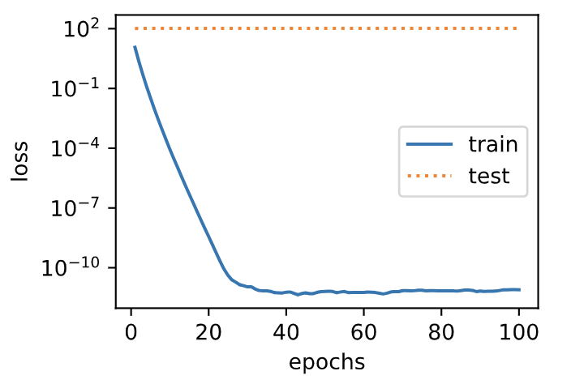
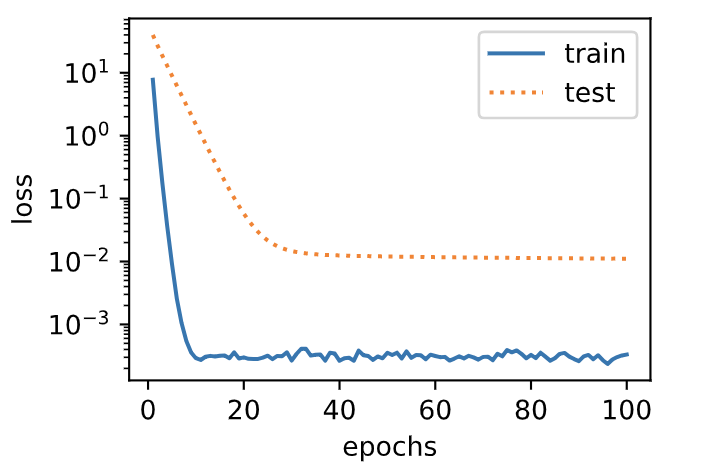
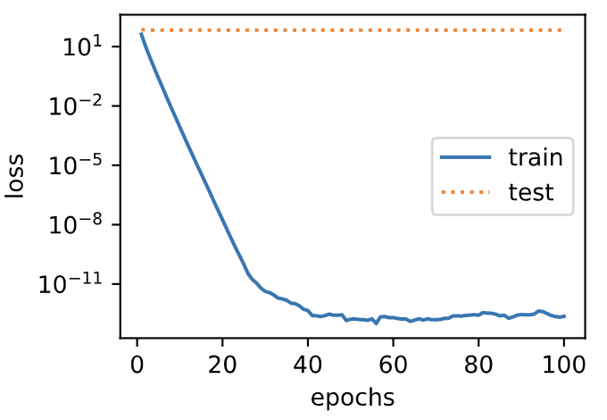
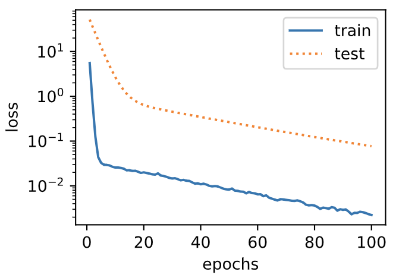

# 3.12 權重衰減

上一節中我們觀察了過擬合現象，即模型的訓練誤差遠小於它在測試集上的誤差。雖然增大訓練數據集可能會減輕過擬合，但是獲取額外的訓練數據往往代價高昂。本節介紹應對過擬合問題的常用方法：權重衰減（weight decay）。


## 3.12.1 方法

權重衰減等價於 $L_2$ 範數正則化（regularization）。正則化通過為模型損失函數添加懲罰項使學出的模型參數值較小，是應對過擬合的常用手段。我們先描述$L_2$範數正則化，再解釋它為何又稱權重衰減。

$L_2$範數正則化在模型原損失函數基礎上添加$L_2$範數懲罰項，從而得到訓練所需要最小化的函數。$L_2$範數懲罰項指的是模型權重參數每個元素的平方和與一個正的常數的乘積。以3.1節（線性迴歸）中的線性迴歸損失函數

$$
\ell(w_1, w_2, b) = \frac{1}{n} \sum_{i=1}^n \frac{1}{2}\left(x_1^{(i)} w_1 + x_2^{(i)} w_2 + b - y^{(i)}\right)^2
$$

為例，其中$w_1, w_2$是權重參數，$b$是偏差參數，樣本$i$的輸入為$x_1^{(i)}, x_2^{(i)}$，標籤為$y^{(i)}$，樣本數為$n$。將權重參數用向量$\boldsymbol{w} = [w_1, w_2]$表示，帶有$L_2$範數懲罰項的新損失函數為

$$\ell(w_1, w_2, b) + \frac{\lambda}{2n} \|\boldsymbol{w}\|^2,$$

其中超參數$\lambda > 0$。當權重參數均為0時，懲罰項最小。當$\lambda$較大時，懲罰項在損失函數中的比重較大，這通常會使學到的權重參數的元素較接近0。當$\lambda$設為0時，懲罰項完全不起作用。上式中$L_2$範數平方$\|\boldsymbol{w}\|^2$展開後得到$w_1^2 + w_2^2$。有了$L_2$範數懲罰項後，在小批量隨機梯度下降中，我們將線性迴歸一節中權重$w_1$和$w_2$的迭代方式更改為

$$
\begin{aligned}
w_1 &\leftarrow \left(1- \frac{\eta\lambda}{|\mathcal{B}|} \right)w_1 -   \frac{\eta}{|\mathcal{B}|} \sum_{i \in \mathcal{B}}x_1^{(i)} \left(x_1^{(i)} w_1 + x_2^{(i)} w_2 + b - y^{(i)}\right),\\
w_2 &\leftarrow \left(1- \frac{\eta\lambda}{|\mathcal{B}|} \right)w_2 -   \frac{\eta}{|\mathcal{B}|} \sum_{i \in \mathcal{B}}x_2^{(i)} \left(x_1^{(i)} w_1 + x_2^{(i)} w_2 + b - y^{(i)}\right).
\end{aligned}
$$

可見，$L_2$範數正則化令權重$w_1$和$w_2$先自乘小於1的數，再減去不含懲罰項的梯度。因此，$L_2$範數正則化又叫權重衰減。權重衰減通過懲罰絕對值較大的模型參數為需要學習的模型增加了限制，這可能對過擬合有效。實際場景中，我們有時也在懲罰項中添加偏差元素的平方和。

## 3.12.2 高維線性迴歸實驗

下面，我們以高維線性迴歸為例來引入一個過擬合問題，並使用權重衰減來應對過擬合。設數據樣本特徵的維度為$p$。對於訓練數據集和測試數據集中特徵為$x_1, x_2, \ldots, x_p$的任一樣本，我們使用如下的線性函數來生成該樣本的標籤：

$$
y = 0.05 + \sum_{i = 1}^p 0.01x_i +  \epsilon
$$

其中噪聲項$\epsilon$服從均值為0、標準差為0.01的正態分佈。為了較容易地觀察過擬合，我們考慮高維線性迴歸問題，如設維度$p=200$；同時，我們特意把訓練數據集的樣本數設低，如20。

``` python
%matplotlib inline
import torch
import torch.nn as nn
import numpy as np
import sys
sys.path.append("..") 
import d2lzh_pytorch as d2l

n_train, n_test, num_inputs = 20, 100, 200
true_w, true_b = torch.ones(num_inputs, 1) * 0.01, 0.05

features = torch.randn((n_train + n_test, num_inputs))
labels = torch.matmul(features, true_w) + true_b
labels += torch.tensor(np.random.normal(0, 0.01, size=labels.size()), dtype=torch.float)
train_features, test_features = features[:n_train, :], features[n_train:, :]
train_labels, test_labels = labels[:n_train], labels[n_train:]
```

## 3.12.3 從零開始實現

下面先介紹從零開始實現權重衰減的方法。我們通過在目標函數後添加$L_2$範數懲罰項來實現權重衰減。

### 3.12.3.1 初始化模型參數

首先，定義隨機初始化模型參數的函數。該函數為每個參數都附上梯度。

``` python
def init_params():
    w = torch.randn((num_inputs, 1), requires_grad=True)
    b = torch.zeros(1, requires_grad=True)
    return [w, b]
```

### 3.12.3.2 定義$L_2$範數懲罰項

下面定義$L_2$範數懲罰項。這裡只懲罰模型的權重參數。

``` python
def l2_penalty(w):
    return (w**2).sum() / 2
```

### 3.12.3.3 定義訓練和測試

下面定義如何在訓練數據集和測試數據集上分別訓練和測試模型。與前面幾節中不同的是，這裡在計算最終的損失函數時添加了$L_2$範數懲罰項。

``` python
batch_size, num_epochs, lr = 1, 100, 0.003
net, loss = d2l.linreg, d2l.squared_loss

dataset = torch.utils.data.TensorDataset(train_features, train_labels)
train_iter = torch.utils.data.DataLoader(dataset, batch_size, shuffle=True)

def fit_and_plot(lambd):
    w, b = init_params()
    train_ls, test_ls = [], []
    for _ in range(num_epochs):
        for X, y in train_iter:
            # 添加了L2範數懲罰項
            l = loss(net(X, w, b), y) + lambd * l2_penalty(w)
            l = l.sum()
            
            if w.grad is not None:
                w.grad.data.zero_()
                b.grad.data.zero_()
            l.backward()
            d2l.sgd([w, b], lr, batch_size)
        train_ls.append(loss(net(train_features, w, b), train_labels).mean().item())
        test_ls.append(loss(net(test_features, w, b), test_labels).mean().item())
    d2l.semilogy(range(1, num_epochs + 1), train_ls, 'epochs', 'loss',
                 range(1, num_epochs + 1), test_ls, ['train', 'test'])
    print('L2 norm of w:', w.norm().item())
```

### 3.12.3.4 觀察過擬合

接下來，讓我們訓練並測試高維線性迴歸模型。當`lambd`設為0時，我們沒有使用權重衰減。結果訓練誤差遠小於測試集上的誤差。這是典型的過擬合現象。

``` python
fit_and_plot(lambd=0)
```
輸出：

```
L2 norm of w: 15.114808082580566
```
<div align=center>

</div>

### 3.12.3.5 使用權重衰減

下面我們使用權重衰減。可以看出，訓練誤差雖然有所提高，但測試集上的誤差有所下降。過擬合現象得到一定程度的緩解。另外，權重參數的$L_2$範數比不使用權重衰減時的更小，此時的權重參數更接近0。

``` python
fit_and_plot(lambd=3)
```
輸出：

```
L2 norm of w: 0.035220853984355927
```
<div align=center>

</div>

## 3.12.4 簡潔實現

這裡我們直接在構造優化器實例時通過`weight_decay`參數來指定權重衰減超參數。默認下，PyTorch會對權重和偏差同時衰減。我們可以分別對權重和偏差構造優化器實例，從而只對權重衰減。

``` python
def fit_and_plot_pytorch(wd):
    # 對權重參數衰減。權重名稱一般是以weight結尾
    net = nn.Linear(num_inputs, 1)
    nn.init.normal_(net.weight, mean=0, std=1)
    nn.init.normal_(net.bias, mean=0, std=1)
    optimizer_w = torch.optim.SGD(params=[net.weight], lr=lr, weight_decay=wd) # 對權重參數衰減
    optimizer_b = torch.optim.SGD(params=[net.bias], lr=lr)  # 不對偏差參數衰減
    
    train_ls, test_ls = [], []
    for _ in range(num_epochs):
        for X, y in train_iter:
            l = loss(net(X), y).mean()
            optimizer_w.zero_grad()
            optimizer_b.zero_grad()
            
            l.backward()
            
            # 對兩個optimizer實例分別調用step函數，從而分別更新權重和偏差
            optimizer_w.step()
            optimizer_b.step()
        train_ls.append(loss(net(train_features), train_labels).mean().item())
        test_ls.append(loss(net(test_features), test_labels).mean().item())
    d2l.semilogy(range(1, num_epochs + 1), train_ls, 'epochs', 'loss',
                 range(1, num_epochs + 1), test_ls, ['train', 'test'])
    print('L2 norm of w:', net.weight.data.norm().item())
```

與從零開始實現權重衰減的實驗現象類似，使用權重衰減可以在一定程度上緩解過擬合問題。

``` python
fit_and_plot_pytorch(0)
```
輸出：

```
L2 norm of w: 12.86785888671875
```
<div align=center>

</div>

``` python
fit_and_plot_pytorch(3)
```
輸出：

```
L2 norm of w: 0.09631537646055222
```
<div align=center>

</div>

## 小結

* 正則化通過為模型損失函數添加懲罰項使學出的模型參數值較小，是應對過擬合的常用手段。
* 權重衰減等價於$L_2$範數正則化，通常會使學到的權重參數的元素較接近0。
* 權重衰減可以通過優化器中的`weight_decay`超參數來指定。
* 可以定義多個優化器實例對不同的模型參數使用不同的迭代方法。


------------
> 注：本節除了代碼之外與原書基本相同，[原書傳送門](https://zh.d2l.ai/chapter_deep-learning-basics/weight-decay.html)
