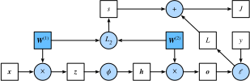

# 3.14 正向傳播、反向傳播和計算圖

前面幾節裡我們使用了小批量隨機梯度下降的優化算法來訓練模型。在實現中，我們只提供了模型的正向傳播（forward propagation）的計算，即對輸入計算模型輸出，然後通過`autograd`模塊來調用系統自動生成的`backward`函數計算梯度。基於反向傳播（back-propagation）算法的自動求梯度極大簡化了深度學習模型訓練算法的實現。本節我們將使用數學和計算圖（computational graph）兩個方式來描述正向傳播和反向傳播。具體來說，我們將以帶$L_2$範數正則化的含單隱藏層的多層感知機為樣例模型解釋正向傳播和反向傳播。

## 3.14.1 正向傳播

正向傳播是指對神經網絡沿著從輸入層到輸出層的順序，依次計算並存儲模型的中間變量（包括輸出）。為簡單起見，假設輸入是一個特徵為$\boldsymbol{x} \in \mathbb{R}^d$的樣本，且不考慮偏差項，那麼中間變量

$$\boldsymbol{z} = \boldsymbol{W}^{(1)} \boldsymbol{x},$$

其中$\boldsymbol{W}^{(1)} \in \mathbb{R}^{h \times d}$是隱藏層的權重參數。把中間變量$\boldsymbol{z} \in \mathbb{R}^h$輸入按元素運算的激活函數$\phi$後，將得到向量長度為$h$的隱藏層變量

$$\boldsymbol{h} = \phi (\boldsymbol{z}).$$

隱藏層變量$\boldsymbol{h}$也是一箇中間變量。假設輸出層參數只有權重$\boldsymbol{W}^{(2)} \in \mathbb{R}^{q \times h}$，可以得到向量長度為$q$的輸出層變量

$$\boldsymbol{o} = \boldsymbol{W}^{(2)} \boldsymbol{h}.$$

假設損失函數為$\ell$，且樣本標籤為$y$，可以計算出單個數據樣本的損失項

$$L = \ell(\boldsymbol{o}, y).$$

根據$L_2$範數正則化的定義，給定超參數$\lambda$，正則化項即

$$s = \frac{\lambda}{2} \left(\|\boldsymbol{W}^{(1)}\|_F^2 + \|\boldsymbol{W}^{(2)}\|_F^2\right),$$

其中矩陣的Frobenius範數等價於將矩陣變平為向量後計算$L_2$範數。最終，模型在給定的數據樣本上帶正則化的損失為

$$J = L + s.$$

我們將$J$稱為有關給定數據樣本的目標函數，並在以下的討論中簡稱目標函數。

## 3.14.2 正向傳播的計算圖

我們通常繪製計算圖來可視化運算符和變量在計算中的依賴關係。圖3.6繪製了本節中樣例模型正向傳播的計算圖，其中左下角是輸入，右上角是輸出。可以看到，圖中箭頭方向大多是向右和向上，其中方框代表變量，圓圈代表運算符，箭頭表示從輸入到輸出之間的依賴關係。

 圖3.6 正向傳播的計算圖

## 3.14.3 反向傳播

反向傳播指的是計算神經網絡參數梯度的方法。總的來說，反向傳播依據微積分中的鏈式法則，沿著從輸出層到輸入層的順序，依次計算並存儲目標函數有關神經網絡各層的中間變量以及參數的梯度。對輸入或輸出$\mathsf{X}, \mathsf{Y}, \mathsf{Z}$為任意形狀張量的函數$\mathsf{Y}=f(\mathsf{X})$和$\mathsf{Z}=g(\mathsf{Y})$，通過鏈式法則，我們有

$$\frac{\partial \mathsf{Z}}{\partial \mathsf{X}} = \text{prod}\left(\frac{\partial \mathsf{Z}}{\partial \mathsf{Y}}, \frac{\partial \mathsf{Y}}{\partial \mathsf{X}}\right),$$

其中$\text{prod}$運算符將根據兩個輸入的形狀，在必要的操作（如轉置和互換輸入位置）後對兩個輸入做乘法。

回顧一下本節中樣例模型，它的參數是$\boldsymbol{W}^{(1)}$和$\boldsymbol{W}^{(2)}$，因此反向傳播的目標是計算$\partial J/\partial \boldsymbol{W}^{(1)}$和$\partial J/\partial \boldsymbol{W}^{(2)}$。我們將應用鏈式法則依次計算各中間變量和參數的梯度，其計算次序與前向傳播中相應中間變量的計算次序恰恰相反。首先，分別計算目標函數$J=L+s$有關損失項$L$和正則項$s$的梯度

$$\frac{\partial J}{\partial L} = 1, \quad \frac{\partial J}{\partial s} = 1.$$

其次，依據鏈式法則計算目標函數有關輸出層變量的梯度$\partial J/\partial \boldsymbol{o} \in \mathbb{R}^q$：

$$
\frac{\partial J}{\partial \boldsymbol{o}}
= \text{prod}\left(\frac{\partial J}{\partial L}, \frac{\partial L}{\partial \boldsymbol{o}}\right)
= \frac{\partial L}{\partial \boldsymbol{o}}.
$$

接下來，計算正則項有關兩個參數的梯度：

$$\frac{\partial s}{\partial \boldsymbol{W}^{(1)}} = \lambda \boldsymbol{W}^{(1)},\quad\frac{\partial s}{\partial \boldsymbol{W}^{(2)}} = \lambda \boldsymbol{W}^{(2)}.$$

現在，我們可以計算最靠近輸出層的模型參數的梯度$\partial J/\partial \boldsymbol{W}^{(2)} \in \mathbb{R}^{q \times h}$。依據鏈式法則，得到

$$
\frac{\partial J}{\partial \boldsymbol{W}^{(2)}}
= \text{prod}\left(\frac{\partial J}{\partial \boldsymbol{o}}, \frac{\partial \boldsymbol{o}}{\partial \boldsymbol{W}^{(2)}}\right) + \text{prod}\left(\frac{\partial J}{\partial s}, \frac{\partial s}{\partial \boldsymbol{W}^{(2)}}\right)
= \frac{\partial J}{\partial \boldsymbol{o}} \boldsymbol{h}^\top + \lambda \boldsymbol{W}^{(2)}.
$$

沿著輸出層向隱藏層繼續反向傳播，隱藏層變量的梯度$\partial J/\partial \boldsymbol{h} \in \mathbb{R}^h$可以這樣計算：

$$
\frac{\partial J}{\partial \boldsymbol{h}}
= \text{prod}\left(\frac{\partial J}{\partial \boldsymbol{o}}, \frac{\partial \boldsymbol{o}}{\partial \boldsymbol{h}}\right)
= {\boldsymbol{W}^{(2)}}^\top \frac{\partial J}{\partial \boldsymbol{o}}.
$$

由於激活函數$\phi$是按元素運算的，中間變量$\boldsymbol{z}$的梯度$\partial J/\partial \boldsymbol{z} \in \mathbb{R}^h$的計算需要使用按元素乘法符$\odot$：

$$
\frac{\partial J}{\partial \boldsymbol{z}}
= \text{prod}\left(\frac{\partial J}{\partial \boldsymbol{h}}, \frac{\partial \boldsymbol{h}}{\partial \boldsymbol{z}}\right)
= \frac{\partial J}{\partial \boldsymbol{h}} \odot \phi'\left(\boldsymbol{z}\right).
$$

最終，我們可以得到最靠近輸入層的模型參數的梯度$\partial J/\partial \boldsymbol{W}^{(1)} \in \mathbb{R}^{h \times d}$。依據鏈式法則，得到

$$
\frac{\partial J}{\partial \boldsymbol{W}^{(1)}}
= \text{prod}\left(\frac{\partial J}{\partial \boldsymbol{z}}, \frac{\partial \boldsymbol{z}}{\partial \boldsymbol{W}^{(1)}}\right) + \text{prod}\left(\frac{\partial J}{\partial s}, \frac{\partial s}{\partial \boldsymbol{W}^{(1)}}\right)
= \frac{\partial J}{\partial \boldsymbol{z}} \boldsymbol{x}^\top + \lambda \boldsymbol{W}^{(1)}.
$$

## 3.14.4 訓練深度學習模型

在訓練深度學習模型時，正向傳播和反向傳播之間相互依賴。下面我們仍然以本節中的樣例模型分別闡述它們之間的依賴關係。

一方面，正向傳播的計算可能依賴於模型參數的當前值，而這些模型參數是在反向傳播的梯度計算後通過優化算法迭代的。例如，計算正則化項$s = (\lambda/2) \left(\|\boldsymbol{W}^{(1)}\|_F^2 + \|\boldsymbol{W}^{(2)}\|_F^2\right)$依賴模型參數$\boldsymbol{W}^{(1)}$和$\boldsymbol{W}^{(2)}$的當前值，而這些當前值是優化算法最近一次根據反向傳播算出梯度後迭代得到的。

另一方面，反向傳播的梯度計算可能依賴於各變量的當前值，而這些變量的當前值是通過正向傳播計算得到的。舉例來說，參數梯度$\partial J/\partial \boldsymbol{W}^{(2)} = (\partial J / \partial \boldsymbol{o}) \boldsymbol{h}^\top + \lambda \boldsymbol{W}^{(2)}$的計算需要依賴隱藏層變量的當前值$\boldsymbol{h}$。這個當前值是通過從輸入層到輸出層的正向傳播計算並存儲得到的。

因此，在模型參數初始化完成後，我們交替地進行正向傳播和反向傳播，並根據反向傳播計算的梯度迭代模型參數。既然我們在反向傳播中使用了正向傳播中計算得到的中間變量來避免重複計算，那麼這個複用也導致正向傳播結束後不能立即釋放中間變量內存。這也是訓練要比預測佔用更多內存的一個重要原因。另外需要指出的是，這些中間變量的個數大體上與網絡層數線性相關，每個變量的大小跟批量大小和輸入個數也是線性相關的，它們是導致較深的神經網絡使用較大批量訓練時更容易超內存的主要原因。

## 小結

* 正向傳播沿著從輸入層到輸出層的順序，依次計算並存儲神經網絡的中間變量。
* 反向傳播沿著從輸出層到輸入層的順序，依次計算並存儲神經網絡中間變量和參數的梯度。
* 在訓練深度學習模型時，正向傳播和反向傳播相互依賴。

------------
> 注：本節與原書基本相同，[原書傳送門](https://zh.d2l.ai/chapter_deep-learning-basics/backprop.html)