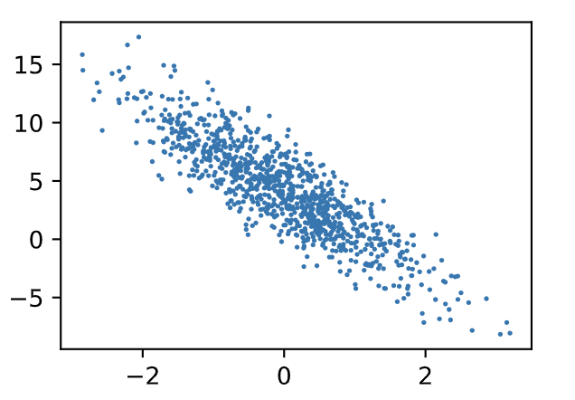

# 3.2 線性迴歸的從零開始實現

在瞭解了線性迴歸的背景知識之後，現在我們可以動手實現它了。儘管強大的深度學習框架可以減少大量重複性工作，但若過於依賴它提供的便利，會導致我們很難深入理解深度學習是如何工作的。因此，本節將介紹如何只利用`Tensor`和`autograd`來實現一個線性迴歸的訓練。

首先，導入本節中實驗所需的包或模塊，其中的matplotlib包可用於作圖，且設置成嵌入顯示。

``` python 
%matplotlib inline
import torch
from IPython import display
from matplotlib import pyplot as plt
import numpy as np
import random
```

## 3.2.1 生成數據集

我們構造一個簡單的人工訓練數據集，它可以使我們能夠直觀比較學到的參數和真實的模型參數的區別。設訓練數據集樣本數為1000，輸入個數（特徵數）為2。給定隨機生成的批量樣本特徵 $\boldsymbol{X} \in \mathbb{R}^{1000 \times 2}$，我們使用線性迴歸模型真實權重 $\boldsymbol{w} = [2, -3.4]^\top$ 和偏差 $b = 4.2$，以及一個隨機噪聲項 $\epsilon$ 來生成標籤
$$
\boldsymbol{y} = \boldsymbol{X}\boldsymbol{w} + b + \epsilon
$$

其中噪聲項 $\epsilon$ 服從均值為0、標準差為0.01的正態分佈。噪聲代表了數據集中無意義的干擾。下面，讓我們生成數據集。

``` python
num_inputs = 2
num_examples = 1000
true_w = [2, -3.4]
true_b = 4.2
features = torch.randn(num_examples, num_inputs,
                       dtype=torch.float32)
labels = true_w[0] * features[:, 0] + true_w[1] * features[:, 1] + true_b
labels += torch.tensor(np.random.normal(0, 0.01, size=labels.size()),
                       dtype=torch.float32)
```

注意，`features`的每一行是一個長度為2的向量，而`labels`的每一行是一個長度為1的向量（標量）。

``` python
print(features[0], labels[0])
```
輸出：
```
tensor([0.8557, 0.4793]) tensor(4.2887)
```

通過生成第二個特徵`features[:, 1]`和標籤 `labels` 的散點圖，可以更直觀地觀察兩者間的線性關係。

``` python
def use_svg_display():
    # 用矢量圖顯示
    display.set_matplotlib_formats('svg')

def set_figsize(figsize=(3.5, 2.5)):
    use_svg_display()
    # 設置圖的尺寸
    plt.rcParams['figure.figsize'] = figsize

# # 在../d2lzh_pytorch裡面添加上面兩個函數後就可以這樣導入
# import sys
# sys.path.append("..")
# from d2lzh_pytorch import * 

set_figsize()
plt.scatter(features[:, 1].numpy(), labels.numpy(), 1);
```
<div align=center>

</div>

我們將上面的`plt`作圖函數以及`use_svg_display`函數和`set_figsize`函數定義在`d2lzh_pytorch`包裡。以後在作圖時，我們將直接調用`d2lzh_pytorch.plt`。由於`plt`在`d2lzh_pytorch`包中是一個全局變量，我們在作圖前只需要調用`d2lzh_pytorch.set_figsize()`即可打印矢量圖並設置圖的尺寸。
> 原書中提到的`d2lzh`裡面使用了mxnet，改成pytorch實現後本項目統一將原書的`d2lzh`改為`d2lzh_pytorch`。

## 3.2.2 讀取數據

在訓練模型的時候，我們需要遍歷數據集並不斷讀取小批量數據樣本。這裡我們定義一個函數：它每次返回`batch_size`（批量大小）個隨機樣本的特徵和標籤。

``` python
# 本函數已保存在d2lzh包中方便以後使用
def data_iter(batch_size, features, labels):
    num_examples = len(features)
    indices = list(range(num_examples))
    random.shuffle(indices)  # 樣本的讀取順序是隨機的
    for i in range(0, num_examples, batch_size):
        j = torch.LongTensor(indices[i: min(i + batch_size, num_examples)]) # 最後一次可能不足一個batch
        yield  features.index_select(0, j), labels.index_select(0, j)
```

讓我們讀取第一個小批量數據樣本並打印。每個批量的特徵形狀為(10, 2)，分別對應批量大小和輸入個數；標籤形狀為批量大小。
``` python
batch_size = 10

for X, y in data_iter(batch_size, features, labels):
    print(X, y)
    break
```
輸出：
```
tensor([[-1.4239, -1.3788],
        [ 0.0275,  1.3550],
        [ 0.7616, -1.1384],
        [ 0.2967, -0.1162],
        [ 0.0822,  2.0826],
        [-0.6343, -0.7222],
        [ 0.4282,  0.0235],
        [ 1.4056,  0.3506],
        [-0.6496, -0.5202],
        [-0.3969, -0.9951]]) 
 tensor([ 6.0394, -0.3365,  9.5882,  5.1810, -2.7355,  5.3873,  4.9827,  5.7962,
         4.6727,  6.7921])
```

## 3.2.3 初始化模型參數

我們將權重初始化成均值為0、標準差為0.01的正態隨機數，偏差則初始化成0。

``` python
w = torch.tensor(np.random.normal(0, 0.01, (num_inputs, 1)), dtype=torch.float32)
b = torch.zeros(1, dtype=torch.float32)
```

之後的模型訓練中，需要對這些參數求梯度來迭代參數的值，因此我們要讓它們的`requires_grad=True`。
``` python
w.requires_grad_(requires_grad=True)
b.requires_grad_(requires_grad=True) 
```

## 3.2.4 定義模型

下面是線性迴歸的矢量計算表達式的實現。我們使用`mm`函數做矩陣乘法。

``` python
def linreg(X, w, b):  # 本函數已保存在d2lzh_pytorch包中方便以後使用
    return torch.mm(X, w) + b
```

## 3.2.5 定義損失函數

我們使用上一節描述的平方損失來定義線性迴歸的損失函數。在實現中，我們需要把真實值`y`變形成預測值`y_hat`的形狀。以下函數返回的結果也將和`y_hat`的形狀相同。

``` python
def squared_loss(y_hat, y):  # 本函數已保存在d2lzh_pytorch包中方便以後使用
    # 注意這裡返回的是向量, 另外, pytorch裡的MSELoss並沒有除以 2
    return (y_hat - y.view(y_hat.size())) ** 2 / 2
```

## 3.2.6 定義優化算法

以下的`sgd`函數實現了上一節中介紹的小批量隨機梯度下降算法。它通過不斷迭代模型參數來優化損失函數。這裡自動求梯度模塊計算得來的梯度是一個批量樣本的梯度和。我們將它除以批量大小來得到平均值。

``` python
def sgd(params, lr, batch_size):  # 本函數已保存在d2lzh_pytorch包中方便以後使用
    for param in params:
        param.data -= lr * param.grad / batch_size # 注意這裡更改param時用的param.data
```

## 3.2.7 訓練模型

在訓練中，我們將多次迭代模型參數。在每次迭代中，我們根據當前讀取的小批量數據樣本（特徵`X`和標籤`y`），通過調用反向函數`backward`計算小批量隨機梯度，並調用優化算法`sgd`迭代模型參數。由於我們之前設批量大小`batch_size`為10，每個小批量的損失`l`的形狀為(10, 1)。回憶一下自動求梯度一節。由於變量`l`並不是一個標量，所以我們可以調用`.sum()`將其求和得到一個標量，再運行`l.backward()`得到該變量有關模型參數的梯度。注意在每次更新完參數後不要忘了將參數的梯度清零。

在一個迭代週期（epoch）中，我們將完整遍歷一遍`data_iter`函數，並對訓練數據集中所有樣本都使用一次（假設樣本數能夠被批量大小整除）。這裡的迭代週期個數`num_epochs`和學習率`lr`都是超參數，分別設3和0.03。在實踐中，大多超參數都需要通過反覆試錯來不斷調節。雖然迭代週期數設得越大模型可能越有效，但是訓練時間可能過長。而有關學習率對模型的影響，我們會在後面“優化算法”一章中詳細介紹。

``` python
lr = 0.03
num_epochs = 3
net = linreg
loss = squared_loss

for epoch in range(num_epochs):  # 訓練模型一共需要num_epochs個迭代週期
    # 在每一個迭代週期中，會使用訓練數據集中所有樣本一次（假設樣本數能夠被批量大小整除）。X
    # 和y分別是小批量樣本的特徵和標籤
    for X, y in data_iter(batch_size, features, labels):
        l = loss(net(X, w, b), y).sum()  # l是有關小批量X和y的損失
        l.backward()  # 小批量的損失對模型參數求梯度
        sgd([w, b], lr, batch_size)  # 使用小批量隨機梯度下降迭代模型參數
        
        # 不要忘了梯度清零
        w.grad.data.zero_()
        b.grad.data.zero_()
    train_l = loss(net(features, w, b), labels)
    print('epoch %d, loss %f' % (epoch + 1, train_l.mean().item()))
```
輸出：
```
epoch 1, loss 0.028127
epoch 2, loss 0.000095
epoch 3, loss 0.000050
```

訓練完成後，我們可以比較學到的參數和用來生成訓練集的真實參數。它們應該很接近。

``` python
print(true_w, '\n', w)
print(true_b, '\n', b)
```
輸出：
```
[2, -3.4] 
 tensor([[ 1.9998],
        [-3.3998]], requires_grad=True)
4.2 
 tensor([4.2001], requires_grad=True)
```

## 小結

* 可以看出，僅使用`Tensor`和`autograd`模塊就可以很容易地實現一個模型。接下來，本書會在此基礎上描述更多深度學習模型，並介紹怎樣使用更簡潔的代碼（見下一節）來實現它們。

-----------
> 注：本節除了代碼之外與原書基本相同，[原書傳送門](https://zh.d2l.ai/chapter_deep-learning-basics/linear-regression-scratch.html)
