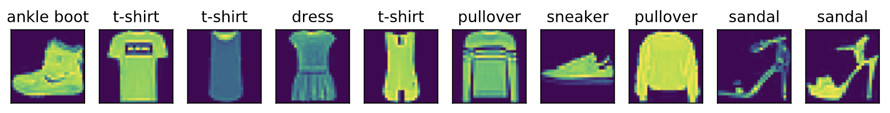

# 3.5 圖像分類數據集（Fashion-MNIST）

在介紹softmax迴歸的實現前我們先引入一個多類圖像分類數據集。它將在後面的章節中被多次使用，以方便我們觀察比較算法之間在模型精度和計算效率上的區別。圖像分類數據集中最常用的是手寫數字識別數據集MNIST[1]。但大部分模型在MNIST上的分類精度都超過了95%。為了更直觀地觀察算法之間的差異，我們將使用一個圖像內容更加複雜的數據集Fashion-MNIST[2]（這個數據集也比較小，只有幾十M，沒有GPU的電腦也能吃得消）。

本節我們將使用torchvision包，它是服務於PyTorch深度學習框架的，主要用來構建計算機視覺模型。torchvision主要由以下幾部分構成：
1. `torchvision.datasets`: 一些加載數據的函數及常用的數據集接口；
2. `torchvision.models`: 包含常用的模型結構（含預訓練模型），例如AlexNet、VGG、ResNet等；
3. `torchvision.transforms`: 常用的圖片變換，例如裁剪、旋轉等；
4. `torchvision.utils`: 其他的一些有用的方法。

## 3.5.1 獲取數據集

首先導入本節需要的包或模塊。

``` python
import torch
import torchvision
import torchvision.transforms as transforms
import matplotlib.pyplot as plt
import time
import sys
sys.path.append("..") # 為了導入上層目錄的d2lzh_pytorch
import d2lzh_pytorch as d2l
```

下面，我們通過torchvision的`torchvision.datasets`來下載這個數據集。第一次調用時會自動從網上獲取數據。我們通過參數`train`來指定獲取訓練數據集或測試數據集（testing data set）。測試數據集也叫測試集（testing set），只用來評價模型的表現，並不用來訓練模型。

另外我們還指定了參數`transform = transforms.ToTensor()`使所有數據轉換為`Tensor`，如果不進行轉換則返回的是PIL圖片。`transforms.ToTensor()`將尺寸為 (H x W x C) 且數據位於[0, 255]的PIL圖片或者數據類型為`np.uint8`的NumPy數組轉換為尺寸為(C x H x W)且數據類型為`torch.float32`且位於[0.0, 1.0]的`Tensor`。
> 注意： 由於像素值為0到255的整數，所以剛好是uint8所能表示的範圍，包括`transforms.ToTensor()`在內的一些關於圖片的函數就默認輸入的是uint8型，若不是，可能不會報錯但可能得不到想要的結果。所以，**如果用像素值(0-255整數)表示圖片數據，那麼一律將其類型設置成uint8，避免不必要的bug。** 本人就被這點坑過，詳見[我的這個博客2.2.4節](https://tangshusen.me/2018/12/05/kaggle-doodle-reco/)。

``` python
mnist_train = torchvision.datasets.FashionMNIST(root='~/Datasets/FashionMNIST', train=True, download=True, transform=transforms.ToTensor())
mnist_test = torchvision.datasets.FashionMNIST(root='~/Datasets/FashionMNIST', train=False, download=True, transform=transforms.ToTensor())
```
上面的`mnist_train`和`mnist_test`都是[`torch.utils.data.Dataset`](https://pytorch.org/docs/stable/data.html)的子類，所以我們可以用`len()`來獲取該數據集的大小，還可以用下標來獲取具體的一個樣本。訓練集中和測試集中的每個類別的圖像數分別為6,000和1,000。因為有10個類別，所以訓練集和測試集的樣本數分別為60,000和10,000。

``` python
print(type(mnist_train))
print(len(mnist_train), len(mnist_test))
```
輸出：
```
<class 'torchvision.datasets.mnist.FashionMNIST'>
60000 10000
```

我們可以通過下標來訪問任意一個樣本:
``` python
feature, label = mnist_train[0]
print(feature.shape, label)  # Channel x Height x Width
```
輸出：
```
torch.Size([1, 28, 28]) tensor(9)
```

變量`feature`對應高和寬均為28像素的圖像。由於我們使用了`transforms.ToTensor()`，所以每個像素的數值為[0.0, 1.0]的32位浮點數。需要注意的是，`feature`的尺寸是 (C x H x W) 的，而不是 (H x W x C)。第一維是通道數，因為數據集中是灰度圖像，所以通道數為1。後面兩維分別是圖像的高和寬。


Fashion-MNIST中一共包括了10個類別，分別為t-shirt（T恤）、trouser（褲子）、pullover（套衫）、dress（連衣裙）、coat（外套）、sandal（涼鞋）、shirt（襯衫）、sneaker（運動鞋）、bag（包）和ankle boot（短靴）。以下函數可以將數值標籤轉成相應的文本標籤。

``` python
# 本函數已保存在d2lzh包中方便以後使用
def get_fashion_mnist_labels(labels):
    text_labels = ['t-shirt', 'trouser', 'pullover', 'dress', 'coat',
                   'sandal', 'shirt', 'sneaker', 'bag', 'ankle boot']
    return [text_labels[int(i)] for i in labels]
```

下面定義一個可以在一行裡畫出多張圖像和對應標籤的函數。

``` python
# 本函數已保存在d2lzh包中方便以後使用
def show_fashion_mnist(images, labels):
    d2l.use_svg_display()
    # 這裡的_表示我們忽略（不使用）的變量
    _, figs = plt.subplots(1, len(images), figsize=(12, 12))
    for f, img, lbl in zip(figs, images, labels):
        f.imshow(img.view((28, 28)).numpy())
        f.set_title(lbl)
        f.axes.get_xaxis().set_visible(False)
        f.axes.get_yaxis().set_visible(False)
    plt.show()
```

現在，我們看一下訓練數據集中前10個樣本的圖像內容和文本標籤。

``` python
X, y = [], []
for i in range(10):
    X.append(mnist_train[i][0])
    y.append(mnist_train[i][1])
show_fashion_mnist(X, get_fashion_mnist_labels(y))
```

<div align=center>

</div>

## 3.5.2 讀取小批量

我們將在訓練數據集上訓練模型，並將訓練好的模型在測試數據集上評價模型的表現。前面說過，`mnist_train`是`torch.utils.data.Dataset`的子類，所以我們可以將其傳入`torch.utils.data.DataLoader`來創建一個讀取小批量數據樣本的DataLoader實例。

在實踐中，數據讀取經常是訓練的性能瓶頸，特別當模型較簡單或者計算硬件性能較高時。PyTorch的`DataLoader`中一個很方便的功能是允許使用多進程來加速數據讀取。這裡我們通過參數`num_workers`來設置4個進程讀取數據。

``` python
batch_size = 256
if sys.platform.startswith('win'):
    num_workers = 0  # 0表示不用額外的進程來加速讀取數據
else:
    num_workers = 4
train_iter = torch.utils.data.DataLoader(mnist_train, batch_size=batch_size, shuffle=True, num_workers=num_workers)
test_iter = torch.utils.data.DataLoader(mnist_test, batch_size=batch_size, shuffle=False, num_workers=num_workers)
```

我們將獲取並讀取Fashion-MNIST數據集的邏輯封裝在`d2lzh_pytorch.load_data_fashion_mnist`函數中供後面章節調用。該函數將返回`train_iter`和`test_iter`兩個變量。隨著本書內容的不斷深入，我們會進一步改進該函數。它的完整實現將在5.6節中描述。

最後我們查看讀取一遍訓練數據需要的時間。

``` python
start = time.time()
for X, y in train_iter:
    continue
print('%.2f sec' % (time.time() - start))
```
輸出：
```
1.57 sec
```

## 小結

* Fashion-MNIST是一個10類服飾分類數據集，之後章節裡將使用它來檢驗不同算法的表現。
* 我們將高和寬分別為$h$和$w$像素的圖像的形狀記為$h \times w$或`(h，w)`。

## 參考文獻

[1] LeCun, Y., Cortes, C., & Burges, C. http://yann.lecun.com/exdb/mnist/

[2] Xiao, H., Rasul, K., & Vollgraf, R. (2017). Fashion-mnist: a novel image dataset for benchmarking machine learning algorithms. arXiv preprint arXiv:1708.07747.

-----------
> 注：本節除了代碼之外與原書基本相同，[原書傳送門](https://zh.d2l.ai/chapter_deep-learning-basics/fashion-mnist.html)