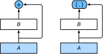

# 5.12 稠密連接網絡（DenseNet）

ResNet中的跨層連接設計引申出了數個後續工作。本節我們介紹其中的一個：稠密連接網絡（DenseNet） [1]。 它與ResNet的主要區別如圖5.10所示。

<div align=center>

</div>
<div align=center>圖5.10 ResNet（左）與DenseNet（右）在跨層連接上的主要區別：使用相加和使用連結</div>

圖5.10中將部分前後相鄰的運算抽象為模塊$A$和模塊$B$。與ResNet的主要區別在於，DenseNet裡模塊$B$的輸出不是像ResNet那樣和模塊$A$的輸出相加，而是在通道維上連結。這樣模塊$A$的輸出可以直接傳入模塊$B$後面的層。在這個設計裡，模塊$A$直接跟模塊$B$後面的所有層連接在了一起。這也是它被稱為“稠密連接”的原因。

DenseNet的主要構建模塊是稠密塊（dense block）和過渡層（transition layer）。前者定義了輸入和輸出是如何連結的，後者則用來控制通道數，使之不過大。


## 5.12.1 稠密塊

DenseNet使用了ResNet改良版的“批量歸一化、激活和卷積”結構，我們首先在`conv_block`函數裡實現這個結構。

``` python
import time
import torch
from torch import nn, optim
import torch.nn.functional as F

import sys
sys.path.append("..") 
import d2lzh_pytorch as d2l
device = torch.device('cuda' if torch.cuda.is_available() else 'cpu')

def conv_block(in_channels, out_channels):
    blk = nn.Sequential(nn.BatchNorm2d(in_channels), 
                        nn.ReLU(),
                        nn.Conv2d(in_channels, out_channels, kernel_size=3, padding=1))
    return blk
```

稠密塊由多個`conv_block`組成，每塊使用相同的輸出通道數。但在前向計算時，我們將每塊的輸入和輸出在通道維上連結。

``` python
class DenseBlock(nn.Module):
    def __init__(self, num_convs, in_channels, out_channels):
        super(DenseBlock, self).__init__()
        net = []
        for i in range(num_convs):
            in_c = in_channels + i * out_channels
            net.append(conv_block(in_c, out_channels))
        self.net = nn.ModuleList(net)
        self.out_channels = in_channels + num_convs * out_channels # 計算輸出通道數

    def forward(self, X):
        for blk in self.net:
            Y = blk(X)
            X = torch.cat((X, Y), dim=1)  # 在通道維上將輸入和輸出連結
        return X
```

在下面的例子中，我們定義一個有2個輸出通道數為10的卷積塊。使用通道數為3的輸入時，我們會得到通道數為$3+2\times 10=23$的輸出。卷積塊的通道數控制了輸出通道數相對於輸入通道數的增長，因此也被稱為增長率（growth rate）。

``` python
blk = DenseBlock(2, 3, 10)
X = torch.rand(4, 3, 8, 8)
Y = blk(X)
Y.shape # torch.Size([4, 23, 8, 8])
```

## 5.12.2 過渡層

由於每個稠密塊都會帶來通道數的增加，使用過多則會帶來過於複雜的模型。過渡層用來控制模型複雜度。它通過$1\times1$卷積層來減小通道數，並使用步幅為2的平均池化層減半高和寬，從而進一步降低模型複雜度。

``` python
def transition_block(in_channels, out_channels):
    blk = nn.Sequential(
            nn.BatchNorm2d(in_channels), 
            nn.ReLU(),
            nn.Conv2d(in_channels, out_channels, kernel_size=1),
            nn.AvgPool2d(kernel_size=2, stride=2))
    return blk
```

對上一個例子中稠密塊的輸出使用通道數為10的過渡層。此時輸出的通道數減為10，高和寬均減半。

``` python
blk = transition_block(23, 10)
blk(Y).shape # torch.Size([4, 10, 4, 4])
```

## 5.12.3 DenseNet模型

我們來構造DenseNet模型。DenseNet首先使用同ResNet一樣的單卷積層和最大池化層。

``` python
net = nn.Sequential(
        nn.Conv2d(1, 64, kernel_size=7, stride=2, padding=3),
        nn.BatchNorm2d(64), 
        nn.ReLU(),
        nn.MaxPool2d(kernel_size=3, stride=2, padding=1))
```

類似於ResNet接下來使用的4個殘差塊，DenseNet使用的是4個稠密塊。同ResNet一樣，我們可以設置每個稠密塊使用多少個卷積層。這裡我們設成4，從而與上一節的ResNet-18保持一致。稠密塊裡的卷積層通道數（即增長率）設為32，所以每個稠密塊將增加128個通道。

ResNet裡通過步幅為2的殘差塊在每個模塊之間減小高和寬。這裡我們則使用過渡層來減半高和寬，並減半通道數。

``` python
num_channels, growth_rate = 64, 32  # num_channels為當前的通道數
num_convs_in_dense_blocks = [4, 4, 4, 4]

for i, num_convs in enumerate(num_convs_in_dense_blocks):
    DB = DenseBlock(num_convs, num_channels, growth_rate)
    net.add_module("DenseBlosk_%d" % i, DB)
    # 上一個稠密塊的輸出通道數
    num_channels = DB.out_channels
    # 在稠密塊之間加入通道數減半的過渡層
    if i != len(num_convs_in_dense_blocks) - 1:
        net.add_module("transition_block_%d" % i, transition_block(num_channels, num_channels // 2))
        num_channels = num_channels // 2
```

同ResNet一樣，最後接上全局池化層和全連接層來輸出。

``` python
net.add_module("BN", nn.BatchNorm2d(num_channels))
net.add_module("relu", nn.ReLU())
net.add_module("global_avg_pool", d2l.GlobalAvgPool2d()) # GlobalAvgPool2d的輸出: (Batch, num_channels, 1, 1)
net.add_module("fc", nn.Sequential(d2l.FlattenLayer(), nn.Linear(num_channels, 10))) 
```
我們嘗試打印每個子模塊的輸出維度確保網絡無誤：
``` python
X = torch.rand((1, 1, 96, 96))
for name, layer in net.named_children():
    X = layer(X)
    print(name, ' output shape:\t', X.shape)
```
輸出：
```
0  output shape:	 torch.Size([1, 64, 48, 48])
1  output shape:	 torch.Size([1, 64, 48, 48])
2  output shape:	 torch.Size([1, 64, 48, 48])
3  output shape:	 torch.Size([1, 64, 24, 24])
DenseBlosk_0  output shape:	 torch.Size([1, 192, 24, 24])
transition_block_0  output shape:	 torch.Size([1, 96, 12, 12])
DenseBlosk_1  output shape:	 torch.Size([1, 224, 12, 12])
transition_block_1  output shape:	 torch.Size([1, 112, 6, 6])
DenseBlosk_2  output shape:	 torch.Size([1, 240, 6, 6])
transition_block_2  output shape:	 torch.Size([1, 120, 3, 3])
DenseBlosk_3  output shape:	 torch.Size([1, 248, 3, 3])
BN  output shape:	 torch.Size([1, 248, 3, 3])
relu  output shape:	 torch.Size([1, 248, 3, 3])
global_avg_pool  output shape:	 torch.Size([1, 248, 1, 1])
fc  output shape:	 torch.Size([1, 10])
```

## 5.12.4 獲取數據並訓練模型

由於這裡使用了比較深的網絡，本節裡我們將輸入高和寬從224降到96來簡化計算。

``` python
batch_size = 256
# 如出現“out of memory”的報錯信息，可減小batch_size或resize
train_iter, test_iter = d2l.load_data_fashion_mnist(batch_size, resize=96)

lr, num_epochs = 0.001, 5
optimizer = torch.optim.Adam(net.parameters(), lr=lr)
d2l.train_ch5(net, train_iter, test_iter, batch_size, optimizer, device, num_epochs)
```
輸出：
```
training on  cuda
epoch 1, loss 0.0020, train acc 0.834, test acc 0.749, time 27.7 sec
epoch 2, loss 0.0011, train acc 0.900, test acc 0.824, time 25.5 sec
epoch 3, loss 0.0009, train acc 0.913, test acc 0.839, time 23.8 sec
epoch 4, loss 0.0008, train acc 0.921, test acc 0.889, time 24.9 sec
epoch 5, loss 0.0008, train acc 0.929, test acc 0.884, time 24.3 sec
```

## 小結

* 在跨層連接上，不同於ResNet中將輸入與輸出相加，DenseNet在通道維上連結輸入與輸出。
* DenseNet的主要構建模塊是稠密塊和過渡層。


## 參考文獻

[1] Huang, G., Liu, Z., Weinberger, K. Q., & van der Maaten, L. (2017). Densely connected convolutional networks. In Proceedings of the IEEE conference on computer vision and pattern recognition (Vol. 1, No. 2).

-----------
> 注：除代碼外本節與原書此節基本相同，[原書傳送門](https://zh.d2l.ai/chapter_convolutional-neural-networks/densenet.html)
