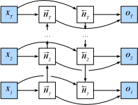

# 6.10 雙向循環神經網絡

之前介紹的循環神經網絡模型都是假設當前時間步是由前面的較早時間步的序列決定的，因此它們都將信息通過隱藏狀態從前往後傳遞。有時候，當前時間步也可能由後面時間步決定。例如，當我們寫下一個句子時，可能會根據句子後面的詞來修改句子前面的用詞。雙向循環神經網絡通過增加從後往前傳遞信息的隱藏層來更靈活地處理這類信息。圖6.12演示了一個含單隱藏層的雙向循環神經網絡的架構。

圖6.12 雙向循環神經網絡的架構

下面我們來介紹具體的定義。
給定時間步$t$的小批量輸入$\boldsymbol{X}_t \in \mathbb{R}^{n \times d}$（樣本數為$n$，輸入個數為$d$）和隱藏層激活函數為$\phi$。在雙向循環神經網絡的架構中，
設該時間步正向隱藏狀態為$\overrightarrow{\boldsymbol{H}}_t  \in \mathbb{R}^{n \times h}$（正向隱藏單元個數為$h$），
反向隱藏狀態為$\overleftarrow{\boldsymbol{H}}_t  \in \mathbb{R}^{n \times h}$（反向隱藏單元個數為$h$）。我們可以分別計算正向隱藏狀態和反向隱藏狀態：

$$
\begin{aligned}
\overrightarrow{\boldsymbol{H}}_t &= \phi(\boldsymbol{X}_t \boldsymbol{W}_{xh}^{(f)} + \overrightarrow{\boldsymbol{H}}_{t-1} \boldsymbol{W}_{hh}^{(f)}  + \boldsymbol{b}_h^{(f)}),\\
\overleftarrow{\boldsymbol{H}}_t &= \phi(\boldsymbol{X}_t \boldsymbol{W}_{xh}^{(b)} + \overleftarrow{\boldsymbol{H}}_{t+1} \boldsymbol{W}_{hh}^{(b)}  + \boldsymbol{b}_h^{(b)}),
\end{aligned}
$$

其中權重$\boldsymbol{W}_{xh}^{(f)} \in \mathbb{R}^{d \times h}$、$\boldsymbol{W}_{hh}^{(f)} \in \mathbb{R}^{h \times h}$、$\boldsymbol{W}_{xh}^{(b)} \in \mathbb{R}^{d \times h}$、$\boldsymbol{W}_{hh}^{(b)} \in \mathbb{R}^{h \times h}$和偏差 $\boldsymbol{b}_h^{(f)} \in \mathbb{R}^{1 \times h}$、$\boldsymbol{b}_h^{(b)} \in \mathbb{R}^{1 \times h}$均為模型參數。

然後我們連結兩個方向的隱藏狀態$\overrightarrow{\boldsymbol{H}}_t$和$\overleftarrow{\boldsymbol{H}}_t$來得到隱藏狀態$\boldsymbol{H}_t \in \mathbb{R}^{n \times 2h}$，並將其輸入到輸出層。輸出層計算輸出$\boldsymbol{O}_t \in \mathbb{R}^{n \times q}$（輸出個數為$q$）：

$$\boldsymbol{O}_t = \boldsymbol{H}_t \boldsymbol{W}_{hq} + \boldsymbol{b}_q,$$

其中權重$\boldsymbol{W}_{hq} \in \mathbb{R}^{2h \times q}$和偏差$\boldsymbol{b}_q \in \mathbb{R}^{1 \times q}$為輸出層的模型參數。不同方向上的隱藏單元個數也可以不同。

## 小結

* 雙向循環神經網絡在每個時間步的隱藏狀態同時取決於該時間步之前和之後的子序列（包括當前時間步的輸入）。

------------
> 注：本節與原書基本相同，[原書傳送門](https://zh.d2l.ai/chapter_recurrent-neural-networks/bi-rnn.html)
