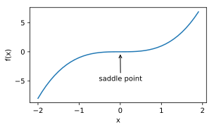
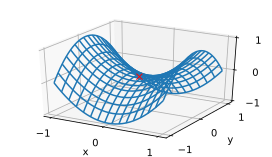

# 7.1 優化與深度學習

本節將討論優化與深度學習的關係，以及優化在深度學習中的挑戰。在一個深度學習問題中，我們通常會預先定義一個損失函數。有了損失函數以後，我們就可以使用優化算法試圖將其最小化。在優化中，這樣的損失函數通常被稱作優化問題的目標函數（objective function）。依據慣例，優化算法通常只考慮最小化目標函數。其實，任何最大化問題都可以很容易地轉化為最小化問題，只需令目標函數的相反數為新的目標函數即可。

## 7.1.1 優化與深度學習的關係

雖然優化為深度學習提供了最小化損失函數的方法，但本質上，優化與深度學習的目標是有區別的。
在3.11節（模型選擇、欠擬合和過擬合）中，我們區分了訓練誤差和泛化誤差。
由於優化算法的目標函數通常是一個基於訓練數據集的損失函數，優化的目標在於降低訓練誤差。
而深度學習的目標在於降低泛化誤差。為了降低泛化誤差，除了使用優化算法降低訓練誤差以外，還需要注意應對過擬合。

本章中，我們只關注優化算法在最小化目標函數上的表現，而不關注模型的泛化誤差。


## 7.1.2 優化在深度學習中的挑戰

我們在3.1節（線性迴歸）中對優化問題的解析解和數值解做了區分。深度學習中絕大多數目標函數都很複雜。因此，很多優化問題並不存在解析解，而需要使用基於數值方法的優化算法找到近似解，即數值解。本書中討論的優化算法都是這類基於數值方法的算法。為了求得最小化目標函數的數值解，我們將通過優化算法有限次迭代模型參數來儘可能降低損失函數的值。

優化在深度學習中有很多挑戰。下面描述了其中的兩個挑戰，即局部最小值和鞍點。為了更好地描述問題，我們先導入本節中實驗需要的包或模塊。

``` python
%matplotlib inline
import sys
sys.path.append("..") 
import d2lzh_pytorch as d2l
from mpl_toolkits import mplot3d # 三維畫圖
import numpy as np
```

### 7.1.2.1 局部最小值

對於目標函數$f(x)$，如果$f(x)$在$x$上的值比在$x$鄰近的其他點的值更小，那麼$f(x)$可能是一個局部最小值（local minimum）。如果$f(x)$在$x$上的值是目標函數在整個定義域上的最小值，那麼$f(x)$是全局最小值（global minimum）。

舉個例子，給定函數

$$
f(x) = x \cdot \text{cos}(\pi x), \qquad -1.0 \leq x \leq 2.0,
$$

我們可以大致找出該函數的局部最小值和全局最小值的位置。需要注意的是，圖中箭頭所指示的只是大致位置。

``` python
def f(x):
    return x * np.cos(np.pi * x)

d2l.set_figsize((4.5, 2.5))
x = np.arange(-1.0, 2.0, 0.1)
fig,  = d2l.plt.plot(x, f(x))
fig.axes.annotate('local minimum', xy=(-0.3, -0.25), xytext=(-0.77, -1.0),
                  arrowprops=dict(arrowstyle='->'))
fig.axes.annotate('global minimum', xy=(1.1, -0.95), xytext=(0.6, 0.8),
                  arrowprops=dict(arrowstyle='->'))
d2l.plt.xlabel('x')
d2l.plt.ylabel('f(x)');
```

<div align=center>

</div>


深度學習模型的目標函數可能有若干局部最優值。當一個優化問題的數值解在局部最優解附近時，由於目標函數有關解的梯度接近或變成零，最終迭代求得的數值解可能只令目標函數局部最小化而非全局最小化。

### 7.1.2.2 鞍點

剛剛我們提到，梯度接近或變成零可能是由於當前解在局部最優解附近造成的。事實上，另一種可能性是當前解在鞍點（saddle point）附近。

舉個例子，給定函數

$$f(x) = x^3,$$

我們可以找出該函數的鞍點位置。

``` python
x = np.arange(-2.0, 2.0, 0.1)
fig, = d2l.plt.plot(x, x**3)
fig.axes.annotate('saddle point', xy=(0, -0.2), xytext=(-0.52, -5.0),
                  arrowprops=dict(arrowstyle='->'))
d2l.plt.xlabel('x')
d2l.plt.ylabel('f(x)');
```
<div align=center>

</div>

再舉個定義在二維空間的函數的例子，例如：

$$f(x, y) = x^2 - y^2.$$

我們可以找出該函數的鞍點位置。也許你已經發現了，該函數看起來像一個馬鞍，而鞍點恰好是馬鞍上可坐區域的中心。

``` python
x, y = np.mgrid[-1: 1: 31j, -1: 1: 31j]
z = x**2 - y**2

ax = d2l.plt.figure().add_subplot(111, projection='3d')
ax.plot_wireframe(x, y, z, **{'rstride': 2, 'cstride': 2})
ax.plot([0], [0], [0], 'rx')
ticks = [-1,  0, 1]
d2l.plt.xticks(ticks)
d2l.plt.yticks(ticks)
ax.set_zticks(ticks)
d2l.plt.xlabel('x')
d2l.plt.ylabel('y');
```
<div align=center>

</div>

在圖的鞍點位置，目標函數在$x$軸方向上是局部最小值，但在$y$軸方向上是局部最大值。

假設一個函數的輸入為$k$維向量，輸出為標量，那麼它的海森矩陣（Hessian matrix）有$k$個特徵值。該函數在梯度為0的位置上可能是局部最小值、局部最大值或者鞍點。

* 當函數的海森矩陣在梯度為零的位置上的特徵值全為正時，該函數得到局部最小值。
* 當函數的海森矩陣在梯度為零的位置上的特徵值全為負時，該函數得到局部最大值。
* 當函數的海森矩陣在梯度為零的位置上的特徵值有正有負時，該函數得到鞍點。

隨機矩陣理論告訴我們，對於一個大的高斯隨機矩陣來說，任一特徵值是正或者是負的概率都是0.5 [1]。那麼，以上第一種情況的概率為 $0.5^k$。由於深度學習模型參數通常都是高維的（$k$很大），目標函數的鞍點通常比局部最小值更常見。

在深度學習中，雖然找到目標函數的全局最優解很難，但這並非必要。我們將在本章接下來的幾節中逐一介紹深度學習中常用的優化算法，它們在很多實際問題中都能夠訓練出十分有效的深度學習模型。


## 小結

* 由於優化算法的目標函數通常是一個基於訓練數據集的損失函數，優化的目標在於降低訓練誤差。
* 由於深度學習模型參數通常都是高維的，目標函數的鞍點通常比局部最小值更常見。


## 參考文獻

[1] Wigner, E. P. (1958). On the distribution of the roots of certain symmetric matrices. Annals of Mathematics, 325-327.


------------
> 注：本節與原書基本相同，[原書傳送門](https://zh.d2l.ai/chapter_optimization/optimization-intro.html)

