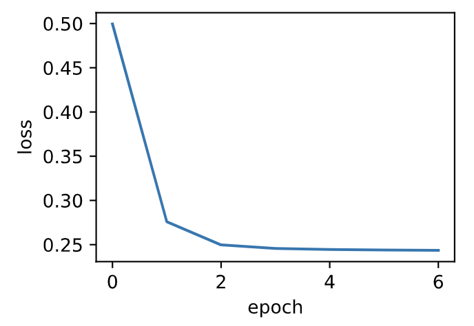
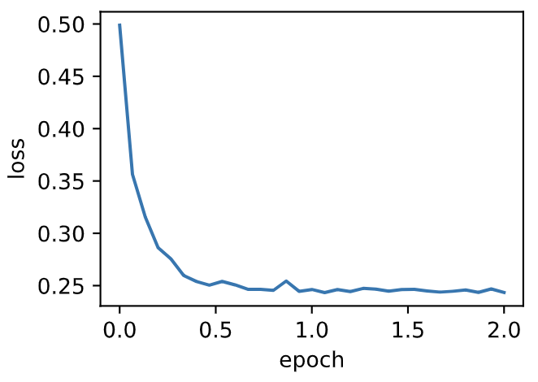
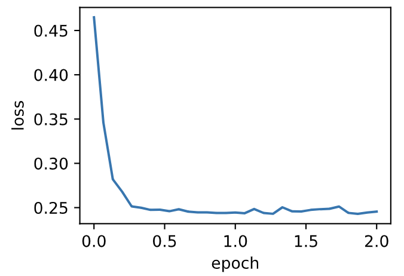

# 7.3 小批量隨機梯度下降

在每一次迭代中，梯度下降使用整個訓練數據集來計算梯度，因此它有時也被稱為批量梯度下降（batch gradient descent）。而隨機梯度下降在每次迭代中只隨機採樣一個樣本來計算梯度。正如我們在前幾章中所看到的，我們還可以在每輪迭代中隨機均勻採樣多個樣本來組成一個小批量，然後使用這個小批量來計算梯度。下面就來描述小批量隨機梯度下降。


設目標函數$f(\boldsymbol{x}): \mathbb{R}^d \rightarrow \mathbb{R}$。在迭代開始前的時間步設為0。該時間步的自變量記為$\boldsymbol{x}_0\in \mathbb{R}^d$，通常由隨機初始化得到。在接下來的每一個時間步$t>0$中，小批量隨機梯度下降隨機均勻採樣一個由訓練數據樣本索引組成的小批量$\mathcal{B}_t$。我們可以通過重複採樣（sampling with replacement）或者不重複採樣（sampling without replacement）得到一個小批量中的各個樣本。前者允許同一個小批量中出現重複的樣本，後者則不允許如此，且更常見。對於這兩者間的任一種方式，都可以使用

$$
\boldsymbol{g}_t \leftarrow \nabla f_{\mathcal{B}_t}(\boldsymbol{x}_{t-1}) = \frac{1}{|\mathcal{B}|} \sum_{i \in \mathcal{B}_t}\nabla f_i(\boldsymbol{x}_{t-1})
$$

來計算時間步$t$的小批量$\mathcal{B}_t$上目標函數位於$\boldsymbol{x}_{t-1}$處的梯度$\boldsymbol{g}_t$。這裡$|\mathcal{B}|$代表批量大小，即小批量中樣本的個數，是一個超參數。同隨機梯度一樣，重複採樣所得的小批量隨機梯度$\boldsymbol{g}_t$也是對梯度$\nabla f(\boldsymbol{x}_{t-1})$的無偏估計。給定學習率$\eta_t$（取正數），小批量隨機梯度下降對自變量的迭代如下：

$$\boldsymbol{x}_t \leftarrow \boldsymbol{x}_{t-1} - \eta_t \boldsymbol{g}_t.$$

基於隨機採樣得到的梯度的方差在迭代過程中無法減小，因此在實際中，（小批量）隨機梯度下降的學習率可以在迭代過程中自我衰減，例如$\eta_t=\eta t^\alpha$（通常$\alpha=-1$或者$-0.5$）、$\eta_t = \eta \alpha^t$（如$\alpha=0.95$）或者每迭代若干次後將學習率衰減一次。如此一來，學習率和（小批量）隨機梯度乘積的方差會減小。而梯度下降在迭代過程中一直使用目標函數的真實梯度，無須自我衰減學習率。


小批量隨機梯度下降中每次迭代的計算開銷為$\mathcal{O}(|\mathcal{B}|)$。當批量大小為1時，該算法即為隨機梯度下降；當批量大小等於訓練數據樣本數時，該算法即為梯度下降。當批量較小時，每次迭代中使用的樣本少，這會導致並行處理和內存使用效率變低。這使得在計算同樣數目樣本的情況下比使用更大批量時所花時間更多。當批量較大時，每個小批量梯度裡可能含有更多的冗餘信息。為了得到較好的解，批量較大時比批量較小時需要計算的樣本數目可能更多，例如增大迭代週期數。


## 7.3.1 讀取數據

本章裡我們將使用一個來自NASA的測試不同飛機機翼噪音的數據集來比較各個優化算法 [1]。我們使用該數據集的前1,500個樣本和5個特徵，並使用標準化對數據進行預處理。

```python
%matplotlib inline
import numpy as np
import time
import torch
from torch import nn, optim
import sys
sys.path.append("..") 
import d2lzh_pytorch as d2l

def get_data_ch7():  # 本函數已保存在d2lzh_pytorch包中方便以後使用
    data = np.genfromtxt('../../data/airfoil_self_noise.dat', delimiter='\t')
    data = (data - data.mean(axis=0)) / data.std(axis=0)
    return torch.tensor(data[:1500, :-1], dtype=torch.float32), \
    torch.tensor(data[:1500, -1], dtype=torch.float32) # 前1500個樣本(每個樣本5個特徵)

features, labels = get_data_ch7()
features.shape # torch.Size([1500, 5])
```

## 7.3.2 從零開始實現

3.2節（線性迴歸的從零開始實現）中已經實現過小批量隨機梯度下降算法。我們在這裡將它的輸入參數變得更加通用，主要是為了方便本章後面介紹的其他優化算法也可以使用同樣的輸入。具體來說，我們添加了一個狀態輸入`states`並將超參數放在字典`hyperparams`裡。此外，我們將在訓練函數裡對各個小批量樣本的損失求平均，因此優化算法裡的梯度不需要除以批量大小。

``` python
def sgd(params, states, hyperparams):
    for p in params:
        p.data -= hyperparams['lr'] * p.grad.data
```

下面實現一個通用的訓練函數，以方便本章後面介紹的其他優化算法使用。它初始化一個線性迴歸模型，然後可以使用小批量隨機梯度下降以及後續小節介紹的其他算法來訓練模型。

``` python
# 本函數已保存在d2lzh_pytorch包中方便以後使用
def train_ch7(optimizer_fn, states, hyperparams, features, labels,
              batch_size=10, num_epochs=2):
    # 初始化模型
    net, loss = d2l.linreg, d2l.squared_loss
    
    w = torch.nn.Parameter(torch.tensor(np.random.normal(0, 0.01, size=(features.shape[1], 1)), dtype=torch.float32),
                           requires_grad=True)
    b = torch.nn.Parameter(torch.zeros(1, dtype=torch.float32), requires_grad=True)

    def eval_loss():
        return loss(net(features, w, b), labels).mean().item()

    ls = [eval_loss()]
    data_iter = torch.utils.data.DataLoader(
        torch.utils.data.TensorDataset(features, labels), batch_size, shuffle=True)
    
    for _ in range(num_epochs):
        start = time.time()
        for batch_i, (X, y) in enumerate(data_iter):
            l = loss(net(X, w, b), y).mean()  # 使用平均損失
            
            # 梯度清零
            if w.grad is not None:
                w.grad.data.zero_()
                b.grad.data.zero_()
                
            l.backward()
            optimizer_fn([w, b], states, hyperparams)  # 迭代模型參數
            if (batch_i + 1) * batch_size % 100 == 0:
                ls.append(eval_loss())  # 每100個樣本記錄下當前訓練誤差
    # 打印結果和作圖
    print('loss: %f, %f sec per epoch' % (ls[-1], time.time() - start))
    d2l.set_figsize()
    d2l.plt.plot(np.linspace(0, num_epochs, len(ls)), ls)
    d2l.plt.xlabel('epoch')
    d2l.plt.ylabel('loss')
```

當批量大小為樣本總數1,500時，優化使用的是梯度下降。梯度下降的1個迭代週期對模型參數只迭代1次。可以看到6次迭代後目標函數值（訓練損失）的下降趨向了平穩。

``` python
def train_sgd(lr, batch_size, num_epochs=2):
    train_ch7(sgd, None, {'lr': lr}, features, labels, batch_size, num_epochs)

train_sgd(1, 1500, 6)
```
輸出：
```
loss: 0.243605, 0.014335 sec per epoch
```
<div align=center>

</div>

當批量大小為1時，優化使用的是隨機梯度下降。為了簡化實現，有關（小批量）隨機梯度下降的實驗中，我們未對學習率進行自我衰減，而是直接採用較小的常數學習率。隨機梯度下降中，每處理一個樣本會更新一次自變量（模型參數），一個迭代週期裡會對自變量進行1,500次更新。可以看到，目標函數值的下降在1個迭代週期後就變得較為平緩。

``` python
train_sgd(0.005, 1)
```
輸出：
```
loss: 0.243433, 0.270011 sec per epoch
```
<div align=center>

</div>


雖然隨機梯度下降和梯度下降在一個迭代週期裡都處理了1,500個樣本，但實驗中隨機梯度下降的一個迭代週期耗時更多。這是因為隨機梯度下降在一個迭代週期裡做了更多次的自變量迭代，而且單樣本的梯度計算難以有效利用矢量計算。

當批量大小為10時，優化使用的是小批量隨機梯度下降。它在每個迭代週期的耗時介於梯度下降和隨機梯度下降的耗時之間。

``` python
train_sgd(0.05, 10)
```
輸出：
```
loss: 0.242805, 0.078792 sec per epoch
```
<div align=center>

</div>

## 7.3.3 簡潔實現

在PyTorch裡可以通過創建`optimizer`實例來調用優化算法。這能讓實現更簡潔。下面實現一個通用的訓練函數，它通過優化算法的函數`optimizer_fn`和超參數`optimizer_hyperparams`來創建`optimizer`實例。

``` python
# 本函數與原書不同的是這裡第一個參數優化器函數而不是優化器的名字
# 例如: optimizer_fn=torch.optim.SGD, optimizer_hyperparams={"lr": 0.05}
def train_pytorch_ch7(optimizer_fn, optimizer_hyperparams, features, labels,
                    batch_size=10, num_epochs=2):
    # 初始化模型
    net = nn.Sequential(
        nn.Linear(features.shape[-1], 1)
    )
    loss = nn.MSELoss()
    optimizer = optimizer_fn(net.parameters(), **optimizer_hyperparams)

    def eval_loss():
        return loss(net(features).view(-1), labels).item() / 2

    ls = [eval_loss()]
    data_iter = torch.utils.data.DataLoader(
        torch.utils.data.TensorDataset(features, labels), batch_size, shuffle=True)

    for _ in range(num_epochs):
        start = time.time()
        for batch_i, (X, y) in enumerate(data_iter):
            # 除以2是為了和train_ch7保持一致, 因為squared_loss中除了2
            l = loss(net(X).view(-1), y) / 2 
            
            optimizer.zero_grad()
            l.backward()
            optimizer.step()
            if (batch_i + 1) * batch_size % 100 == 0:
                ls.append(eval_loss())
    # 打印結果和作圖
    print('loss: %f, %f sec per epoch' % (ls[-1], time.time() - start))
    d2l.set_figsize()
    d2l.plt.plot(np.linspace(0, num_epochs, len(ls)), ls)
    d2l.plt.xlabel('epoch')
    d2l.plt.ylabel('loss')
```
使用PyTorch重複上一個實驗。
``` python
train_pytorch_ch7(optim.SGD, {"lr": 0.05}, features, labels, 10)
```
輸出：
```
loss: 0.245491, 0.044150 sec per epoch
```
<div align=center>

</div>

## 小結

* 小批量隨機梯度每次隨機均勻採樣一個小批量的訓練樣本來計算梯度。
* 在實際中，（小批量）隨機梯度下降的學習率可以在迭代過程中自我衰減。
* 通常，小批量隨機梯度在每個迭代週期的耗時介於梯度下降和隨機梯度下降的耗時之間。


## 參考文獻

[1] 飛機機翼噪音數據集。https://archive.ics.uci.edu/ml/datasets/Airfoil+Self-Noise

-----------
> 注：除代碼外本節與原書此節基本相同，[原書傳送門](https://zh.d2l.ai/chapter_optimization/minibatch-sgd.html)
