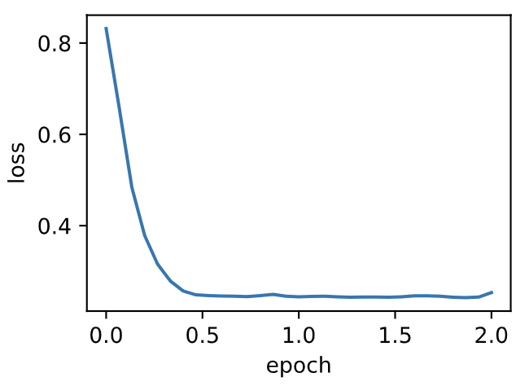

# 7.4 動量法

在7.2節（梯度下降和隨機梯度下降）中我們提到，目標函數有關自變量的梯度代表了目標函數在自變量當前位置下降最快的方向。因此，梯度下降也叫作最陡下降（steepest descent）。在每次迭代中，梯度下降根據自變量當前位置，沿著當前位置的梯度更新自變量。然而，如果自變量的迭代方向僅僅取決於自變量當前位置，這可能會帶來一些問題。


## 7.4.1 梯度下降的問題

讓我們考慮一個輸入和輸出分別為二維向量$\boldsymbol{x} = [x_1, x_2]^\top$和標量的目標函數$f(\boldsymbol{x})=0.1x_1^2+2x_2^2$。與7.2節中不同，這裡將$x_1^2$係數從$1$減小到了$0.1$。下面實現基於這個目標函數的梯度下降，並演示使用學習率為$0.4$時自變量的迭代軌跡。

``` python
%matplotlib inline
import sys
sys.path.append("..") 
import d2lzh_pytorch as d2l
import torch

eta = 0.4 # 學習率

def f_2d(x1, x2):
    return 0.1 * x1 ** 2 + 2 * x2 ** 2

def gd_2d(x1, x2, s1, s2):
    return (x1 - eta * 0.2 * x1, x2 - eta * 4 * x2, 0, 0)

d2l.show_trace_2d(f_2d, d2l.train_2d(gd_2d))
```
輸出：
```
epoch 20, x1 -0.943467, x2 -0.000073
```

<div align=center>

</div>

可以看到，同一位置上，目標函數在豎直方向（$x_2$軸方向）比在水平方向（$x_1$軸方向）的斜率的絕對值更大。因此，給定學習率，梯度下降迭代自變量時會使自變量在豎直方向比在水平方向移動幅度更大。那麼，我們需要一個較小的學習率從而避免自變量在豎直方向上越過目標函數最優解。然而，這會造成自變量在水平方向上朝最優解移動變慢。

下面我們試著將學習率調得稍大一點，此時自變量在豎直方向不斷越過最優解並逐漸發散。

``` python
eta = 0.6
d2l.show_trace_2d(f_2d, d2l.train_2d(gd_2d))
```
輸出：
```
epoch 20, x1 -0.387814, x2 -1673.365109
```
<div align=center>

</div>

## 7.4.2 動量法

動量法的提出是為了解決梯度下降的上述問題。由於小批量隨機梯度下降比梯度下降更為廣義，本章後續討論將沿用7.3節（小批量隨機梯度下降）中時間步$t$的小批量隨機梯度$\boldsymbol{g}_t$的定義。設時間步$t$的自變量為$\boldsymbol{x}_t$，學習率為$\eta_t$。
在時間步$0$，動量法創建速度變量$\boldsymbol{v}_0$，並將其元素初始化成0。在時間步$t>0$，動量法對每次迭代的步驟做如下修改：

$$
\begin{aligned}
\boldsymbol{v}_t &\leftarrow \gamma \boldsymbol{v}_{t-1} + \eta_t \boldsymbol{g}_t, \\
\boldsymbol{x}_t &\leftarrow \boldsymbol{x}_{t-1} - \boldsymbol{v}_t,
\end{aligned}
$$

其中，動量超參數$\gamma$滿足$0 \leq \gamma < 1$。當$\gamma=0$時，動量法等價於小批量隨機梯度下降。

在解釋動量法的數學原理前，讓我們先從實驗中觀察梯度下降在使用動量法後的迭代軌跡。

``` python
def momentum_2d(x1, x2, v1, v2):
    v1 = gamma * v1 + eta * 0.2 * x1
    v2 = gamma * v2 + eta * 4 * x2
    return x1 - v1, x2 - v2, v1, v2

eta, gamma = 0.4, 0.5
d2l.show_trace_2d(f_2d, d2l.train_2d(momentum_2d))
```
輸出：
```
epoch 20, x1 -0.062843, x2 0.001202
```
<div align=center>

</div>

可以看到使用較小的學習率$\eta=0.4$和動量超參數$\gamma=0.5$時，動量法在豎直方向上的移動更加平滑，且在水平方向上更快逼近最優解。下面使用較大的學習率$\eta=0.6$，此時自變量也不再發散。

``` python
eta = 0.6
d2l.show_trace_2d(f_2d, d2l.train_2d(momentum_2d))
```
輸出：
```
epoch 20, x1 0.007188, x2 0.002553
```
<div align=center>

</div>

### 7.4.2.1 指數加權移動平均

為了從數學上理解動量法，讓我們先解釋一下指數加權移動平均（exponentially weighted moving average）。給定超參數$0 \leq \gamma < 1$，當前時間步$t$的變量$y_t$是上一時間步$t-1$的變量$y_{t-1}$和當前時間步另一變量$x_t$的線性組合：

$$y_t = \gamma y_{t-1} + (1-\gamma) x_t.$$

我們可以對$y_t$展開：

$$
\begin{aligned}
y_t  &= (1-\gamma) x_t + \gamma y_{t-1}\\
         &= (1-\gamma)x_t + (1-\gamma) \cdot \gamma x_{t-1} + \gamma^2y_{t-2}\\
         &= (1-\gamma)x_t + (1-\gamma) \cdot \gamma x_{t-1} + (1-\gamma) \cdot \gamma^2x_{t-2} + \gamma^3y_{t-3}\\
         &\ldots
\end{aligned}
$$

令$n = 1/(1-\gamma)$，那麼 $\left(1-1/n\right)^n = \gamma^{1/(1-\gamma)}$。因為

$$ \lim_{n \rightarrow \infty}  \left(1-\frac{1}{n}\right)^n = \exp(-1) \approx 0.3679,$$

所以當$\gamma \rightarrow 1$時，$\gamma^{1/(1-\gamma)}=\exp(-1)$，如$0.95^{20} \approx \exp(-1)$。如果把$\exp(-1)$當作一個比較小的數，我們可以在近似中忽略所有含$\gamma^{1/(1-\gamma)}$和比$\gamma^{1/(1-\gamma)}$更高階的係數的項。例如，當$\gamma=0.95$時，

$$y_t \approx 0.05 \sum_{i=0}^{19} 0.95^i x_{t-i}.$$

因此，在實際中，我們常常將$y_t$看作是對最近$1/(1-\gamma)$個時間步的$x_t$值的加權平均。例如，當$\gamma = 0.95$時，$y_t$可以被看作對最近20個時間步的$x_t$值的加權平均；當$\gamma = 0.9$時，$y_t$可以看作是對最近10個時間步的$x_t$值的加權平均。而且，離當前時間步$t$越近的$x_t$值獲得的權重越大（越接近1）。


### 7.4.2.2 由指數加權移動平均理解動量法

現在，我們對動量法的速度變量做變形：

$$\boldsymbol{v}_t \leftarrow \gamma \boldsymbol{v}_{t-1} + (1 - \gamma) \left(\frac{\eta_t}{1 - \gamma} \boldsymbol{g}_t\right). $$

由指數加權移動平均的形式可得，速度變量$\boldsymbol{v}_t$實際上對序列$\{\eta_{t-i}\boldsymbol{g}_{t-i} /(1-\gamma):i=0,\ldots,1/(1-\gamma)-1\}$做了指數加權移動平均。換句話說，相比於小批量隨機梯度下降，**動量法在每個時間步的自變量更新量近似於將最近$1/(1-\gamma)$個時間步的普通更新量（即學習率乘以梯度）做了指數加權移動平均後再除以$1-\gamma$**。所以，在動量法中，自變量在各個方向上的移動幅度不僅取決當前梯度，還取決於過去的各個梯度在各個方向上是否一致。在本節之前示例的優化問題中，所有梯度在水平方向上為正（向右），而在豎直方向上時正（向上）時負（向下）。這樣，我們就可以使用較大的學習率，從而使自變量向最優解更快移動。


## 7.4.3 從零開始實現

相對於小批量隨機梯度下降，動量法需要對每一個自變量維護一個同它一樣形狀的速度變量，且超參數裡多了動量超參數。實現中，我們將速度變量用更廣義的狀態變量`states`表示。

``` python
features, labels = d2l.get_data_ch7()

def init_momentum_states():
    v_w = torch.zeros((features.shape[1], 1), dtype=torch.float32)
    v_b = torch.zeros(1, dtype=torch.float32)
    return (v_w, v_b)

def sgd_momentum(params, states, hyperparams):
    for p, v in zip(params, states):
        v.data = hyperparams['momentum'] * v.data + hyperparams['lr'] * p.grad.data
        p.data -= v.data
```

我們先將動量超參數`momentum`設0.5，這時可以看成是特殊的小批量隨機梯度下降：其小批量隨機梯度為最近2個時間步的2倍小批量梯度的加權平均。
> 注：個人認為這裡不應該是“加權平均”而應該是“加權和”，因為根據7.4.2.2節分析，加權平均最後除以了$1-\gamma$，所以就相當於沒有進行平均。

``` python
d2l.train_ch7(sgd_momentum, init_momentum_states(),
              {'lr': 0.02, 'momentum': 0.5}, features, labels)
```
輸出：
```
loss: 0.245518, 0.042304 sec per epoch
```
<div align=center>

</div>

將動量超參數`momentum`增大到0.9，這時依然可以看成是特殊的小批量隨機梯度下降：其小批量隨機梯度為最近10個時間步的10倍小批量梯度的加權平均。我們先保持學習率0.02不變。
> 同理，這裡不應該是“加權平均”而應該是“加權和”。

``` python
d2l.train_ch7(sgd_momentum, init_momentum_states(),
              {'lr': 0.02, 'momentum': 0.9}, features, labels)
```
輸出：
```
loss: 0.252046, 0.095708 sec per epoch
```
<div align=center>

</div>

可見目標函數值在後期迭代過程中的變化不夠平滑。直覺上，10倍小批量梯度比2倍小批量梯度大了5倍，我們可以試著將學習率減小到原來的1/5。此時目標函數值在下降了一段時間後變化更加平滑。
> 這也印證了剛剛的觀點。

``` python
d2l.train_ch7(sgd_momentum, init_momentum_states(),
              {'lr': 0.004, 'momentum': 0.9}, features, labels)
```
輸出：
```
loss: 0.242905, 0.073496 sec per epoch
```
<div align=center>

</div>

## 7.4.4 簡潔實現

在PyTorch中，只需要通過參數`momentum`來指定動量超參數即可使用動量法。

``` python
d2l.train_pytorch_ch7(torch.optim.SGD, {'lr': 0.004, 'momentum': 0.9},
                    features, labels)
```
輸出：
```
loss: 0.253280, 0.060247 sec per epoch
```
<div align=center>

</div>

## 小結

* 動量法使用了指數加權移動平均的思想。它將過去時間步的梯度做了加權平均，且權重按時間步指數衰減。
* 動量法使得相鄰時間步的自變量更新在方向上更加一致。

-----------
> 注：除代碼外本節與原書此節基本相同，[原書傳送門](https://zh.d2l.ai/chapter_optimization/momentum.html)