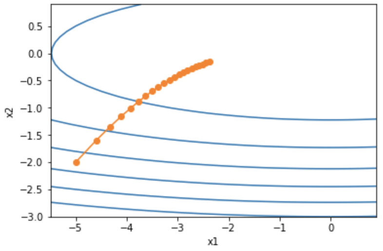
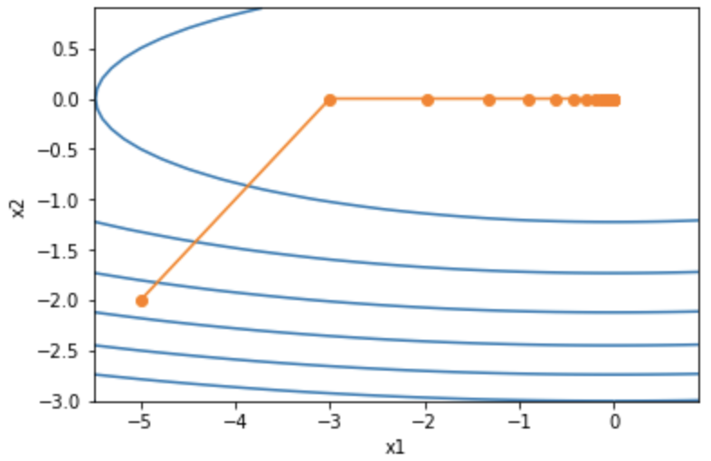
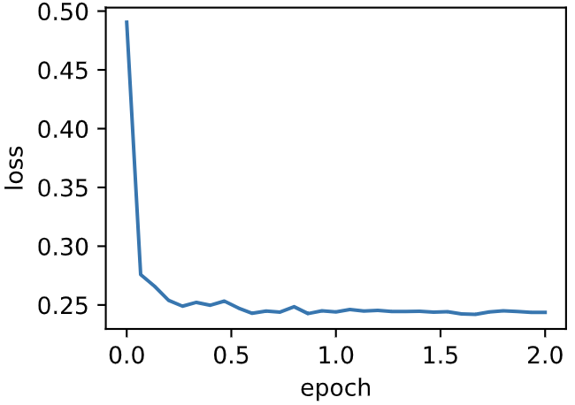
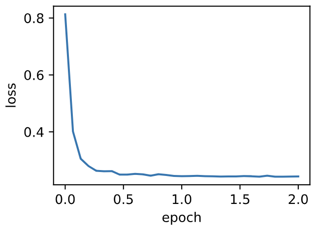

# 7.5 AdaGrad算法

在之前介紹過的優化算法中，目標函數自變量的每一個元素在相同時間步都使用同一個學習率來自我迭代。舉個例子，假設目標函數為$f$，自變量為一個二維向量$[x_1, x_2]^\top$，該向量中每一個元素在迭代時都使用相同的學習率。例如，在學習率為$\eta$的梯度下降中，元素$x_1$和$x_2$都使用相同的學習率$\eta$來自我迭代：

$$
x_1 \leftarrow x_1 - \eta \frac{\partial{f}}{\partial{x_1}}, \quad
x_2 \leftarrow x_2 - \eta \frac{\partial{f}}{\partial{x_2}}.
$$

在7.4節（動量法）裡我們看到當$x_1$和$x_2$的梯度值有較大差別時，需要選擇足夠小的學習率使得自變量在梯度值較大的維度上不發散。但這樣會導致自變量在梯度值較小的維度上迭代過慢。動量法依賴指數加權移動平均使得自變量的更新方向更加一致，從而降低發散的可能。本節我們介紹**AdaGrad算法，它根據自變量在每個維度的梯度值的大小來調整各個維度上的學習率，從而避免統一的學習率難以適應所有維度的問題**[1]。


## 7.5.1 算法

AdaGrad算法會使用一個小批量隨機梯度$\boldsymbol{g}_t$按元素平方的累加變量$\boldsymbol{s}_t$。在時間步0，AdaGrad將$\boldsymbol{s}_0$中每個元素初始化為0。在時間步$t$，首先將小批量隨機梯度$\boldsymbol{g}_t$按元素平方後累加到變量$\boldsymbol{s}_t$：

$$\boldsymbol{s}_t \leftarrow \boldsymbol{s}_{t-1} + \boldsymbol{g}_t \odot \boldsymbol{g}_t,$$

其中$\odot$是按元素相乘。接著，我們將目標函數自變量中每個元素的學習率通過按元素運算重新調整一下：

$$\boldsymbol{x}_t \leftarrow \boldsymbol{x}_{t-1} - \frac{\eta}{\sqrt{\boldsymbol{s}_t + \epsilon}} \odot \boldsymbol{g}_t,$$

其中$\eta$是學習率，$\epsilon$是為了維持數值穩定性而添加的常數，如$10^{-6}$。這裡開方、除法和乘法的運算都是按元素運算的。這些按元素運算使得目標函數自變量中每個元素都分別擁有自己的學習率。

## 7.5.2 特點

需要強調的是，小批量隨機梯度按元素平方的累加變量$\boldsymbol{s}_t$出現在學習率的分母項中。因此，如果目標函數有關自變量中某個元素的偏導數一直都較大，那麼該元素的學習率將下降較快；反之，如果目標函數有關自變量中某個元素的偏導數一直都較小，那麼該元素的學習率將下降較慢。然而，由於$\boldsymbol{s}_t$一直在累加按元素平方的梯度，自變量中每個元素的學習率在迭代過程中一直在降低（或不變）。所以，**當學習率在迭代早期降得較快且當前解依然不佳時，AdaGrad算法在迭代後期由於學習率過小，可能較難找到一個有用的解**。

下面我們仍然以目標函數$f(\boldsymbol{x})=0.1x_1^2+2x_2^2$為例觀察AdaGrad算法對自變量的迭代軌跡。我們實現AdaGrad算法並使用和上一節實驗中相同的學習率0.4。可以看到，自變量的迭代軌跡較平滑。但由於$\boldsymbol{s}_t$的累加效果使學習率不斷衰減，自變量在迭代後期的移動幅度較小。

``` python
%matplotlib inline
import math
import torch
import sys
sys.path.append("..") 
import d2lzh_pytorch as d2l

def adagrad_2d(x1, x2, s1, s2):
    g1, g2, eps = 0.2 * x1, 4 * x2, 1e-6  # 前兩項為自變量梯度
    s1 += g1 ** 2
    s2 += g2 ** 2
    x1 -= eta / math.sqrt(s1 + eps) * g1
    x2 -= eta / math.sqrt(s2 + eps) * g2
    return x1, x2, s1, s2

def f_2d(x1, x2):
    return 0.1 * x1 ** 2 + 2 * x2 ** 2

eta = 0.4
d2l.show_trace_2d(f_2d, d2l.train_2d(adagrad_2d))
```
輸出：
```
epoch 20, x1 -2.382563, x2 -0.158591
```

<div align=center>

</div>

下面將學習率增大到2。可以看到自變量更為迅速地逼近了最優解。

```python
eta = 2
d2l.show_trace_2d(f_2d, d2l.train_2d(adagrad_2d))
```
輸出：
```
epoch 20, x1 -0.002295, x2 -0.000000
```
<div align=center>

</div>

## 7.5.3 從零開始實現

同動量法一樣，AdaGrad算法需要對每個自變量維護同它一樣形狀的狀態變量。我們根據AdaGrad算法中的公式實現該算法。

``` python
features, labels = d2l.get_data_ch7()

def init_adagrad_states():
    s_w = torch.zeros((features.shape[1], 1), dtype=torch.float32)
    s_b = torch.zeros(1, dtype=torch.float32)
    return (s_w, s_b)

def adagrad(params, states, hyperparams):
    eps = 1e-6
    for p, s in zip(params, states):
        s.data += (p.grad.data**2)
        p.data -= hyperparams['lr'] * p.grad.data / torch.sqrt(s + eps)
```

與7.3節（小批量隨機梯度下降）中的實驗相比，這裡使用更大的學習率來訓練模型。

``` python
d2l.train_ch7(adagrad, init_adagrad_states(), {'lr': 0.1}, features, labels)
```

輸出：
```
loss: 0.243675, 0.049749 sec per epoch
```

<div align=center>

</div>

## 7.5.4 簡潔實現

通過名稱為`Adagrad`的優化器方法，我們便可使用PyTorch提供的AdaGrad算法來訓練模型。

``` python
d2l.train_pytorch_ch7(torch.optim.Adagrad, {'lr': 0.1}, features, labels)
```
輸出：
```
loss: 0.243147, 0.040675 sec per epoch
```

<div align=center>

</div>

## 小結

* AdaGrad算法在迭代過程中不斷調整學習率，並讓目標函數自變量中每個元素都分別擁有自己的學習率。
* 使用AdaGrad算法時，自變量中每個元素的學習率在迭代過程中一直在降低（或不變）。


## 參考文獻

[1] Duchi, J., Hazan, E., & Singer, Y. (2011). Adaptive subgradient methods for online learning and stochastic optimization. Journal of Machine Learning Research, 12(Jul), 2121-2159.


-----------
> 注：除代碼外本節與原書此節基本相同，[原書傳送門](https://zh.d2l.ai/chapter_optimization/adagrad.html)
