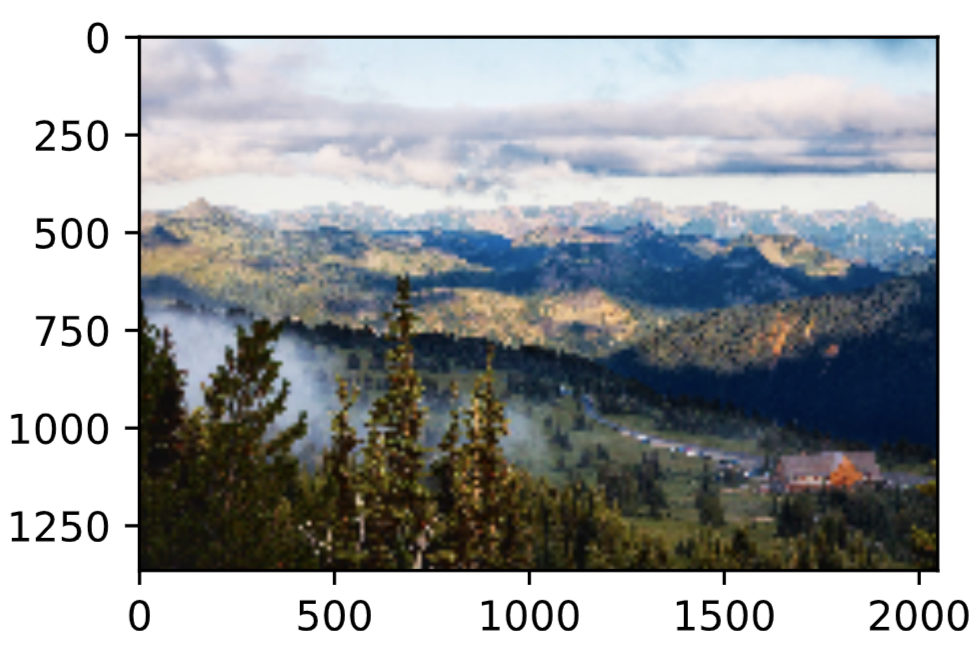
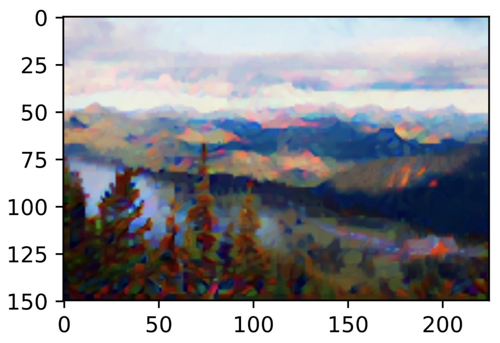

# 9.11 樣式遷移

如果你是一位攝影愛好者，也許接觸過濾鏡。它能改變照片的顏色樣式，從而使風景照更加銳利或者令人像更加美白。但一個濾鏡通常只能改變照片的某個方面。如果要照片達到理想中的樣式，經常需要嘗試大量不同的組合，其複雜程度不亞於模型調參。

在本節中，我們將介紹如何使用卷積神經網絡自動將某圖像中的樣式應用在另一圖像之上，即樣式遷移（style transfer）[1]。這裡我們需要兩張輸入圖像，一張是內容圖像，另一張是樣式圖像，我們將使用神經網絡修改內容圖像使其在樣式上接近樣式圖像。圖9.12中的內容圖像為本書作者在西雅圖郊區的雷尼爾山國家公園（Mount Rainier National Park）拍攝的風景照，而樣式圖像則是一副主題為秋天橡樹的油畫。最終輸出的合成圖像在保留了內容圖像中物體主體形狀的情況下應用了樣式圖像的油畫筆觸，同時也讓整體顏色更加鮮豔。

<div align=center>

</div>
<div align=center>圖9.12 輸入內容圖像和樣式圖像，輸出樣式遷移後的合成圖像</div>

## 9.11.1 方法

圖9.13用一個例子來闡述基於卷積神經網絡的樣式遷移方法。首先，我們初始化合成圖像，例如將其初始化成內容圖像。該合成圖像是樣式遷移過程中唯一需要更新的變量，即樣式遷移所需迭代的模型參數。然後，我們選擇一個預訓練的卷積神經網絡來抽取圖像的特徵，其中的模型參數在訓練中無須更新。深度卷積神經網絡憑藉多個層逐級抽取圖像的特徵。我們可以選擇其中某些層的輸出作為內容特徵或樣式特徵。以圖9.13為例，這裡選取的預訓練的神經網絡含有3個卷積層，其中第二層輸出圖像的內容特徵，而第一層和第三層的輸出被作為圖像的樣式特徵。接下來，我們通過正向傳播（實線箭頭方向）計算樣式遷移的損失函數，並通過反向傳播（虛線箭頭方向）迭代模型參數，即不斷更新合成圖像。樣式遷移常用的損失函數由3部分組成：內容損失（content loss）使合成圖像與內容圖像在內容特徵上接近，樣式損失（style loss）令合成圖像與樣式圖像在樣式特徵上接近，而總變差損失（total variation loss）則有助於減少合成圖像中的噪點。最後，當模型訓練結束時，我們輸出樣式遷移的模型參數，即得到最終的合成圖像。

<div align=center>

</div>
<div align=center>圖9.13 基於卷積神經網絡的樣式遷移。實線箭頭和虛線箭頭分別表示正向傳播和反向傳播</div>

下面，我們通過實驗來進一步瞭解樣式遷移的技術細節。實驗需要用到一些導入的包或模塊。

``` python

%matplotlib inline
import time
import torch
import torch.nn.functional as F
import torchvision
import numpy as np
from PIL import Image

import sys
sys.path.append("..") 
import d2lzh_pytorch as d2l
device = torch.device('cuda' if torch.cuda.is_available() else 'cpu')
```

## 9.11.2 讀取內容圖像和樣式圖像

首先，我們分別讀取內容圖像和樣式圖像。從打印出的圖像座標軸可以看出，它們的尺寸並不一樣。

``` python
d2l.set_figsize()
content_img = Image.open('../../data/rainier.jpg')
d2l.plt.imshow(content_img);
```
<div align=center>

</div>

``` python
d2l.set_figsize()
style_img = Image.open('../../data/autumn_oak.jpg')
d2l.plt.imshow(style_img);
```
<div align=center>

</div>

## 9.11.3 預處理和後處理圖像

下面定義圖像的預處理函數和後處理函數。預處理函數`preprocess`對先對更改輸入圖像的尺寸，然後再將PIL圖片轉成卷積神經網絡接受的輸入格式，再在RGB三個通道分別做標準化，由於預訓練模型是在均值為[0.485, 0.456, 0.406]標準差為[0.229, 0.224, 0.225]的圖片數據上預訓練的，所以我們要將圖片標準化保持相同的均值和標準差。後處理函數`postprocess`則將輸出圖像中的像素值還原回標準化之前的值。由於圖像每個像素的浮點數值在0到1之間，我們使用`clamp`函數對小於0和大於1的值分別取0和1。

> `torchvision.transforms`模塊有大量現成的轉換方法，不過需要注意的是有的方法輸入的是PIL圖像，如`Resize`；有的方法輸入的是`tensor`，如`Normalize`；而還有的是用於二者轉換，如`ToTensor`將PIL圖像轉換成`tensor`。一定要注意這點，使用時看清[文檔](http://pytorch.org/docs/stable/torchvision/transforms.html)。

``` python
rgb_mean = np.array([0.485, 0.456, 0.406])
rgb_std = np.array([0.229, 0.224, 0.225])

def preprocess(PIL_img, image_shape):
    process = torchvision.transforms.Compose([
        torchvision.transforms.Resize(image_shape),
        torchvision.transforms.ToTensor(),
        torchvision.transforms.Normalize(mean=rgb_mean, std=rgb_std)])

    return process(PIL_img).unsqueeze(dim = 0) # (batch_size, 3, H, W)

def postprocess(img_tensor):
    inv_normalize = torchvision.transforms.Normalize(
        mean= -rgb_mean / rgb_std,
        std= 1/rgb_std)
    to_PIL_image = torchvision.transforms.ToPILImage()
    return to_PIL_image(inv_normalize(img_tensor[0].cpu()).clamp(0, 1))
```

## 9.11.4 抽取特徵

我們使用基於ImageNet數據集預訓練的VGG-19模型來抽取圖像特徵 [1]。

> PyTorch官方在`torchvision.models`模塊提供了一些常見的預訓練好的計算機視覺模型，包括圖片分類、語義分割、目標檢測、實例分割、人關鍵點檢測和視頻分類等等。使用時要仔細閱讀其[文檔](https://pytorch.org/docs/stable/torchvision/models.html)，搞清楚如何使用，例如剛剛提到的對圖片進行標準化等。

``` python
pretrained_net = torchvision.models.vgg19(pretrained=True, progress=True)
```

> 第一次執行上述代碼會把預訓練好的模型參數下載到環境變量`TORCH_HOME`指定的位置，如果沒有該環境變量的話默認位置是`.cache/torch`。

為了抽取圖像的內容特徵和樣式特徵，我們可以選擇VGG網絡中某些層的輸出。一般來說，越靠近輸入層的輸出越容易抽取圖像的細節信息，反之則越容易抽取圖像的全局信息。為了避免合成圖像過多保留內容圖像的細節，我們選擇VGG較靠近輸出的層，也稱內容層，來輸出圖像的內容特徵。我們還從VGG中選擇不同層的輸出來匹配局部和全局的樣式，這些層也叫樣式層。在5.7節（使用重複元素的網絡（VGG））中我們曾介紹過，VGG網絡使用了5個卷積塊。實驗中，我們選擇第四卷積塊的最後一個卷積層作為內容層，以及每個卷積塊的第一個卷積層作為樣式層。這些層的索引可以通過打印`pretrained_net`實例來獲取。

``` python
pretrained_net
```
輸出:
```
VGG(
  (features): Sequential(
    (0): Conv2d(3, 64, kernel_size=(3, 3), stride=(1, 1), padding=(1, 1))
    (1): ReLU(inplace)
    (2): Conv2d(64, 64, kernel_size=(3, 3), stride=(1, 1), padding=(1, 1))
    (3): ReLU(inplace)
    (4): MaxPool2d(kernel_size=2, stride=2, padding=0, dilation=1, ceil_mode=False)
    (5): Conv2d(64, 128, kernel_size=(3, 3), stride=(1, 1), padding=(1, 1))
    (6): ReLU(inplace)
    (7): Conv2d(128, 128, kernel_size=(3, 3), stride=(1, 1), padding=(1, 1))
    (8): ReLU(inplace)
    (9): MaxPool2d(kernel_size=2, stride=2, padding=0, dilation=1, ceil_mode=False)
    (10): Conv2d(128, 256, kernel_size=(3, 3), stride=(1, 1), padding=(1, 1))
    (11): ReLU(inplace)
    (12): Conv2d(256, 256, kernel_size=(3, 3), stride=(1, 1), padding=(1, 1))
    (13): ReLU(inplace)
    (14): Conv2d(256, 256, kernel_size=(3, 3), stride=(1, 1), padding=(1, 1))
    (15): ReLU(inplace)
    (16): Conv2d(256, 256, kernel_size=(3, 3), stride=(1, 1), padding=(1, 1))
    (17): ReLU(inplace)
    (18): MaxPool2d(kernel_size=2, stride=2, padding=0, dilation=1, ceil_mode=False)
    (19): Conv2d(256, 512, kernel_size=(3, 3), stride=(1, 1), padding=(1, 1))
    (20): ReLU(inplace)
    (21): Conv2d(512, 512, kernel_size=(3, 3), stride=(1, 1), padding=(1, 1))
    (22): ReLU(inplace)
    (23): Conv2d(512, 512, kernel_size=(3, 3), stride=(1, 1), padding=(1, 1))
    (24): ReLU(inplace)
    (25): Conv2d(512, 512, kernel_size=(3, 3), stride=(1, 1), padding=(1, 1))
    (26): ReLU(inplace)
    (27): MaxPool2d(kernel_size=2, stride=2, padding=0, dilation=1, ceil_mode=False)
    (28): Conv2d(512, 512, kernel_size=(3, 3), stride=(1, 1), padding=(1, 1))
    (29): ReLU(inplace)
    (30): Conv2d(512, 512, kernel_size=(3, 3), stride=(1, 1), padding=(1, 1))
    (31): ReLU(inplace)
    (32): Conv2d(512, 512, kernel_size=(3, 3), stride=(1, 1), padding=(1, 1))
    (33): ReLU(inplace)
    (34): Conv2d(512, 512, kernel_size=(3, 3), stride=(1, 1), padding=(1, 1))
    (35): ReLU(inplace)
    (36): MaxPool2d(kernel_size=2, stride=2, padding=0, dilation=1, ceil_mode=False)
  )
  (avgpool): AdaptiveAvgPool2d(output_size=(7, 7))
  (classifier): Sequential(
    (0): Linear(in_features=25088, out_features=4096, bias=True)
    (1): ReLU(inplace)
    (2): Dropout(p=0.5)
    (3): Linear(in_features=4096, out_features=4096, bias=True)
    (4): ReLU(inplace)
    (5): Dropout(p=0.5)
    (6): Linear(in_features=4096, out_features=1000, bias=True)
  )
)

```

``` python
style_layers, content_layers = [0, 5, 10, 19, 28], [25]
```

在抽取特徵時，我們只需要用到VGG從輸入層到最靠近輸出層的內容層或樣式層之間的所有層。下面構建一個新的網絡`net`，它只保留需要用到的VGG的所有層。我們將使用`net`來抽取特徵。

``` python
net_list = []
for i in range(max(content_layers + style_layers) + 1):
    net_list.append(pretrained_net.features[i])
net = torch.nn.Sequential(*net_list)
```

給定輸入`X`，如果簡單調用前向計算`net(X)`，只能獲得最後一層的輸出。由於我們還需要中間層的輸出，因此這裡我們逐層計算，並保留內容層和樣式層的輸出。

``` python
def extract_features(X, content_layers, style_layers):
    contents = []
    styles = []
    for i in range(len(net)):
        X = net[i](X)
        if i in style_layers:
            styles.append(X)
        if i in content_layers:
            contents.append(X)
    return contents, styles
```

下面定義兩個函數，其中`get_contents`函數對內容圖像抽取內容特徵，而`get_styles`函數則對樣式圖像抽取樣式特徵。因為在訓練時無須改變預訓練的VGG的模型參數，所以我們可以在訓練開始之前就提取出內容圖像的內容特徵，以及樣式圖像的樣式特徵。由於合成圖像是樣式遷移所需迭代的模型參數，我們只能在訓練過程中通過調用`extract_features`函數來抽取合成圖像的內容特徵和樣式特徵。

``` python
def get_contents(image_shape, device):
    content_X = preprocess(content_img, image_shape).to(device)
    contents_Y, _ = extract_features(content_X, content_layers, style_layers)
    return content_X, contents_Y

def get_styles(image_shape, device):
    style_X = preprocess(style_img, image_shape).to(device)
    _, styles_Y = extract_features(style_X, content_layers, style_layers)
    return style_X, styles_Y
```

## 9.11.5 定義損失函數

下面我們來描述樣式遷移的損失函數。它由內容損失、樣式損失和總變差損失3部分組成。

### 9.11.5.1 內容損失

與線性迴歸中的損失函數類似，內容損失通過平方誤差函數衡量合成圖像與內容圖像在內容特徵上的差異。平方誤差函數的兩個輸入均為`extract_features`函數計算所得到的內容層的輸出。

``` python
def content_loss(Y_hat, Y):
    return F.mse_loss(Y_hat, Y)
```

### 9.11.5.2 樣式損失

樣式損失也一樣通過平方誤差函數衡量合成圖像與樣式圖像在樣式上的差異。為了表達樣式層輸出的樣式，我們先通過`extract_features`函數計算樣式層的輸出。假設該輸出的樣本數為1，通道數為$c$，高和寬分別為$h$和$w$，我們可以把輸出變換成$c$行$hw$列的矩陣$\boldsymbol{X}$。矩陣$\boldsymbol{X}$可以看作是由$c$個長度為$hw$的向量$\boldsymbol{x}_1, \ldots, \boldsymbol{x}_c$組成的。其中向量$\boldsymbol{x}_i$代表了通道$i$上的樣式特徵。這些向量的格拉姆矩陣（Gram matrix）$\boldsymbol{X}\boldsymbol{X}^\top \in \mathbb{R}^{c \times c}$中$i$行$j$列的元素$x_{ij}$即向量$\boldsymbol{x}_i$與$\boldsymbol{x}_j$的內積，它表達了通道$i$和通道$j$上樣式特徵的相關性。我們用這樣的格拉姆矩陣表達樣式層輸出的樣式。需要注意的是，當$hw$的值較大時，格拉姆矩陣中的元素容易出現較大的值。此外，格拉姆矩陣的高和寬皆為通道數$c$。為了讓樣式損失不受這些值的大小影響，下面定義的`gram`函數將格拉姆矩陣除以了矩陣中元素的個數，即$chw$。

``` python
def gram(X):
    num_channels, n = X.shape[1], X.shape[2] * X.shape[3]
    X = X.view(num_channels, n)
    return torch.matmul(X, X.t()) / (num_channels * n)
```

自然地，樣式損失的平方誤差函數的兩個格拉姆矩陣輸入分別基於合成圖像與樣式圖像的樣式層輸出。這裡假設基於樣式圖像的格拉姆矩陣`gram_Y`已經預先計算好了。

``` python
def style_loss(Y_hat, gram_Y):
    return F.mse_loss(gram(Y_hat), gram_Y)
```

### 9.11.5.3 總變差損失

有時候，我們學到的合成圖像裡面有大量高頻噪點，即有特別亮或者特別暗的顆粒像素。一種常用的降噪方法是總變差降噪（total variation denoising）。假設$x_{i,j}$表示座標為$(i,j)$的像素值，降低總變差損失

$$\sum_{i,j} \left|x_{i,j} - x_{i+1,j}\right| + \left|x_{i,j} - x_{i,j+1}\right|$$

能夠儘可能使鄰近的像素值相似。

``` python
def tv_loss(Y_hat):
    return 0.5 * (F.l1_loss(Y_hat[:, :, 1:, :], Y_hat[:, :, :-1, :]) + 
                  F.l1_loss(Y_hat[:, :, :, 1:], Y_hat[:, :, :, :-1]))
```

### 9.11.5.4 損失函數

樣式遷移的損失函數即內容損失、樣式損失和總變差損失的加權和。通過調節這些權值超參數，我們可以權衡合成圖像在保留內容、遷移樣式以及降噪三方面的相對重要性。

``` python
content_weight, style_weight, tv_weight = 1, 1e3, 10

def compute_loss(X, contents_Y_hat, styles_Y_hat, contents_Y, styles_Y_gram):
    # 分別計算內容損失、樣式損失和總變差損失
    contents_l = [content_loss(Y_hat, Y) * content_weight for Y_hat, Y in zip(
        contents_Y_hat, contents_Y)]
    styles_l = [style_loss(Y_hat, Y) * style_weight for Y_hat, Y in zip(
        styles_Y_hat, styles_Y_gram)]
    tv_l = tv_loss(X) * tv_weight
    # 對所有損失求和
    l = sum(styles_l) + sum(contents_l) + tv_l
    return contents_l, styles_l, tv_l, l
```

## 9.11.6 創建和初始化合成圖像

在樣式遷移中，合成圖像是唯一需要更新的變量。因此，我們可以定義一個簡單的模型`GeneratedImage`，並將合成圖像視為模型參數。模型的前向計算只需返回模型參數即可。

``` python
class GeneratedImage(torch.nn.Module):
    def __init__(self, img_shape):
        super(GeneratedImage, self).__init__()
        self.weight = torch.nn.Parameter(torch.rand(*img_shape))

    def forward(self):
        return self.weight
```

下面，我們定義`get_inits`函數。該函數創建了合成圖像的模型實例，並將其初始化為圖像`X`。樣式圖像在各個樣式層的格拉姆矩陣`styles_Y_gram`將在訓練前預先計算好。

``` python
def get_inits(X, device, lr, styles_Y):
    gen_img = GeneratedImage(X.shape).to(device)
    gen_img.weight.data = X.data
    optimizer = torch.optim.Adam(gen_img.parameters(), lr=lr)
    styles_Y_gram = [gram(Y) for Y in styles_Y]
    return gen_img(), styles_Y_gram, optimizer
```

## 9.11.7 訓練

在訓練模型時，我們不斷抽取合成圖像的內容特徵和樣式特徵，並計算損失函數。

``` python
def train(X, contents_Y, styles_Y, device, lr, max_epochs, lr_decay_epoch):
    print("training on ", device)
    X, styles_Y_gram, optimizer = get_inits(X, device, lr, styles_Y)
    scheduler = torch.optim.lr_scheduler.StepLR(optimizer, lr_decay_epoch, gamma=0.1)
    for i in range(max_epochs):
        start = time.time()
        
        contents_Y_hat, styles_Y_hat = extract_features(
                X, content_layers, style_layers)
        contents_l, styles_l, tv_l, l = compute_loss(
                X, contents_Y_hat, styles_Y_hat, contents_Y, styles_Y_gram)
        
        optimizer.zero_grad()
        l.backward(retain_graph = True)
        optimizer.step()
        scheduler.step()
        
        if i % 50 == 0 and i != 0:
            print('epoch %3d, content loss %.2f, style loss %.2f, '
                  'TV loss %.2f, %.2f sec'
                  % (i, sum(contents_l).item(), sum(styles_l).item(), tv_l.item(),
                     time.time() - start))
    return X.detach()
```

下面我們開始訓練模型。首先將內容圖像和樣式圖像的高和寬分別調整為150和225像素。合成圖像將由內容圖像來初始化。

``` python
image_shape =  (150, 225)
net = net.to(device)
content_X, contents_Y = get_contents(image_shape, device)
style_X, styles_Y = get_styles(image_shape, device)
output = train(content_X, contents_Y, styles_Y, device, 0.01, 500, 200)
```
輸出：
```

training on  cuda
epoch  50, content loss 0.24, style loss 1.11, TV loss 1.33, 0.07 sec
epoch 100, content loss 0.24, style loss 0.81, TV loss 1.20, 0.07 sec
epoch 150, content loss 0.24, style loss 0.72, TV loss 1.12, 0.07 sec
epoch 200, content loss 0.24, style loss 0.68, TV loss 1.06, 0.07 sec
epoch 250, content loss 0.23, style loss 0.68, TV loss 1.05, 0.07 sec
epoch 300, content loss 0.23, style loss 0.67, TV loss 1.04, 0.07 sec
epoch 350, content loss 0.23, style loss 0.67, TV loss 1.04, 0.07 sec
epoch 400, content loss 0.23, style loss 0.67, TV loss 1.03, 0.07 sec
epoch 450, content loss 0.23, style loss 0.67, TV loss 1.03, 0.07 sec
```

下面我們查看一下訓練好的合成圖像。可以看到圖9.14中的合成圖像保留了內容圖像的風景和物體，並同時遷移了樣式圖像的色彩。因為圖像尺寸較小，所以細節上依然比較模糊。

``` python
d2l.plt.imshow(postprocess(output));
```
<div align=center>

</div>
<div align=center>圖9.14 150X225 尺寸的合成圖像</div>

為了得到更加清晰的合成圖像，下面我們在更大的$300 \times 450$尺寸上訓練。我們將圖9.14的高和寬放大2倍，以初始化更大尺寸的合成圖像。

``` python
image_shape = (300, 450)
_, content_Y = get_contents(image_shape, device)
_, style_Y = get_styles(image_shape, device)
X = preprocess(postprocess(output), image_shape).to(device)
big_output = train(X, content_Y, style_Y, device, 0.01, 500, 200)
```
輸出:
```

training on  cuda
epoch  50, content loss 0.34, style loss 0.63, TV loss 0.79, 0.18 sec
epoch 100, content loss 0.30, style loss 0.50, TV loss 0.74, 0.18 sec
epoch 150, content loss 0.29, style loss 0.46, TV loss 0.72, 0.18 sec
epoch 200, content loss 0.28, style loss 0.43, TV loss 0.70, 0.18 sec
epoch 250, content loss 0.28, style loss 0.43, TV loss 0.69, 0.18 sec
epoch 300, content loss 0.27, style loss 0.42, TV loss 0.69, 0.18 sec
epoch 350, content loss 0.27, style loss 0.42, TV loss 0.69, 0.18 sec
epoch 400, content loss 0.27, style loss 0.42, TV loss 0.69, 0.18 sec
epoch 450, content loss 0.27, style loss 0.42, TV loss 0.69, 0.18 sec
```
可以看到，由於圖像尺寸更大，每一次迭代需要花費更多的時間。下面我們查看一下訓練好的合成圖像。

``` python
d2l.set_figsize((7, 5))
d2l.plt.imshow(postprocess(big_output));
```

<div align=center>

</div>
<div align=center>圖9.15 300X450 尺寸的合成圖像</div>

從訓練得到的圖9.15中可以看到，此時的合成圖像因為尺寸更大，所以保留了更多的細節。合成圖像裡面不僅有大塊的類似樣式圖像的油畫色彩塊，色彩塊中甚至出現了細微的紋理。


## 小結

* 樣式遷移常用的損失函數由3部分組成：內容損失使合成圖像與內容圖像在內容特徵上接近，樣式損失令合成圖像與樣式圖像在樣式特徵上接近，而總變差損失則有助於減少合成圖像中的噪點。
* 可以通過預訓練的卷積神經網絡來抽取圖像的特徵，並通過最小化損失函數來不斷更新合成圖像。
* 用格拉姆矩陣表達樣式層輸出的樣式。


## 練習

* 選擇不同的內容和樣式層，輸出有什麼變化？
* 調整損失函數中的權值超參數，輸出是否保留更多內容或減少更多噪點？
* 替換實驗中的內容圖像和樣式圖像，你能創作出更有趣的合成圖像嗎？


## 參考文獻

[1] Gatys, L. A., Ecker, A. S., & Bethge, M. (2016). Image style transfer using convolutional neural networks. In Proceedings of the IEEE Conference on Computer Vision and Pattern Recognition (pp. 2414-2423).

-----------
> 注：除代碼外本節與原書基本相同，[原書傳送門](http://zh.d2l.ai/chapter_computer-vision/neural-style.html)

