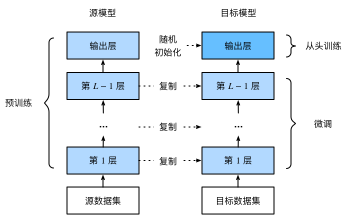

# 9.2 微調

在前面的一些章節中，我們介紹瞭如何在只有6萬張圖像的Fashion-MNIST訓練數據集上訓練模型。我們還描述了學術界當下使用最廣泛的大規模圖像數據集ImageNet，它有超過1,000萬的圖像和1,000類的物體。然而，我們平常接觸到數據集的規模通常在這兩者之間。

假設我們想從圖像中識別出不同種類的椅子，然後將購買鏈接推薦給用戶。一種可能的方法是先找出100種常見的椅子，為每種椅子拍攝1,000張不同角度的圖像，然後在收集到的圖像數據集上訓練一個分類模型。這個椅子數據集雖然可能比Fashion-MNIST數據集要龐大，但樣本數仍然不及ImageNet數據集中樣本數的十分之一。這可能會導致適用於ImageNet數據集的複雜模型在這個椅子數據集上過擬合。同時，因為數據量有限，最終訓練得到的模型的精度也可能達不到實用的要求。

為了應對上述問題，一個顯而易見的解決辦法是收集更多的數據。然而，收集和標註數據會花費大量的時間和資金。例如，為了收集ImageNet數據集，研究人員花費了數百萬美元的研究經費。雖然目前的數據採集成本已降低了不少，但其成本仍然不可忽略。

另外一種解決辦法是應用遷移學習（transfer learning），將從源數據集學到的知識遷移到目標數據集上。例如，雖然ImageNet數據集的圖像大多跟椅子無關，但在該數據集上訓練的模型可以抽取較通用的圖像特徵，從而能夠幫助識別邊緣、紋理、形狀和物體組成等。這些類似的特徵對於識別椅子也可能同樣有效。

本節我們介紹遷移學習中的一種常用技術：微調（fine tuning）。如圖9.1所示，微調由以下4步構成。

1. 在源數據集（如ImageNet數據集）上預訓練一個神經網絡模型，即源模型。
2. 創建一個新的神經網絡模型，即目標模型。它複製了源模型上除了輸出層外的所有模型設計及其參數。我們假設這些模型參數包含了源數據集上學習到的知識，且這些知識同樣適用於目標數據集。我們還假設源模型的輸出層跟源數據集的標籤緊密相關，因此在目標模型中不予採用。
3. 為目標模型添加一個輸出大小為目標數據集類別個數的輸出層，並隨機初始化該層的模型參數。
4. 在目標數據集（如椅子數據集）上訓練目標模型。我們將從頭訓練輸出層，而其餘層的參數都是基於源模型的參數微調得到的。

<div align=center>

</div>
<div align=center>圖9.1 微調</div>

當目標數據集遠小於源數據集時，微調有助於提升模型的泛化能力。


## 9.2.1 熱狗識別

接下來我們來實踐一個具體的例子：熱狗識別。我們將基於一個小數據集對在ImageNet數據集上訓練好的ResNet模型進行微調。該小數據集含有數千張包含熱狗和不包含熱狗的圖像。我們將使用微調得到的模型來識別一張圖像中是否包含熱狗。

首先，導入實驗所需的包或模塊。torchvision的[`models`](https://pytorch.org/docs/stable/torchvision/models.html)包提供了常用的預訓練模型。如果希望獲取更多的預訓練模型，可以使用使用[`pretrained-models.pytorch`](https://github.com/Cadene/pretrained-models.pytorch)倉庫。

``` python
%matplotlib inline
import torch
from torch import nn, optim
from torch.utils.data import Dataset, DataLoader
import torchvision
from torchvision.datasets import ImageFolder
from torchvision import transforms
from torchvision import models
import os

import sys
sys.path.append("..") 
import d2lzh_pytorch as d2l

device = torch.device('cuda' if torch.cuda.is_available() else 'cpu')
```

### 9.2.1.1 獲取數據集

我們使用的熱狗數據集（[點擊下載](https://apache-mxnet.s3-accelerate.amazonaws.com/gluon/dataset/hotdog.zip)）是從網上抓取的，它含有1400張包含熱狗的正類圖像，和同樣多包含其他食品的負類圖像。各類的1000張圖像被用於訓練，其餘則用於測試。

我們首先將壓縮後的數據集下載到路徑`data_dir`之下，然後在該路徑將下載好的數據集解壓，得到兩個文件夾`hotdog/train`和`hotdog/test`。這兩個文件夾下面均有`hotdog`和`not-hotdog`兩個類別文件夾，每個類別文件夾裡面是圖像文件。

``` python
data_dir = '/S1/CSCL/tangss/Datasets'
os.listdir(os.path.join(data_dir, "hotdog")) # ['train', 'test']
```

我們創建兩個`ImageFolder`實例來分別讀取訓練數據集和測試數據集中的所有圖像文件。

``` python
train_imgs = ImageFolder(os.path.join(data_dir, 'hotdog/train'))
test_imgs = ImageFolder(os.path.join(data_dir, 'hotdog/test'))
```

下面畫出前8張正類圖像和最後8張負類圖像。可以看到，它們的大小和高寬比各不相同。

``` python
hotdogs = [train_imgs[i][0] for i in range(8)]
not_hotdogs = [train_imgs[-i - 1][0] for i in range(8)]
d2l.show_images(hotdogs + not_hotdogs, 2, 8, scale=1.4);
```
<div align=center>

</div>

在訓練時，我們先從圖像中裁剪出隨機大小和隨機高寬比的一塊隨機區域，然後將該區域縮放為高和寬均為224像素的輸入。測試時，我們將圖像的高和寬均縮放為256像素，然後從中裁剪出高和寬均為224像素的中心區域作為輸入。此外，我們對RGB（紅、綠、藍）三個顏色通道的數值做標準化：每個數值減去該通道所有數值的平均值，再除以該通道所有數值的標準差作為輸出。
> 注: 在使用預訓練模型時，一定要和預訓練時作同樣的預處理。
如果你使用的是`torchvision`的`models`，那就要求:
    All pre-trained models expect input images normalized in the same way, i.e. mini-batches of 3-channel RGB images of shape (3 x H x W), where H and W are expected to be at least 224. The images have to be loaded in to a range of [0, 1] and then normalized using mean = [0.485, 0.456, 0.406] and std = [0.229, 0.224, 0.225].
如果你使用的是[`pretrained-models.pytorch`](https://github.com/Cadene/pretrained-models.pytorch)倉庫，請**務必**閱讀其README，其中說明了如何預處理。

``` python
# 指定RGB三個通道的均值和方差來將圖像通道歸一化
normalize = transforms.Normalize(mean=[0.485, 0.456, 0.406], std=[0.229, 0.224, 0.225])
train_augs = transforms.Compose([
        transforms.RandomResizedCrop(size=224),
        transforms.RandomHorizontalFlip(),
        transforms.ToTensor(),
        normalize
    ])

test_augs = transforms.Compose([
        transforms.Resize(size=256),
        transforms.CenterCrop(size=224),
        transforms.ToTensor(),
        normalize
    ])
```

### 9.2.1.2 定義和初始化模型

我們使用在ImageNet數據集上預訓練的ResNet-18作為源模型。這裡指定`pretrained=True`來自動下載並加載預訓練的模型參數。在第一次使用時需要聯網下載模型參數。
``` python
pretrained_net = models.resnet18(pretrained=True)
```
> 不管你是使用的torchvision的`models`還是[`pretrained-models.pytorch`](https://github.com/Cadene/pretrained-models.pytorch)倉庫，默認都會將預訓練好的模型參數下載到你的home目錄下`.torch`文件夾。你可以通過修改環境變量`$TORCH_MODEL_ZOO`來更改下載目錄:
    ```
    export TORCH_MODEL_ZOO="/local/pretrainedmodels
    ```
另外我比較常使用的方法是，在其源碼中找到下載地址直接瀏覽器輸入地址下載，下載好後將其放到環境變量`$TORCH_MODEL_ZOO`所指文件夾即可，這樣比較快。

下面打印源模型的成員變量`fc`。作為一個全連接層，它將ResNet最終的全局平均池化層輸出變換成ImageNet數據集上1000類的輸出。

``` python
print(pretrained_net.fc)
```
輸出：
```
Linear(in_features=512, out_features=1000, bias=True)
```
> 注: 如果你使用的是其他模型，那可能沒有成員變量`fc`（比如models中的VGG預訓練模型），所以正確做法是查看對應模型源碼中其定義部分，這樣既不會出錯也能加深我們對模型的理解。[`pretrained-models.pytorch`](https://github.com/Cadene/pretrained-models.pytorch)倉庫貌似統一了接口，但是我還是建議使用時查看一下對應模型的源碼。

可見此時`pretrained_net`最後的輸出個數等於目標數據集的類別數1000。所以我們應該將最後的`fc`成修改我們需要的輸出類別數:
```
pretrained_net.fc = nn.Linear(512, 2)
print(pretrained_net.fc)
```
輸出：
```
Linear(in_features=512, out_features=2, bias=True)
```
此時，`pretrained_net`的`fc`層就被隨機初始化了，但是其他層依然保存著預訓練得到的參數。由於是在很大的ImageNet數據集上預訓練的，所以參數已經足夠好，因此一般只需使用較小的學習率來微調這些參數，而`fc`中的隨機初始化參數一般需要更大的學習率從頭訓練。PyTorch可以方便的對模型的不同部分設置不同的學習參數，我們在下面代碼中將`fc`的學習率設為已經預訓練過的部分的10倍。

``` python
output_params = list(map(id, pretrained_net.fc.parameters()))
feature_params = filter(lambda p: id(p) not in output_params, pretrained_net.parameters())

lr = 0.01
optimizer = optim.SGD([{'params': feature_params},
                       {'params': pretrained_net.fc.parameters(), 'lr': lr * 10}],
                       lr=lr, weight_decay=0.001)
```

### 9.2.1.3 微調模型

我們先定義一個使用微調的訓練函數`train_fine_tuning`以便多次調用。

``` python
def train_fine_tuning(net, optimizer, batch_size=128, num_epochs=5):
    train_iter = DataLoader(ImageFolder(os.path.join(data_dir, 'hotdog/train'), transform=train_augs),
                            batch_size, shuffle=True)
    test_iter = DataLoader(ImageFolder(os.path.join(data_dir, 'hotdog/test'), transform=test_augs),
                           batch_size)
    loss = torch.nn.CrossEntropyLoss()
    d2l.train(train_iter, test_iter, net, loss, optimizer, device, num_epochs)
```

根據前面的設置，我們將以10倍的學習率從頭訓練目標模型的輸出層參數。

``` python
train_fine_tuning(pretrained_net, optimizer)
```
輸出：
```
training on  cuda
epoch 1, loss 3.1183, train acc 0.731, test acc 0.932, time 41.4 sec
epoch 2, loss 0.6471, train acc 0.829, test acc 0.869, time 25.6 sec
epoch 3, loss 0.0964, train acc 0.920, test acc 0.910, time 24.9 sec
epoch 4, loss 0.0659, train acc 0.922, test acc 0.936, time 25.2 sec
epoch 5, loss 0.0668, train acc 0.913, test acc 0.929, time 25.0 sec
```

作為對比，我們定義一個相同的模型，但將它的所有模型參數都初始化為隨機值。由於整個模型都需要從頭訓練，我們可以使用較大的學習率。

``` python
scratch_net = models.resnet18(pretrained=False, num_classes=2)
lr = 0.1
optimizer = optim.SGD(scratch_net.parameters(), lr=lr, weight_decay=0.001)
train_fine_tuning(scratch_net, optimizer)
```
輸出：
```
training on  cuda
epoch 1, loss 2.6686, train acc 0.582, test acc 0.556, time 25.3 sec
epoch 2, loss 0.2434, train acc 0.797, test acc 0.776, time 25.3 sec
epoch 3, loss 0.1251, train acc 0.845, test acc 0.802, time 24.9 sec
epoch 4, loss 0.0958, train acc 0.833, test acc 0.810, time 25.0 sec
epoch 5, loss 0.0757, train acc 0.836, test acc 0.780, time 24.9 sec
```

可以看到，微調的模型因為參數初始值更好，往往在相同迭代週期下取得更高的精度。


## 小結


* 遷移學習將從源數據集學到的知識遷移到目標數據集上。微調是遷移學習的一種常用技術。
* 目標模型複製了源模型上除了輸出層外的所有模型設計及其參數，並基於目標數據集微調這些參數。而目標模型的輸出層需要從頭訓練。
* 一般來說，微調參數會使用較小的學習率，而從頭訓練輸出層可以使用較大的學習率。


-----------
> 注：除代碼外本節與原書基本相同，[原書傳送門](https://zh.d2l.ai/chapter_computer-vision/fine-tuning.html)


