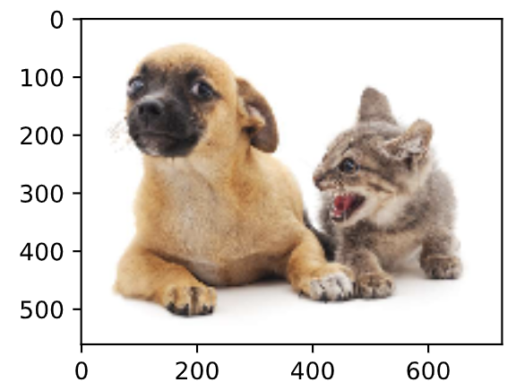
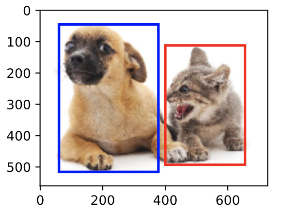

# 9.3 目標檢測和邊界框

在前面的一些章節中，我們介紹了諸多用於圖像分類的模型。在圖像分類任務裡，我們假設圖像裡只有一個主體目標，並關注如何識別該目標的類別。然而，很多時候圖像裡有多個我們感興趣的目標，我們不僅想知道它們的類別，還想得到它們在圖像中的具體位置。在計算機視覺裡，我們將這類任務稱為目標檢測（object detection）或物體檢測。

目標檢測在多個領域中被廣泛使用。例如，在無人駕駛裡，我們需要通過識別拍攝到的視頻圖像裡的車輛、行人、道路和障礙的位置來規劃行進線路。機器人也常通過該任務來檢測感興趣的目標。安防領域則需要檢測異常目標，如歹徒或者炸彈。

在接下來的幾節裡，我們將介紹目標檢測裡的多個深度學習模型。在此之前，讓我們來了解目標位置這個概念。先導入實驗所需的包或模塊。

``` python
%matplotlib inline
from PIL import Image

import sys
sys.path.append("..") 
import d2lzh_pytorch as d2l
```

下面加載本節將使用的示例圖像。可以看到圖像左邊是一隻狗，右邊是一隻貓。它們是這張圖像裡的兩個主要目標。

``` python
d2l.set_figsize()
img = Image.open('../img/catdog.jpg')
d2l.plt.imshow(img);  # 加分號只顯示圖
```
<div align=center>

</div>

## 9.3.1 邊界框

在目標檢測裡，我們通常使用邊界框（bounding box）來描述目標位置。邊界框是一個矩形框，可以由矩形左上角的$x$和$y$軸座標與右下角的$x$和$y$軸座標確定。我們根據上面的圖的座標信息來定義圖中狗和貓的邊界框。圖中的座標原點在圖像的左上角，原點往右和往下分別為$x$軸和$y$軸的正方向。

``` python
# bbox是bounding box的縮寫
dog_bbox, cat_bbox = [60, 45, 378, 516], [400, 112, 655, 493]
```

我們可以在圖中將邊界框畫出來，以檢查其是否準確。畫之前，我們定義一個輔助函數`bbox_to_rect`。它將邊界框表示成matplotlib的邊界框格式。

``` python
def bbox_to_rect(bbox, color):  # 本函數已保存在d2lzh_pytorch中方便以後使用
    # 將邊界框(左上x, 左上y, 右下x, 右下y)格式轉換成matplotlib格式：
    # ((左上x, 左上y), 寬, 高)
    return d2l.plt.Rectangle(
        xy=(bbox[0], bbox[1]), width=bbox[2]-bbox[0], height=bbox[3]-bbox[1],
        fill=False, edgecolor=color, linewidth=2)
```

我們將邊界框加載在圖像上，可以看到目標的主要輪廓基本在框內。

``` python
fig = d2l.plt.imshow(img)
fig.axes.add_patch(bbox_to_rect(dog_bbox, 'blue'))
fig.axes.add_patch(bbox_to_rect(cat_bbox, 'red'));
```
輸出：
<div align=center>

</div>

## 小結

* 在目標檢測裡不僅需要找出圖像裡面所有感興趣的目標，而且要知道它們的位置。位置一般由矩形邊界框來表示。


-----------
> 注：除代碼外本節與原書基本相同，[原書傳送門](https://zh.d2l.ai/chapter_computer-vision/bounding-box.html)
