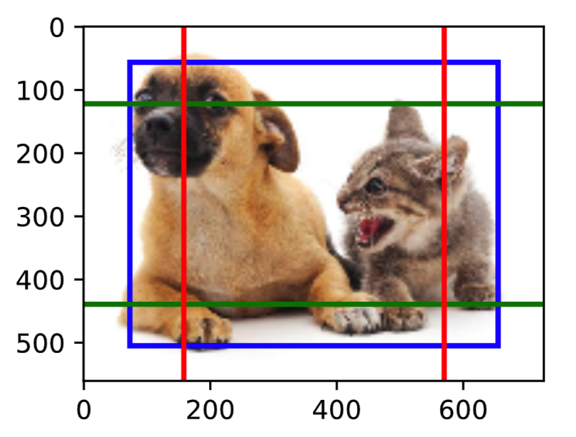

# 9.5 多尺度目標檢測

在9.4節（錨框）中，我們在實驗中以輸入圖像的每個像素為中心生成多個錨框。這些錨框是對輸入圖像不同區域的採樣。然而，如果以圖像每個像素為中心都生成錨框，很容易生成過多錨框而造成計算量過大。舉個例子，假設輸入圖像的高和寬分別為561像素和728像素，如果以每個像素為中心生成5個不同形狀的錨框，那麼一張圖像上則需要標註並預測200多萬個錨框（$561 \times 728 \times 5$）。

減少錨框個數並不難。一種簡單的方法是在輸入圖像中均勻採樣一小部分像素，並以採樣的像素為中心生成錨框。此外，在不同尺度下，我們可以生成不同數量和不同大小的錨框。值得注意的是，較小目標比較大目標在圖像上出現位置的可能性更多。舉個簡單的例子：形狀為$1 \times 1$、$1 \times 2$和$2 \times 2$的目標在形狀為$2 \times 2$的圖像上可能出現的位置分別有4、2和1種。因此，當使用較小錨框來檢測較小目標時，我們可以採樣較多的區域；而當使用較大錨框來檢測較大目標時，我們可以採樣較少的區域。

為了演示如何多尺度生成錨框，我們先讀取一張圖像。它的高和寬分別為561像素和728像素。

``` python
%matplotlib inline
from PIL import Image
import numpy as np
import torch

import sys
sys.path.append("..") 
import d2lzh_pytorch as d2l

img = Image.open('../../docs/img/catdog.jpg')
w, h = img.size # (728, 561)
```

我們在5.1節（二維卷積層）中將卷積神經網絡的二維數組輸出稱為特徵圖。
我們可以通過定義特徵圖的形狀來確定任一圖像上均勻採樣的錨框中心。

下面定義`display_anchors`函數。我們在特徵圖`fmap`上以每個單元（像素）為中心生成錨框`anchors`。由於錨框`anchors`中$x$和$y$軸的座標值分別已除以特徵圖`fmap`的寬和高，這些值域在0和1之間的值表達了錨框在特徵圖中的相對位置。由於錨框`anchors`的中心遍佈特徵圖`fmap`上的所有單元，`anchors`的中心在任一圖像的空間相對位置一定是均勻分佈的。具體來說，當特徵圖的寬和高分別設為`fmap_w`和`fmap_h`時，該函數將在任一圖像上均勻採樣`fmap_h`行`fmap_w`列個像素，並分別以它們為中心生成大小為`s`（假設列表`s`長度為1）的不同寬高比（`ratios`）的錨框。

``` python
d2l.set_figsize()

def display_anchors(fmap_w, fmap_h, s):
    # 前兩維的取值不影響輸出結果(原書這裡是(1, 10, fmap_w, fmap_h), 我認為錯了)
    fmap = torch.zeros((1, 10, fmap_h, fmap_w), dtype=torch.float32)
    
    # 平移所有錨框使均勻分佈在圖片上
    offset_x, offset_y = 1.0/fmap_w, 1.0/fmap_h
    anchors = d2l.MultiBoxPrior(fmap, sizes=s, ratios=[1, 2, 0.5]) + \
        torch.tensor([offset_x/2, offset_y/2, offset_x/2, offset_y/2])
    
    bbox_scale = torch.tensor([[w, h, w, h]], dtype=torch.float32)
    d2l.show_bboxes(d2l.plt.imshow(img).axes,
                    anchors[0] * bbox_scale)
```

我們先關注小目標的檢測。為了在顯示時更容易分辨，這裡令不同中心的錨框不重合：設錨框大小為0.15，特徵圖的高和寬分別為2和4。可以看出，圖像上2行4列的錨框中心分佈均勻。

``` python
display_anchors(fmap_w=4, fmap_h=2, s=[0.15])
```
<div align=center>

</div>

我們將特徵圖的高和寬分別減半，並用更大的錨框檢測更大的目標。當錨框大小設0.4時，有些錨框的區域有重合。

``` python
display_anchors(fmap_w=2, fmap_h=1, s=[0.4])
```
<div align=center>

</div>

最後，我們將特徵圖的寬進一步減半至1，並將錨框大小增至0.8。此時錨框中心即圖像中心。

``` python
display_anchors(fmap_w=1, fmap_h=1, s=[0.8])
```
<div align=center>

</div>

既然我們已在多個尺度上生成了不同大小的錨框，相應地，我們需要在不同尺度下檢測不同大小的目標。下面我們來介紹一種基於卷積神經網絡的方法。

在某個尺度下，假設我們依據$c_i$張形狀為$h \times w$的特徵圖生成$h \times w$組不同中心的錨框，且每組的錨框個數為$a$。例如，在剛才實驗的第一個尺度下，我們依據10（通道數）張形狀為$4 \times 2$的特徵圖生成了8組不同中心的錨框，且每組含3個錨框。
接下來，依據真實邊界框的類別和位置，每個錨框將被標註類別和偏移量。在當前的尺度下，目標檢測模型需要根據輸入圖像預測$h \times w$組不同中心的錨框的類別和偏移量。

假設這裡的$c_i$張特徵圖為卷積神經網絡根據輸入圖像做前向計算所得的中間輸出。既然每張特徵圖上都有$h \times w$個不同的空間位置，那麼相同空間位置可以看作含有$c_i$個單元。
根據5.1節（二維卷積層）中感受野的定義，特徵圖在相同空間位置的$c_i$個單元在輸入圖像上的感受野相同，並表徵了同一感受野內的輸入圖像信息。
因此，我們可以將特徵圖在相同空間位置的$c_i$個單元變換為以該位置為中心生成的$a$個錨框的類別和偏移量。
不難發現，本質上，我們用輸入圖像在某個感受野區域內的信息來預測輸入圖像上與該區域位置相近的錨框的類別和偏移量。

當不同層的特徵圖在輸入圖像上分別擁有不同大小的感受野時，它們將分別用來檢測不同大小的目標。例如，我們可以通過設計網絡，令較接近輸出層的特徵圖中每個單元擁有更廣闊的感受野，從而檢測輸入圖像中更大尺寸的目標。

我們將在9.7節（單發多框檢測（SSD））中具體實現一個多尺度目標檢測的模型。


## 小結

* 可以在多個尺度下生成不同數量和不同大小的錨框，從而在多個尺度下檢測不同大小的目標。
* 特徵圖的形狀能確定任一圖像上均勻採樣的錨框中心。
* 用輸入圖像在某個感受野區域內的信息來預測輸入圖像上與該區域相近的錨框的類別和偏移量。


-----------
> 注：除代碼外本節與原書基本相同，[原書傳送門](http://zh.d2l.ai/chapter_computer-vision/multiscale-object-detection.html)