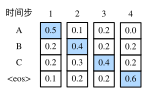

# 10.10 束搜索

上一節介紹瞭如何訓練輸入和輸出均為不定長序列的編碼器—解碼器。本節我們介紹如何使用編碼器—解碼器來預測不定長的序列。

上一節裡已經提到，在準備訓練數據集時，我們通常會在樣本的輸入序列和輸出序列後面分別附上一個特殊符號"&lt;eos&gt;"表示序列的終止。我們在接下來的討論中也將沿用上一節的全部數學符號。為了便於討論，假設解碼器的輸出是一段文本序列。設輸出文本詞典$\mathcal{Y}$（包含特殊符號"&lt;eos&gt;"）的大小為$\left|\mathcal{Y}\right|$，輸出序列的最大長度為$T'$。所有可能的輸出序列一共有$\mathcal{O}(\left|\mathcal{Y}\right|^{T'})$種。這些輸出序列中所有特殊符號"&lt;eos&gt;"後面的子序列將被捨棄。

## 10.10.1 貪婪搜索

讓我們先來看一個簡單的解決方案：貪婪搜索（greedy search）。對於輸出序列任一時間步$t'$，我們從$|\mathcal{Y}|$個詞中搜索出條件概率最大的詞

$$
y _ { t ^ { \prime } } = \underset { y \in \mathcal { Y } } { \operatorname { argmax } } P \left( y | y _ { 1 } , \ldots , y _ { t ^ { \prime } - 1 } , c \right)
$$

作為輸出。一旦搜索出"&lt;eos&gt;"符號，或者輸出序列長度已經達到了最大長度$T'$，便完成輸出。

我們在描述解碼器時提到，基於輸入序列生成輸出序列的條件概率是$\prod_{t'=1}^{T'} P(y_{t'} \mid y_1, \ldots, y_{t'-1}, \boldsymbol{c})$。我們將該條件概率最大的輸出序列稱為最優輸出序列。而貪婪搜索的主要問題是不能保證得到最優輸出序列。

下面來看一個例子。假設輸出詞典裡面有“A”“B”“C”和“&lt;eos&gt;”這4個詞。圖10.9中每個時間步下的4個數字分別代表了該時間步生成“A”“B”“C”和“&lt;eos&gt;”這4個詞的條件概率。在每個時間步，貪婪搜索選取條件概率最大的詞。因此，圖10.9中將生成輸出序列“A”“B”“C”“&lt;eos&gt;”。該輸出序列的條件概率是$0.5\times0.4\times0.4\times0.6 = 0.048$。

圖10.9 在每個時間步，貪婪搜索選取條件概率最大的詞

接下來，觀察圖10.10演示的例子。與圖10.9中不同，圖10.10在時間步2中選取了條件概率第二大的詞“C”。由於時間步3所基於的時間步1和2的輸出子序列由圖10.9中的“A”“B”變為了圖10.10中的“A”“C”，圖10.10中時間步3生成各個詞的條件概率發生了變化。我們選取條件概率最大的詞“B”。此時時間步4所基於的前3個時間步的輸出子序列為“A”“C”“B”，與圖10.9中的“A”“B”“C”不同。因此，圖10.10中時間步4生成各個詞的條件概率也與圖10.9中的不同。我們發現，此時的輸出序列“A”“C”“B”“&lt;eos&gt;”的條件概率是$0.5\times0.3\times0.6\times0.6=0.054$，大於貪婪搜索得到的輸出序列的條件概率。因此，貪婪搜索得到的輸出序列“A”“B”“C”“&lt;eos&gt;”並非最優輸出序列。

圖10.10 在時間步2選取條件概率第二大的詞“C”

## 10.10.2 窮舉搜索

如果目標是得到最優輸出序列，我們可以考慮窮舉搜索（exhaustive search）：窮舉所有可能的輸出序列，輸出條件概率最大的序列。

雖然窮舉搜索可以得到最優輸出序列，但它的計算開銷$\mathcal{O}(\left|\mathcal{Y}\right|^{T'})$很容易過大。例如，當$|\mathcal{Y}|=10000$且$T'=10$時，我們將評估$10000^{10} = 10^{40}$個序列：這幾乎不可能完成。而貪婪搜索的計算開銷是$\mathcal{O}(\left|\mathcal{Y}\right|T')$，通常顯著小於窮舉搜索的計算開銷。例如，當$|\mathcal{Y}|=10000$且$T'=10$時，我們只需評估$10000\times10=10^5$個序列。

## 10.10.3 束搜索

束搜索（beam search）是對貪婪搜索的一個改進算法。它有一個束寬（beam size）超參數。我們將它設為$k$。在時間步1時，選取當前時間步條件概率最大的$k$個詞，分別組成$k$個候選輸出序列的首詞。在之後的每個時間步，基於上個時間步的$k$個候選輸出序列，從$k\left|\mathcal{Y}\right|$個可能的輸出序列中選取條件概率最大的$k$個，作為該時間步的候選輸出序列。最終，我們從各個時間步的候選輸出序列中篩選出包含特殊符號“&lt;eos&gt;”的序列，並將它們中所有特殊符號“&lt;eos&gt;”後面的子序列捨棄，得到最終候選輸出序列的集合。

圖10.11 束搜索的過程。束寬為2，輸出序列最大長度為3。候選輸出序列有A、C、AB、CE、ABD和CED

圖10.11通過一個例子演示了束搜索的過程。假設輸出序列的詞典中只包含5個元素，即$\mathcal{Y} = \{A, B, C, D, E\}$，且其中一個為特殊符號“&lt;eos&gt;”。設束搜索的束寬等於2，輸出序列最大長度為3。在輸出序列的時間步1時，假設條件概率$P(y_1 \mid \boldsymbol{c})$最大的2個詞為$A$和$C$。我們在時間步2時將對所有的$y_2 \in \mathcal{Y}$都分別計算$P(y_2 \mid A, \boldsymbol{c})$和$P(y_2 \mid C, \boldsymbol{c})$，並從計算出的10個條件概率中取最大的2個，假設為$P(B \mid A, \boldsymbol{c})$和$P(E \mid C, \boldsymbol{c})$。那麼，我們在時間步3時將對所有的$y_3 \in \mathcal{Y}$都分別計算$P(y_3 \mid A, B, \boldsymbol{c})$和$P(y_3 \mid C, E, \boldsymbol{c})$，並從計算出的10個條件概率中取最大的2個，假設為$P(D \mid A, B, \boldsymbol{c})$和$P(D \mid C, E, \boldsymbol{c})$。如此一來，我們得到6個候選輸出序列：（1）$A$；（2）$C$；（3）$A$、$B$；（4）$C$、$E$；（5）$A$、$B$、$D$和（6）$C$、$E$、$D$。接下來，我們將根據這6個序列得出最終候選輸出序列的集合。

在最終候選輸出序列的集合中，我們取以下分數最高的序列作為輸出序列：

$$ \frac{1}{L^\alpha} \log P(y_1, \ldots, y_{L}) = \frac{1}{L^\alpha} \sum_{t'=1}^L \log P(y_{t'} \mid y_1, \ldots, y_{t'-1}, \boldsymbol{c}),$$

其中$L$為最終候選序列長度，$\alpha$一般可選為0.75。分母上的$L^\alpha$是為了懲罰較長序列在以上分數中較多的對數相加項。分析可知，束搜索的計算開銷為$\mathcal{O}(k\left|\mathcal{Y}\right|T')$。這介於貪婪搜索和窮舉搜索的計算開銷之間。此外，貪婪搜索可看作是束寬為1的束搜索。束搜索通過靈活的束寬$k$來權衡計算開銷和搜索質量。

## 小結

* 預測不定長序列的方法包括貪婪搜索、窮舉搜索和束搜索。
* 束搜索通過靈活的束寬來權衡計算開銷和搜索質量。

-----------
> 注：本節與原書基本相同，[原書傳送門](https://zh.d2l.ai/chapter_natural-language-processing/beam-search.html)

