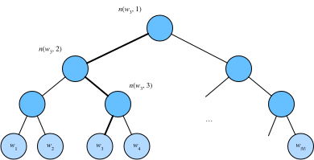

# 10.2 近似訓練

回憶上一節的內容。跳字模型的核心在於使用softmax運算得到給定中心詞$w_c$來生成背景詞$w_o$的條件概率

$$P(w_o \mid w_c) = \frac{\text{exp}(\boldsymbol{u}_o^\top \boldsymbol{v}_c)}{ \sum_{i \in \mathcal{V}} \text{exp}(\boldsymbol{u}_i^\top \boldsymbol{v}_c)}.$$

該條件概率相應的對數損失

$$-\log P(w_o \mid w_c) =
-\boldsymbol{u}_o^\top \boldsymbol{v}_c + \log\left(\sum_{i \in \mathcal{V}} \text{exp}(\boldsymbol{u}_i^\top \boldsymbol{v}_c)\right).$$

由於softmax運算考慮了背景詞可能是詞典$\mathcal{V}$中的任一詞，以上損失包含了詞典大小數目的項的累加。在上一節中我們看到，不論是跳字模型還是連續詞袋模型，由於條件概率使用了softmax運算，每一步的梯度計算都包含詞典大小數目的項的累加。對於含幾十萬或上百萬詞的較大詞典，每次的梯度計算開銷可能過大。為了降低該計算複雜度，本節將介紹兩種近似訓練方法，即負採樣（negative sampling）或層序softmax（hierarchical softmax）。由於跳字模型和連續詞袋模型類似，本節僅以跳字模型為例介紹這兩種方法。

## 10.2.1 負採樣

負採樣修改了原來的目標函數。給定中心詞$w_c$的一個背景窗口，我們把背景詞$w_o$出現在該背景窗口看作一個事件，並將該事件的概率計算為

$$P(D=1\mid w_c, w_o) = \sigma(\boldsymbol{u}_o^\top \boldsymbol{v}_c),$$

其中的$\sigma$函數與sigmoid激活函數的定義相同：

$$\sigma(x) = \frac{1}{1+\exp(-x)}.$$

我們先考慮最大化文本序列中所有該事件的聯合概率來訓練詞向量。具體來說，給定一個長度為$T$的文本序列，設時間步$t$的詞為$w^{(t)}$且背景窗口大小為$m$，考慮最大化聯合概率

$$ \prod_{t=1}^{T} \prod_{-m \leq j \leq m,\ j \neq 0} P(D=1\mid w^{(t)}, w^{(t+j)}).$$

然而，以上模型中包含的事件僅考慮了正類樣本。這導致當所有詞向量相等且值為無窮大時，以上的聯合概率才被最大化為1。很明顯，這樣的詞向量毫無意義。負採樣通過採樣並添加負類樣本使目標函數更有意義。設背景詞$w_o$出現在中心詞$w_c$的一個背景窗口為事件$P$，我們根據分佈$P(w)$採樣$K$個未出現在該背景窗口中的詞，即噪聲詞。設噪聲詞$w_k$（$k=1, \ldots, K$）不出現在中心詞$w_c$的該背景窗口為事件$N_k$。假設同時含有正類樣本和負類樣本的事件$P, N_1, \ldots, N_K$相互獨立，負採樣將以上需要最大化的僅考慮正類樣本的聯合概率改寫為

$$ \prod_{t=1}^{T} \prod_{-m \leq j \leq m,\ j \neq 0} P(w^{(t+j)} \mid w^{(t)}),$$

其中條件概率被近似表示為
$$ P(w^{(t+j)} \mid w^{(t)}) =P(D=1\mid w^{(t)}, w^{(t+j)})\prod_{k=1,\ w_k \sim P(w)}^K P(D=0\mid w^{(t)}, w_k).$$

設文本序列中時間步$t$的詞$w^{(t)}$在詞典中的索引為$i_t$，噪聲詞$w_k$在詞典中的索引為$h_k$。有關以上條件概率的對數損失為

$$
\begin{aligned}
-\log P(w^{(t+j)} \mid w^{(t)})
=& -\log P(D=1\mid w^{(t)}, w^{(t+j)}) - \sum_{k=1,\ w_k \sim P(w)}^K \log P(D=0\mid w^{(t)}, w_k)\\
=&-  \log\, \sigma\left(\boldsymbol{u}_{i_{t+j}}^\top \boldsymbol{v}_{i_t}\right) - \sum_{k=1,\ w_k \sim P(w)}^K \log\left(1-\sigma\left(\boldsymbol{u}_{h_k}^\top \boldsymbol{v}_{i_t}\right)\right)\\
=&-  \log\, \sigma\left(\boldsymbol{u}_{i_{t+j}}^\top \boldsymbol{v}_{i_t}\right) - \sum_{k=1,\ w_k \sim P(w)}^K \log\sigma\left(-\boldsymbol{u}_{h_k}^\top \boldsymbol{v}_{i_t}\right).
\end{aligned}
$$

現在，訓練中每一步的梯度計算開銷不再與詞典大小相關，而與$K$線性相關。當$K$取較小的常數時，負採樣在每一步的梯度計算開銷較小。

## 10.2.2 層序softmax

層序softmax是另一種近似訓練法。它使用了二叉樹這一數據結構，樹的每個葉結點代表詞典$\mathcal{V}$中的每個詞。

圖10.3 層序softmax。二叉樹的每個葉結點代表著詞典的每個詞

假設$L(w)$為從二叉樹的根結點到詞$w$的葉結點的路徑（包括根結點和葉結點）上的結點數。設$n(w,j)$為該路徑上第$j$個結點，並設該結點的背景詞向量為$\boldsymbol{u}_{n(w,j)}$。以圖10.3為例，$L(w_3) = 4$。層序softmax將跳字模型中的條件概率近似表示為

$$P(w_o \mid w_c) = \prod_{j=1}^{L(w_o)-1} \sigma\left( [\![  n(w_o, j+1) = \text{leftChild}(n(w_o,j)) ]\!] \cdot \boldsymbol{u}_{n(w_o,j)}^\top \boldsymbol{v}_c\right),$$

其中$\sigma$函數與3.8節（多層感知機）中sigmoid激活函數的定義相同，$\text{leftChild}(n)$是結點$n$的左子結點：如果判斷$x$為真，$[\![x]\!] = 1$；反之$[\![x]\!] = -1$。
讓我們計算圖10.3中給定詞$w_c$生成詞$w_3$的條件概率。我們需要將$w_c$的詞向量$\boldsymbol{v}_c$和根結點到$w_3$路徑上的非葉結點向量一一求內積。由於在二叉樹中由根結點到葉結點$w_3$的路徑上需要向左、向右再向左地遍歷（圖10.3中加粗的路徑），我們得到

$$P(w_3 \mid w_c) = \sigma(\boldsymbol{u}_{n(w_3,1)}^\top \boldsymbol{v}_c) \cdot \sigma(-\boldsymbol{u}_{n(w_3,2)}^\top \boldsymbol{v}_c) \cdot \sigma(\boldsymbol{u}_{n(w_3,3)}^\top \boldsymbol{v}_c).$$

由於$\sigma(x)+\sigma(-x) = 1$，給定中心詞$w_c$生成詞典$\mathcal{V}$中任一詞的條件概率之和為1這一條件也將滿足：

$$\sum_{w \in \mathcal{V}} P(w \mid w_c) = 1.$$

此外，由於$L(w_o)-1$的數量級為$\mathcal{O}(\text{log}_2|\mathcal{V}|)$，當詞典$\mathcal{V}$很大時，層序softmax在訓練中每一步的梯度計算開銷相較未使用近似訓練時大幅降低。

## 小結

* 負採樣通過考慮同時含有正類樣本和負類樣本的相互獨立事件來構造損失函數。其訓練中每一步的梯度計算開銷與採樣的噪聲詞的個數線性相關。
* 層序softmax使用了二叉樹，並根據根結點到葉結點的路徑來構造損失函數。其訓練中每一步的梯度計算開銷與詞典大小的對數相關。

-----------
> 注：本節與原書完全相同，[原書傳送門](https://zh.d2l.ai/chapter_natural-language-processing/approx-training.html)
