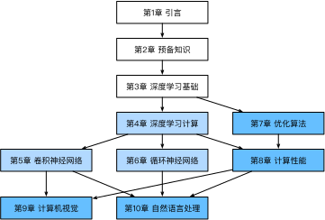

# 閱讀指南
和原書一樣，docs內容大體可以分為3個部分：
* 第一部分（第1章至第3章）涵蓋預備工作和基礎知識。第1章介紹深度學習的背景。第2章提供動手學深度學習所需要的預備知識。第3章包括深度學習最基礎的概念和技術，如多層感知機和模型正則化。如果讀者時間有限，並且只想瞭解深度學習最基礎的概念和技術，那麼只需閱讀第一部分。
* 第二部分（第4章至第6章）關注現代深度學習技術。第4章描述深度學習計算的各個重要組成部分，併為實現後續更復雜的模型打下基礎。第5章解釋近年來令深度學習在計算機視覺領域大獲成功的卷積神經網絡。第6章闡述近年來常用於處理序列數據的循環神經網絡。閱讀第二部分有助於掌握現代深度學習技術。
* 第三部分（第7章至第10章）討論計算性能和應用。第7章評價各種用來訓練深度學習模型的優化算法。第8章檢驗影響深度學習計算性能的幾個重要因素。第9章和第10章分別列舉深度學習在計算機視覺和自然語言處理中的重要應用。這部分內容讀者可根據興趣選擇閱讀。

下圖描繪了《動手學深度學習》的結構。

上圖中由甲章指向乙章的箭頭表明甲章的知識有助於理解乙章的內容。如果讀者想短時間瞭解深度學習最基礎的概念和技術，只需閱讀第1章至第3章；如果讀者希望掌握現代深度學習技術，還需閱讀第4章至第6章。第7章至第10章讀者可以根據興趣選擇閱讀。